## Introduction

This project implements a RESTful web service (REST API) in Java using the Spring Framework and Maven.  
It was developed as part of the **Service-Oriented Systems** course in the Computer Science degree. All the source code is available in my [GitHub repository](https://github.com/azuar4e/RESTful-Service).

> ⚠️ **Note:** Since the course is taught in Spanish, all source code, directories, and documentation are in Spanish.

---

## Overview

The service provides basic functionality for managing book loans in a library. In the following image we can see the entity-relationship model:


> **Note:** The relation ``books-loans`` is intended to be a one-one relationship but our implementation allows multiple loans per book as long as the book is available.

## REST API Design

The root URL of the service is `http://localhost:8080/biblioteca.api/`.

The API exposes three resources:

- `/libros` (books)
- `/users`
- `/prestamos` (loans)

Each one allows full CRUD operations (`Create`, `Read`, `Update`, `Delete`), using the standard HTTP methods (`GET`, `POST`, `PUT`, `DELETE`).

The following **endpoints** are available:

### 📚 Books

- `GET /libros`
- `GET /libros/{isbn}`
- `GET /libros/{isbn}/unidades` – Number of available copies
- `GET /libros?titulo_contiene={titulo}` – Search by title
- `GET /libros?disponible={true|false}` – Search by availability
- `POST /libros`
- `PUT /libros/{isbn}`
- `DELETE /libros/{isbn}`

---

### 📄 Loans

- `GET /prestamos`
- `GET /prestamos/{id}`
- `POST /prestamos`
- `PUT /prestamos/{id}` – Return book or verify loan (set ``devuelto`` attribute to ``true`` || set `verificar_devolucion` to ``true``)
- `DELETE /prestamos/{id}`

---

### 👤 Users

- `GET /users`
- `GET /users/{matricula}` – Student ID
- `GET /users/{matricula}/prestamos` – Loans by student
- `PUT /users/{matricula}/prestamos/{id}` – Extend loan (set ``ampliar`` attribute to ``true``)
- `GET /users/{matricula}/actividad` – Student's activity
- `POST /users`
- `PUT /users/{matricula}`
- `DELETE /users/{matricula}`

---

## Architecture

The project follows the **Controller-Service-Repository** pattern, with the following structure:

- **Model:** Represents the database information through entities, relationships, and attributes (the tables).
- **Repository:** Responsible for directly interacting with the database.
- **Service:** Contains the application logic and communicates with the repository to process data.
- **Controller:** Manages HTTP requests and responses, connecting the client with the service logic.

As shown in the following image, this is the structure of the project:


In the **Exceptions** folder, all error types for each resource are declared, along with their corresponding HTTP status codes.

> All the code shown below will be related to *loans* since it's the entity that links books and users, and therefore it's the most representative of the API’s general behavior.

### Models

The first step is to define the entities that make up the database. To do this, we declare two classes for each entity within the **models** folder:

- One class where we define the table and its attributes.
- Another one containing the ``ModelAssembler``, which allows us to add ``HATEOAS`` links to the resources.

Below is the model for the `Prestamo` (Loan) entity, which makes use of:

- **Lombok** (`@Data`, `@NoArgsConstructor`, `@AllArgsConstructor`) to automatically generate getters, setters, and constructors.
- **JPA** (`@Entity`, `@Table`, `@Id`, etc.) to map the class to a table in the database.
- **Spring HATEOAS** (`extends RepresentationModel<Prestamo>`) to add HATEOAS links to the resources via the `ModelAssembler`.

```Java
package es.upm.sos.biblioteca.models;
import java.time.LocalDate;
import org.springframework.hateoas.RepresentationModel;
import com.fasterxml.jackson.annotation.JsonBackReference;
import jakarta.persistence.*;
import lombok.*;

@Entity
@Table(name = "Prestamo")
@Data
@NoArgsConstructor
@AllArgsConstructor

public class Prestamo extends RepresentationModel<Prestamo> {
    @Id
    @GeneratedValue(strategy = GenerationType.IDENTITY)
    private int id;

    @ManyToOne
    @JoinColumn(name = "usuario_id") //user_id
    @JsonBackReference
    private Usuario usuario;

    @ManyToOne
    @JoinColumn(name = "libro_id") //book_id
    private Libro libro;

    @Column(name = "fecha_prestamo", nullable = false) //loan_date
    private LocalDate fecha_prestamo;

    @Column(name = "fecha_devolucion", nullable = false) //return_date
    private LocalDate fecha_devolucion;

    @Column(columnDefinition = "boolean default false") //returned
    private boolean devuelto;

    @Column(columnDefinition = "boolean default false") //verified_return
    private boolean verificar_devolucion;

    @Column(name = "ampliar", columnDefinition = "boolean default false") //extend
    private boolean ampliar;
}
```

`@Id` marks the identifier of the entity, and we auto-generate it using `@GeneratedValue`.

`usuario` and `libro` represent *ManyToOne* relationships with their respective entities.

- In the case of the user, we use `@JsonBackReference` to avoid cyclic serialization. This is because the **Usuario** model includes an attribute named `prestamos`, which points to the user's loans; that attribute uses `@JsonManagedReference`. The one annotated with `@JsonManagedReference` is the side that gets serialized in the returned JSON. In other words, when a user is returned, their loans are included; but when a loan is returned, the user information is not included.

For the rest of the attributes, we use `@Column` to indicate that they are fields in the corresponding table, and to define whether they can be null, their default values, etc.

As for the `ModelAssembler`, we define it as follows:

```Java
package es.upm.sos.biblioteca.models;
import static org.springframework.hateoas.server.mvc.WebMvcLinkBuilder.linkTo;
import static org.springframework.hateoas.server.mvc.WebMvcLinkBuilder.methodOn;
import org.springframework.hateoas.server.mvc.RepresentationModelAssemblerSupport;
import org.springframework.stereotype.Component;
import es.upm.sos.biblioteca.controllers.PrestamosController;

@Component

public class PrestamoModelAssembler extends RepresentationModelAssemblerSupport<Prestamo, Prestamo> {
    public PrestamoModelAssembler(){
        super(PrestamosController.class, Prestamo.class);
    }
    
    @Override
    public Prestamo toModel(Prestamo entity) {
        entity.add(linkTo(methodOn(PrestamosController.class).getPrestamo(entity.getId())).withSelfRel());
        return entity;
    }
}
```

In the `toModel` method, a self-link (`self`) is added using ``linkTo`` and ``methodOn``, pointing to the controller method that retrieves a loan by its identifier (`getPrestamo(id)`).

This allows the returned `Prestamo` object to include a link in the JSON response like:

```json
"_links": {
  "self": {
    "href": "http://localhost:8080/biblioteca.api/prestamos/1"
  }
}
```

### Repositories

Next, we define the repositories corresponding to each entity. As previously mentioned, these are responsible for directly interacting with the database.

For the repositories, we use:

- **JPA**: We use annotations such as ``@Repository`` and ``@Query``, and extend ``JpaRepository<Prestamo, Integer>`` to gain access to the most common persistence methods (like ``save``, ``findAll``, ``findById``, etc.), as well as the ability to define custom queries.

```Java
package es.upm.sos.biblioteca.repository;
import es.upm.sos.biblioteca.models.Libro;
import es.upm.sos.biblioteca.models.Prestamo;
import java.time.LocalDate;
import java.util.Optional;

import org.springframework.data.domain.*;
import org.springframework.data.jpa.repository.JpaRepository;
import org.springframework.data.jpa.repository.Query;
import org.springframework.data.repository.query.Param;
import org.springframework.stereotype.Repository;


@Repository
public interface PrestamosRepository extends JpaRepository<Prestamo, Integer> {

    Optional<Prestamo> findById(Integer id);

    Page<Prestamo> findByUsuarioMatriculaAndDevueltoFalse(@Param("matricula") String matricula, Pageable pageable);

    //actual loans
    @Query("SELECT p FROM Prestamo p WHERE p.usuario.matricula = :matricula AND p.devuelto = false AND p.fecha_devolucion > CURRENT_DATE ORDER BY p.fecha_prestamo DESC")
    Page<Prestamo> getPrestamosActuales(@Param("matricula") String matricula, Pageable paginable);
     
     //returned loans
    @Query("SELECT p FROM Prestamo p WHERE p.usuario.matricula = :matricula AND p.devuelto = true ORDER BY p.fecha_devolucion DESC")
    Page<Prestamo> getUltimosLibrosDevueltos(@Param("matricula") String matricula, Pageable pageable);

    Prestamo findByLibroIsbn(String isbn);
}
```

The persistence methods mentioned earlier do not require any explicit SQL or JPQL queries: Spring Data automatically infers them based on the method name. The rest are custom queries.

- `getPrestamosActuales` returns the current loans of a user that have not yet been returned and whose return date has not yet passed, ordered by descending loan date.
- `getUltimosLibrosDevueltos` returns the latest books returned by a user, ordered by descending return date.

### Services

The following section describes the services that make up the application. These contain the business logic and communicate with the repositories to process data.

The annotation ``@Service`` is used to indicate that this class belongs to the service layer of the application, along with `lombok`’s ``@AllArgsConstructor``.

> Since the file is very long, only a *snippet* is shown here. For readability, *some imports* related to models and exceptions have been removed.

```Java
package es.upm.sos.biblioteca.services;

import java.time.LocalDate;
import java.util.Objects;
import java.util.Optional;

import org.springframework.stereotype.Service;
import org.slf4j.Logger;
import org.slf4j.LoggerFactory;
import org.springframework.data.domain.*;
import jakarta.transaction.Transactional;
import lombok.*;

@Service
@AllArgsConstructor
public class ServicioPrestamos{    
    private final PrestamosRepository repository;
    private final LibrosRepository repoLibro;
    private final UsuariosRepository userRepo;
    private static final Logger logger = LoggerFactory.getLogger(ServicioPrestamos.class);

    public Page<Prestamo> getPrestamos(int page, int size){
    Pageable paginable = PageRequest.of(page, size);
      return repository.findAll(paginable);
    }

    public Prestamo getPrestamoId(int id) {
      Optional<Prestamo> prestamo = repository.findById(id);

      if (prestamo.isEmpty()) { throw new PrestamoNotFoundException(id, null, null); }

      return prestamo.get();
    }

    @Transactional
    public void postPrestamo(Prestamo prestamo) {
      Libro libro = repoLibro.findByIsbn(prestamo.getLibro().getIsbn());
      Usuario usuario = userRepo.getUsuario(prestamo.getUsuario().getMatricula());
      int cantidad = libro.getDisponibles();
      logger.info("Servicio postPrestamo");
      Optional<Prestamo> prestamoExistente = repository.findById(prestamo.getId());
      logger.info("Cantidad: "+cantidad);
      if (prestamoExistente.isPresent()) { throw new PrestamoConflictException(prestamo.getId()); }
      if(cantidad == 0) { throw new LibroNoDisponibleException(libro.getIsbn()); }
      if (usuario.getPor_devolver() != 0) { throw new UsuarioDevolucionesPendientesException(prestamo.getUsuario().getMatricula()); }
      if (usuario.getSancion() != null) { throw new UsuarioSancionadoException(prestamo.getUsuario().getMatricula()); } 
      if(prestamo.getFecha_devolucion().isBefore(prestamo.getFecha_prestamo())) { throw new FechasNoValidasException(prestamo.getFecha_prestamo(), prestamo.getFecha_devolucion()); }
      libro.setDisponibles(cantidad-1);
      logger.info("Cantidad: "+ libro.getDisponibles());
      repoLibro.save(libro);
      repository.save(prestamo);
    }
}
```

I have included three different methods, from the simplest to the most complex:

- `getPrestamos`: returns all the loans from the database. We only declare a `Pageable` to enable pagination, and return whatever the repository returns.
- `getPrestamoId`: returns a loan by its identifier. We use an `Optional` to handle the possible absence of the resource, throwing a custom exception (which the controller will receive) if the loan is not found.
- `postPrestamo`: allows creating a new loan. Since this method modifies the database, it is annotated with `@Transactional`. Data is received from the controller (in JSON format), associated entities are extracted, and multiple validations are performed: existence of the loan, availability of the book, user's status, and consistency between dates. If everything is correct, the number of available copies is updated and the loan is saved.

### Controllers

Finally, the controllers that make up the application are described. They are responsible for managing HTTP requests and responses, connecting the client with the service logic.

The `@RestController` annotation is used to indicate that this class is part of the application's controller layer, along with Lombok's `@AllArgsConstructor` and the `@RequestMapping` to indicate the **entry point** to the resource.

> Just like with the services, I include a *snippet* of the controller, omitting some imports.

```Java
package es.upm.sos.biblioteca.controllers;
import jakarta.validation.Valid;
import org.springframework.data.domain.Page;
import org.springframework.data.web.PagedResourcesAssembler;
import static org.springframework.hateoas.server.mvc.WebMvcLinkBuilder.linkTo;
import static org.springframework.hateoas.server.mvc.WebMvcLinkBuilder.methodOn;
import lombok.AllArgsConstructor;
import org.springframework.http.HttpStatus;
import org.springframework.http.ResponseEntity;
import org.springframework.web.bind.annotation.*;
import org.slf4j.Logger;
import org.slf4j.LoggerFactory;


@RestController
@RequestMapping("/biblioteca.api/prestamos")
@AllArgsConstructor
public class PrestamosController {
    private ServicioPrestamos servicio;
    private PagedResourcesAssembler<Prestamo> pagedResourcesAssembler;
    private PrestamoModelAssembler prestamoModelAssembler;
    private static final Logger logger = LoggerFactory.getLogger(PrestamosController.class);

    @GetMapping
    public ResponseEntity<Object> getPrestamos(
        @RequestParam(defaultValue = "0", required = false) int page,
        @RequestParam(defaultValue = "3", required = false) int size) {
        Page<Prestamo> prestamos = servicio.getPrestamos(page, size);
        return ResponseEntity.ok(pagedResourcesAssembler.toModel(prestamos, prestamoModelAssembler));
    }    

    @PutMapping("/{id}")
    public ResponseEntity<Object> devolverLibro_verificarDevolucion(@PathVariable int id, @Valid @RequestBody Prestamo prestamo){

        if(prestamo.isDevuelto()){
            //to return a book
            try{
                servicio.devolverLibro(id, prestamo);
                return ResponseEntity.noContent().build();
            }
            catch (PrestamoNotFoundException e) {
                return ResponseEntity.status(HttpStatus.NOT_FOUND).body(e);
            } catch (PrestamoDevueltoException e) {
             return ResponseEntity.status(HttpStatus.CONFLICT).body(e);
            } catch (PrestamoFechaPrestamoNoCoincideException | PrestamoFechaDevolucionNoCoincideException | UsuarioNoCoincideException | LibroNoCoincideException e) {
                return ResponseEntity.status(HttpStatus.BAD_REQUEST).body(e);
            }

        } else{
            //to verify a return
            try{
                servicio.verificarDevolucion(id, prestamo);
                return ResponseEntity.noContent().build();
            }
            catch(PrestamoVerificadoException e){
                return ResponseEntity.status(HttpStatus.CONFLICT).body(e);
            } catch (PrestamoNotFoundException e) {
                return ResponseEntity.status(HttpStatus.NOT_FOUND).body(e);
            } catch (PrestamoFechaPrestamoNoCoincideException | PrestamoFechaDevolucionNoCoincideException | UsuarioNoCoincideException | LibroNoCoincideException e) {
                return ResponseEntity.status(HttpStatus.BAD_REQUEST).body(e);
            }

        }
    }

    @DeleteMapping("/{id}")
    public ResponseEntity<Object> deletePrestamo(@PathVariable int id) {
        try{
            servicio.deletePrestamo(id);
            return ResponseEntity.noContent().build();
        }   
        catch (PrestamoNotFoundException e) {
            return ResponseEntity.status(HttpStatus.NOT_FOUND).body(e.getMessage()); 
        }
    }
}
```

Just like before, I have included three different methods, from the simplest to the most complex:

- `getPrestamos`: we call the service method with the request parameters (`page` and `size`), which default to 0 and 3, and return the result of that call.
- `devolverLibro_verificarDevolucion`: allows us to return a book or verify the return of a loan. Since this method can throw exceptions, we wrap it in a `try-catch` block to return an error message if any exception occurs, handling exceptions according to the HTTP error code returned.
- `deletePrestamo`: allows us to delete a loan. We call the service method with the loan ID and return the result of that call. If the loan didn’t exist, the exception is caught and an HTTP 404 Not Found status code is returned.

### Exceptions

To handle errors in a controlled and consistent way, we define a custom exception system. For each resource in the application, a specific package is created containing two types of files:

- **Custom exception classes**, one for each type of error that can occur in that resource.
- A **centralized exception handler**, which catches the thrown exceptions and returns an HTTP response in JSON format to the client.

An example of an exception class would be the following:

```Java
package es.upm.sos.biblioteca.Excepciones.Prestamos;

public class PrestamoNotFoundException extends RuntimeException {
    public PrestamoNotFoundException(Integer id, String matricula, String isbn) {
        super(construirMensaje(id, matricula, isbn));
    }

    public static String construirMensaje(Integer id, String matricula, String isbn) {
        if (id ==  null) {
            return "No se pudo encontrar el prestamo con matricula "+matricula+" e isbn "+isbn+".";
        } else {
            return "No se pudo encontrar el prestamo con id "+id+".";
        }
    }
}
```

An exception is defined to be thrown when a loan is not found. The `construirMensaje` method allows us to construct the error message dynamically, depending on whether the resource ID was specified or not.

On the other hand, we have the exception handler file (in this case `PrestamosExcepciones.java`), annotated with `@RestControllerAdvice` to catch and handle exceptions related to loans and return an HTTP response in JSON format:

```Java
package es.upm.sos.biblioteca.Excepciones.Prestamos;

import es.upm.sos.biblioteca.Excepciones.ErrorMessage;
import org.springframework.http.HttpStatus;
import org.springframework.web.bind.annotation.ExceptionHandler;
import org.springframework.web.bind.annotation.ResponseStatus;
import org.springframework.web.bind.annotation.RestControllerAdvice;

@RestControllerAdvice//Captura excepciones de toda la aplicación y devuelve JSON
public class PrestamosExcepciones {

    @ExceptionHandler(PrestamoNotFoundContentException.class)
    @ResponseStatus(HttpStatus.NOT_FOUND)
    ErrorMessage PrestamoNotFoundContentException(PrestamoNotFoundContentException ex) {
        return new ErrorMessage(ex.getMessage());
    }

    @ExceptionHandler(FechaDevolucionException.class)
    @ResponseStatus(HttpStatus.CONFLICT)
    ErrorMessage FechaDevolucionException(FechaDevolucionException ex) {
        return new ErrorMessage(ex.getMessage());
    }

    @ExceptionHandler(PrestamoNotFoundException.class)
    @ResponseStatus(HttpStatus.NOT_FOUND)
    ErrorMessage PrestamoNotFoundException(PrestamoNotFoundException ex) {
        return new ErrorMessage(ex.getMessage());
    }

    @ExceptionHandler(PrestamoConflictException.class)
    @ResponseStatus(HttpStatus.CONFLICT)
    ErrorMessage PrestamoConflictException(PrestamoConflictException ex) {
        return new ErrorMessage(ex.getMessage());
    }

    @ExceptionHandler(PrestamoVerificadoException.class)
    @ResponseStatus(HttpStatus.CONFLICT)
    ErrorMessage PrestamoVerificadoException(PrestamoVerificadoException ex) {
        return new ErrorMessage(ex.getMessage());
    }

    @ExceptionHandler(LibroNoDisponibleException.class)
    @ResponseStatus(HttpStatus.FORBIDDEN)
    ErrorMessage LibroNoDisponibleException(LibroNoDisponibleException ex) {
        return new ErrorMessage(ex.getMessage());
    }

    @ExceptionHandler(UsuarioDevolucionesPendientesException.class)
    @ResponseStatus(HttpStatus.FORBIDDEN)
    ErrorMessage UsuarioDevolucionesPendientesException(UsuarioDevolucionesPendientesException ex) {
        return new ErrorMessage(ex.getMessage());
    }

    @ExceptionHandler(UsuarioSancionadoException.class)
    @ResponseStatus(HttpStatus.FORBIDDEN)
    ErrorMessage UsuarioSancionadoException(UsuarioSancionadoException ex) {
        return new ErrorMessage(ex.getMessage());
    }

    @ExceptionHandler(PrestamoDevueltoException.class)
    @ResponseStatus(HttpStatus.CONFLICT)
    ErrorMessage PrestamoDevueltoException(PrestamoDevueltoException ex) {
        return new ErrorMessage(ex.getMessage());
    }

    @ExceptionHandler(PrestamoFechaPrestamoNoCoincideException.class)
    @ResponseStatus(HttpStatus.BAD_REQUEST)
    ErrorMessage PrestamoFechaPrestamoNoCoincideException(PrestamoFechaPrestamoNoCoincideException ex) {
        return new ErrorMessage(ex.getMessage());
    }

    @ExceptionHandler(PrestamoFechaDevolucionNoCoincideException.class)
    @ResponseStatus(HttpStatus.BAD_REQUEST)
    ErrorMessage PrestamoFechaDevolucionNoCoincideException(PrestamoFechaDevolucionNoCoincideException ex) {
        return new ErrorMessage(ex.getMessage());
    }

    @ExceptionHandler(UsuarioNoCoincideException.class)
    @ResponseStatus(HttpStatus.BAD_REQUEST)
    ErrorMessage UsuarioNoCoincideException(UsuarioNoCoincideException ex) {
        return new ErrorMessage(ex.getMessage());
    }

    @ExceptionHandler(LibroNoCoincideException.class)
    @ResponseStatus(HttpStatus.BAD_REQUEST)
    ErrorMessage LibroNoCoincideException(LibroNoCoincideException ex) {
        return new ErrorMessage(ex.getMessage());
    }
}
```

In each method of the handler:

- We indicate with the `@ExceptionHandler` annotation the class of the exception to be caught.
- With the `@ResponseStatus` annotation, we specify the HTTP error code to be returned.
- We return an `ErrorMessage` object containing the error message, which is returned in JSON format.

---

## Client

To create the client that will consume the RESTful API, we create a new **Spring** project. We structure the code into *two folders*:

- `models`: contains the entities, their pageable versions, and some auxiliary classes like `href`, `ResourceLink`, and `Pagelinks`.
- `service`: defines the methods that perform operations on the RESTful API (`post`, `get`, `put`, `delete`).

Outside of these folders, at the same level, there is the `ClienteApplication.java` file, which is the entry point of the client, and where we invoke the methods defined in `service`.

To begin, in the `models` folder we define the attributes of each class. For example, the `Prestamo` class would be the same as before, but with the addition of the `_links` attribute:

```Java
package es.upm.sos.biblioteca.cliente.models;

import java.time.LocalDate;
import com.fasterxml.jackson.annotation.JsonProperty;
import lombok.*;

@NoArgsConstructor
@AllArgsConstructor
@Data
public class Prestamo {
    private int id;
    private Usuario usuario;
    private Libro libro;
    private LocalDate fecha_prestamo;
    private LocalDate fecha_devolucion;
    private boolean devuelto;
    private boolean verificar_devolucion;
    private boolean ampliar;
    @JsonProperty("_links")
    private ResourceLink _links;
}
```

The `ResourceLink` class is composed of an `Href` object, which encapsulates a URL as a ``string``. Regarding `Pagelinks`, it is a class that contains references for the paged navigation of results:

```Java
package es.upm.sos.biblioteca.cliente.models;

import lombok.*;

@NoArgsConstructor
@AllArgsConstructor
@Data

public class PageLinks {
    private Href first;
    private Href self;
    private Href next;
    private Href last;
}
```

Within the `service` folder, we have a single file `BibliotecaService.java` that implements the methods to interact with the different RESTful API endpoints.

> As in previous occasions, to facilitate reading I have included a representative snippet of the complete file.

```Java
package es.upm.sos.biblioteca.cliente.service;

import java.time.LocalDate;
import java.util.Map;
import org.springframework.http.HttpStatus;
import org.springframework.http.MediaType;

import org.springframework.http.HttpStatusCode;
import org.springframework.web.reactive.function.client.WebClient;
import es.upm.sos.biblioteca.cliente.models.Libro;
import es.upm.sos.biblioteca.cliente.models.Prestamo;
import es.upm.sos.biblioteca.cliente.models.Usuario;
import reactor.core.publisher.Mono;

public class BibliotecaService {

    private final WebClient webClient = WebClient.builder().baseUrl("http://localhost:8080/biblioteca.api").build();

    public void getUsuario(String matricula){
        Usuario user = webClient.get().uri("/users/{matricula}",matricula).retrieve()
        .onStatus(HttpStatusCode::is4xxClientError, response -> response.bodyToMono(String.class)
        .doOnNext(body -> System.err.println("Error 4xx: " + body)).then(Mono.empty())
        )
        .onStatus(HttpStatusCode::is5xxServerError,response -> response.bodyToMono(String.class)
        .doOnNext(body -> System.err.println("Error 5xx"+body)).then(Mono.empty())
        )
        .bodyToMono(Usuario.class)
        .block();

        if(user != null){
            String selfLink = user.get_links().getFirstHref();
            System.out.println("Usuario con matricula: "+user.getMatricula()+ 
            " y correo: "+user.getCorreo() + " se encuentra disponible en el link: "+ selfLink);
        } else {
            System.out.println("Usuario no encontrado");
        }
    }

    public int postPrestamo(Usuario user, Libro libro, LocalDate fechaPrestamo,
    LocalDate fechaDevolucion, boolean devuelto, boolean verificarDevolucion, boolean ampliar) {

        Prestamo prestamo = new Prestamo();
        prestamo.setUsuario(user);
        prestamo.setLibro(libro);
        prestamo.setFecha_prestamo(fechaPrestamo);
        prestamo.setFecha_devolucion(fechaDevolucion);
        prestamo.setDevuelto(devuelto);
        prestamo.setVerificar_devolucion(verificarDevolucion);
        prestamo.setAmpliar(ampliar);

        try {
            String referencia = webClient.post()
            .uri("/prestamos")
            .contentType(MediaType.APPLICATION_JSON)
            .body(Mono.just(prestamo), Prestamo.class)
            .retrieve()
            .onStatus(HttpStatusCode::is4xxClientError, response -> response.bodyToMono(String.class)
                .doOnNext(body -> System.err.println("Error 4xx: "+body))
                .then(Mono.empty()))
            .toBodilessEntity()
            .map(response -> {
                if (response.getHeaders().getLocation() != null){
                    return response.getHeaders().getLocation().toString();
                } else {
                    throw new RuntimeException("No se recibió URL en la cabecera Location");
                }
            })
            .block();

            if (referencia != null) {
                System.out.println(referencia);
                String[] partes = referencia.split("/");
                return Integer.parseInt(partes[partes.length - 1]);
            }
            return -1;
        } catch (RuntimeException e) {
            System.err.println("Error: "+e.getMessage());
            return -1;
        }
    }

    public void putLibro(String isbn, String titulo, String autores, String edicion, 
    String editorial, int disponibles, int unidades){

        Libro libro = new Libro();
        libro.setIsbn(isbn);
        libro.setTitulo(titulo);
        libro.setAutores(autores);
        libro.setEdicion(edicion);
        libro.setEditorial(editorial);
        libro.setDisponibles(disponibles);
        libro.setUnidades(unidades);
        webClient.put()
        .uri("/libros/{isbn}", isbn)
        .contentType(MediaType.APPLICATION_JSON)
        .body(Mono.just(libro),Usuario.class)
        .retrieve()
        .onStatus(HttpStatusCode::is4xxClientError, response -> response.bodyToMono(String.class)
        .doOnNext(body -> System.err.println("Error 4xx: " + body)).then(Mono.empty())
        )
        .onStatus(HttpStatusCode::is5xxServerError,response -> response.bodyToMono(String.class)
        .doOnNext(body -> System.err.println("Error 5xx"+body)).then(Mono.empty())
        ).toBodilessEntity()
        .block();
    }

    public void deleteUsuario(String matricula) {
        webClient.delete()
        .uri("/users/{matricula}", matricula)
        .retrieve()
        .onStatus(HttpStatusCode::is4xxClientError, response -> response.bodyToMono(String.class)
        .doOnNext(body -> System.err.println("Error 4xx: " + body))
        .then(Mono.empty()))
        .toBodilessEntity()
        .block();

        System.out.println("El Usuario con matricula " + matricula + " ha sido eliminado.");
    }
}
```

I have included the four CRUD operations to illustrate the different use cases. As can be seen, `webClient` is invoked with the operation to perform, the URI with its parameter is passed (if applicable), the request is sent using `retrieve()`, possible errors are handled with `onStatus()` and `doOnNext()`, and finally the response is processed with `bodyToMono()` or `toBodilessEntity()`, followed by `block()` to obtain the result synchronously.

Regarding `ClienteApplication.java`, it consists of a set of tests that are responsible for testing each method of the RESTful API. Here I show a snippet of the code from this file:

```Java
package es.upm.sos.biblioteca.cliente;

import java.time.LocalDate;
import java.util.ArrayList;
import java.util.List;

import org.springframework.boot.SpringApplication;
import org.springframework.boot.autoconfigure.SpringBootApplication;
import es.upm.sos.biblioteca.cliente.models.*;
import es.upm.sos.biblioteca.cliente.service.BibliotecaService;

@SpringBootApplication
public class ClienteApplication {
    static BibliotecaService servicio = new BibliotecaService();
    public static void main(String[] args) {
        System.out.println("===== INICIO DEL TEST DE OPERACIONES =====");
        SpringApplication.run(ClienteApplication.class, args);
        System.out.println("\n\n[+] POST de Usuarios\n");
        System.out.println("Añadir 2 usuarios");
        String[] nombres = {"Ana", "Luis"};
        String[] correos = {"correo1@correo.com", "correo2@correo.com"};
        int matricula = 1;
        for (int i = 0; i < 2; i++) {
            System.out.println("Añadiendo Usuario con matricula: " + matricula + " y nombre: " + nombres[i]);
            String aux = matricula + "";
            servicio.postUsuario(aux, nombres[i], correos[i], "1990-01-01", null, 0);
            matricula++;
        }

        System.out.println("\n\n[+] GET de Usuarios\n");
        System.out.println("\t[-] GET de Usuario con matricula 1");
        servicio.getUsuario("1");
        System.out.println("\n\t[-] GET de Usuario con matricula 2");
        servicio.getUsuario("2");

        //___________________________________________________________________________________________________________________________________________________________________
        //___________________________________________________________________________________________________________________________________________________________________

        System.out.println("\n\n[+] POST de libros\n");
        System.out.println("Añadir cuatro libros");
        String[] isbn = {"1","2","3", "4"};
        String[] titulos = {"King pantera", "Amongus","Terrence McKenna", "pedro sanchez ~ final electrica"};
        String[] autores = {"King", "Miguel de Cervantes", "Abderraman III", "Kevin Roldan"};
        String ediciones = "1";
        String editoriales = "1";
        
        for (int i = 0; i < 4; i++) {
            System.out.println("Añadiendo Libro con isbn: " + isbn[i] + " y titulo: " + titulos[i]);
            servicio.postLibro(isbn[i], titulos[i], autores[i], ediciones, editoriales, 2, 2);
        }

        System.out.println("\n\n[+] GET de Libros\n");
        System.out.println("\n\t[-] GET de Libros con isbn 1");
        servicio.getLibro("1");
        System.out.println("\n\t[-] GET de Libros con isbn 4");
        servicio.getLibro("4");

        System.out.println("\n\t[-] GET de Libros con filtrado por titulo => 'pedro'");
        servicio.getPorTitulo("pedro");
        System.out.println("\n\t[-] GET unidades del Libro con isbn 1");
        Integer unidades = servicio.getLibroUnidades("1");
        System.out.println("Unidades del libro con isbn 1: " + unidades);

        //___________________________________________________________________________________________________________________________________________________________________
        //___________________________________________________________________________________________________________________________________________________________________

        System.out.println("\n\n[+] POST de prestamos\n");
        List<Prestamo> prestamo1 = new ArrayList<>();
        Usuario user1 = new Usuario("1","Ana","correo1@correo.com","1990-01-01",null,0, prestamo1, null);
        Libro libro1 = new Libro("1", titulos[0], autores[0], "1", "1", 2, 2, null);
        Libro libro2 = new Libro("2",titulos[1], autores[1], "1", "1", 2, 2, null);
        Libro libro3 = new Libro("3",titulos[2], autores[2], "1", "1", 2, 2, null);

        LocalDate fechaPrestamo = LocalDate.now();
        LocalDate fechaDevolucion = LocalDate.now();
        int[] ids = new int[3];

        System.out.println("Añadiendo Prestamo con usuario: " + user1.getMatricula() + " y libro: " + libro1.getIsbn());
        ids[0] = servicio.postPrestamo(user1, libro1, fechaPrestamo, fechaDevolucion.plusWeeks(1), false, false, false);
        System.out.println("Añadiendo Prestamo con usuario: " + user1.getMatricula() + " y libro: " + libro2.getIsbn());
        ids[1] = servicio.postPrestamo(user1, libro2, fechaPrestamo, fechaDevolucion.plusWeeks(1), false, false, false);
        System.out.println("Añadiendo Prestamo con usuario: " + user1.getMatricula() + " y libro: " + libro3.getIsbn());
        ids[2] = servicio.postPrestamo(user1, libro3, fechaPrestamo.minusMonths(1), fechaDevolucion.minusMonths(1), false, false, false);

        System.out.println("\n\n[+] GET de Prestamos\n");
        servicio.getPrestamo(ids[0]);
    }
}
```

As can be seen, the standard operations for creating and querying **users**, **books**, and **loans** are performed, thus covering the typical use cases of the application.

To see it in action, you can check the [usage example](#usage-example) section.

---

## Usage

To run the project, we use `Docker`. Since we have both a `Dockerfile` and a `docker-compose.yaml`, we can start the service with the following command:

```bash
docker-compose up -d
```

(or without the ``-d`` flag). This will launch *two containers*:

- One for the application backend, accessible through port ``8080``.
- Another for the ``PostgreSQL`` database.

To run the client, we have two options: either navigate to the client file and execute it directly, or use the ``script.sh`` located in the root directory of the repository. This script will start the service (if it’s not already running) and execute the client.

> **Note:** Make sure you are in the root of the project for the script to work properly.

## Usage Example

This section shows some examples of how to interact with the API, all extracted from the [client](#client). In my case I use `Postman`, but you can use any REST client.

> The client is executed using **break points** after each block of operations.

We start the client execution:

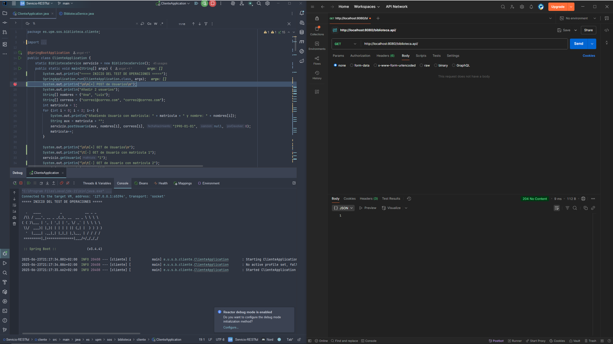

We create 2 users (POST):


We do a GET for each of them:

 

We create 3 books (POST):


The first 3 books are shown (`page=0&size=3`).

Next, the GET operations shown in the previous console output.

GET for the book with ISBN 1:


GET for the book with ISBN 4:

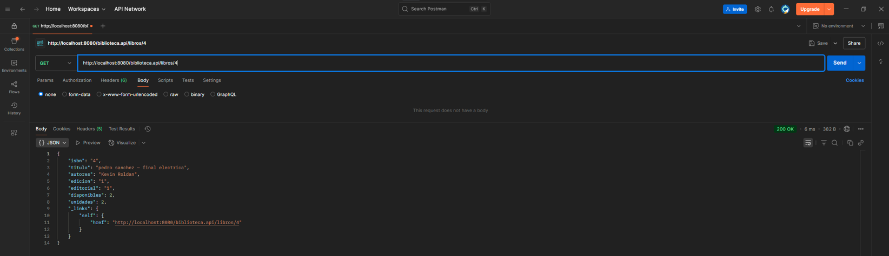

GET for book filtered by name:


GET for the number of available units of the book with ISBN 1:


We create 3 loans (POST):


GET for the loan with id=1:


We update a user and a book (PUT):


We verify the user update in Postman:


We verify the book update in Postman:

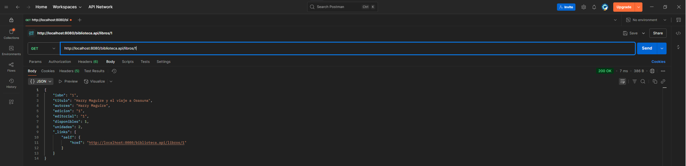

We delete the user with matriculation number 2:


We verify the existence of user 2:


We run all possible GET operations:


We verify the GET for users — in this case, there's only one left:


We verify the GET for books:


We verify the GET for loans:


We verify the GET for loans of a user:


Now we perform all possible PUT operations on loans: extending a loan, returning a loan, and verifying a return.

Extend a loan (PUT):


We verify that the return date was correctly extended.
The original return date was `LocalDate.now().plusWeeks(1)`. Since today is **25/06**, the initial date was **02/07**. After the extension (two additional weeks), the new return date should be **16/07**.


Now we try 2 error cases:

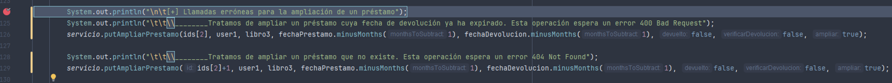
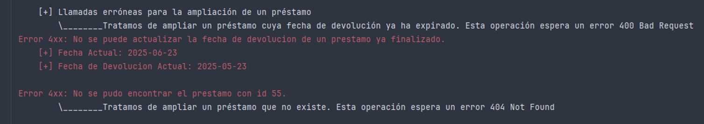

As seen, the appropriate errors are thrown. Testing in Postman shows the same:

 

Return a loan (PUT):


Verification:


Now we try 3 more error cases:


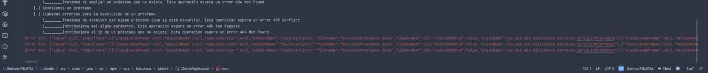

Again, all errors are triggered. We check in Postman:

- **409 Conflict**: already returned.


- **400 Bad Request**: loan ID 1 has a different book than the one sent — actual ISBN is 1, sent ISBN is 3.


- **404 Not Found**: loan with ID 3 not found.

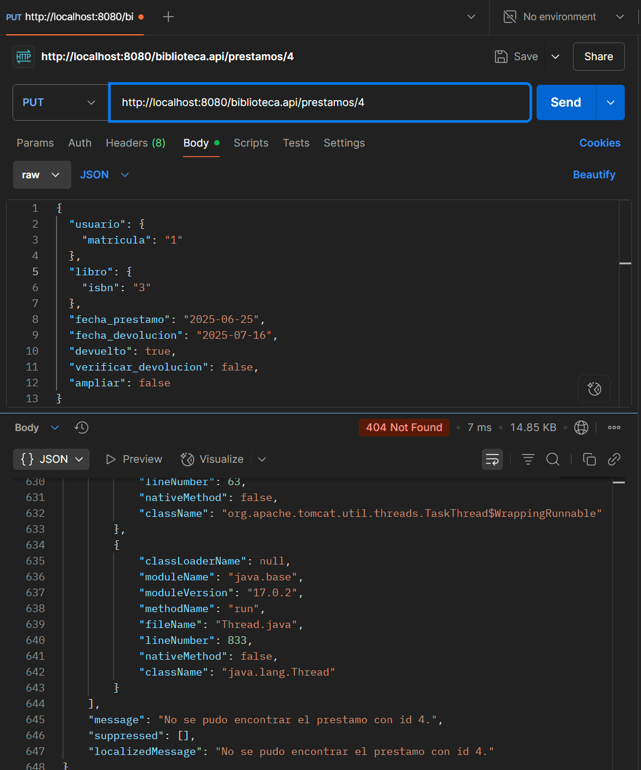

Verify a return (PUT):


Verification:


Since it was an overdue and unreturned loan, the number of pending returns for the user increases:


Indeed, it increased. If the user returns it now, the pending count drops to 0 and a penalty is applied.

We perform 3 incorrect return verifications:


All three errors appear. In Postman:

- **409 Conflict**: loan ID 3 cannot be verified — already verified, already returned, or not yet overdue.


- **400 Bad Request**: loan ID 3 has a different loan date — expected 2025-05-25, sent 2025-05-20.

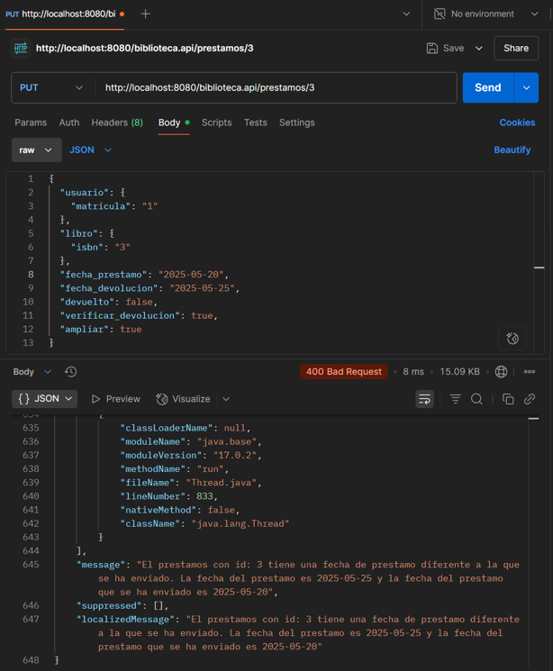

- **404 Not Found**: loan ID 4 not found.


Now we try to request a loan with a user that has pending returns, and then again after returns.


Both fail as expected. In Postman:

 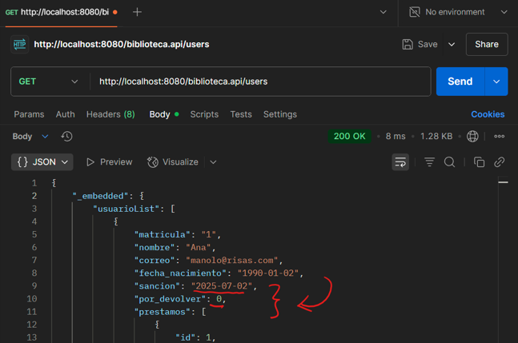

To finish, we test different GET methods:

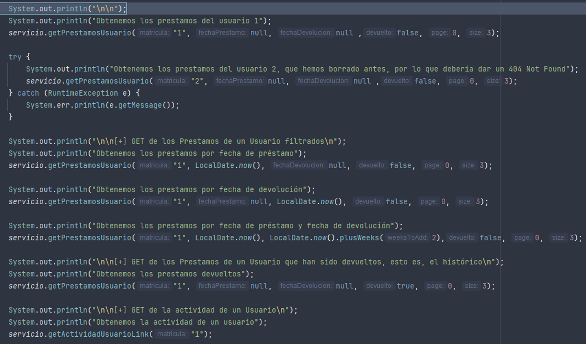


Verifying in the same order as the console and code:


Returned:


Activity:


Delete loans (DELETE):

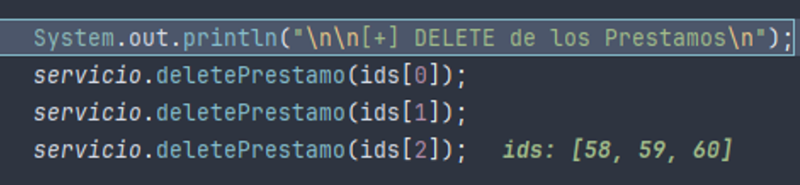


Delete books (DELETE):

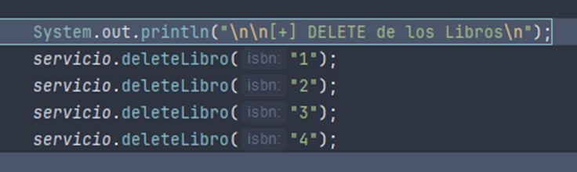


Delete users (DELETE):


And that concludes the client.

## Conclusion

This project is a good example of how to create a RESTful API using *Spring Boot*. It is quite complete, as it covers various aspects such as architecture, the use of REST patterns, centralized exception handling, and the creation of a client to consume the API.

As always, you can find the source code in my [GitHub repository](https://github.com/azuar4e/RESTful-Service).

Have a nice life! 👋
