## Introduction

This article covers the implementation of a cloud-native infrastructure deployed on Amazon Web Services (AWS), based on a microservices architecture developed in Go. It also incorporates a CI/CD pipeline that automates the deployment process and ensures high availability, fault tolerance, and service scaling through GitHub workflows and tools such as FluxCD.

The proposed infrastructure represents a common scenario in modern production environments, where microservices-based architectures have largely replaced traditional **monolithic systems**. In the latter, the application is built as a single unit, which may simplify initial development but introduces limitations as the system grows in complexity. In particular, the accumulation of responsibilities in a single component makes maintenance harder and means a failure can bring down the entire system.

In contrast, in a microservices architecture each component handles a specific piece of functionality and operates independently. This improves system availability since a failure in one service does not cause a total outage. **Decoupling** between services also makes it easier to evolve the system, add new features, and maintain it over time.

Cloud platforms, compared to traditional on-premises infrastructure, provide resources on demand, enabling scalability, high availability, and simplified infrastructure management. Providers like AWS, Microsoft Azure, and Google Cloud offer managed services that simplify the deployment and operation of distributed applications.

Adopting a cloud-native architecture is challenging, particularly around deployment, infrastructure management, and inter-service communication. Tools like Kubernetes and CI/CD systems help address these challenges.

To accomplish this, Terraform is used to provision the cloud infrastructure. On top of it, a Kubernetes cluster is deployed where FluxCD acts as the continuous delivery tool, connected to a GitHub repository containing the manifests needed to deploy and manage the application.

The application itself is a price-tracking tool for products on a given website. It is implemented as a microservices architecture composed of an API, a scraping service, and a serverless task re-scheduling component via AWS Lambda.

> **Note:** This article assumes the reader is familiar with the technologies used in this project.
>
> **Note 2:** The full thesis will be published on the university website at the end of the month, after the defense. It includes a more detailed explanation of the work for readers with less background in the topic, although it will be in spanish.

## Development

Before diving in, here is a high-level overview of the system design and the chosen tech stack.

The microservices are developed in [Go](https://go.dev/doc/faq#creating_a_new_language) (Golang), a language designed by Google specifically for scalability and distributed systems problems. It performs close to low-level languages while keeping memory management simple. It is also the *de facto* standard in the cloud-native ecosystem (Kubernetes itself is written in Go), which ensures optimal integration and efficient container deployment.

The following AWS resources were deployed to support the services:

- Amazon DynamoDB for job storage, and an Amazon Relational Database Service (RDS) PostgreSQL instance for user management. An AWS Lambda function implements the re-scheduler.
- A Virtual Private Cloud (VPC) encompassing the entire infrastructure, with two public and two private subnets. The main resources (EKS cluster, RDS) live in the private ones. The setup includes routing tables, an Internet Gateway, and a NAT Gateway for external connectivity.
- Amazon Simple Notification Service (SNS) for notifying users of price changes.
- Amazon Simple Queue Service for message queue management.
- Amazon CloudWatch for metrics collection and monitoring.
- Amazon Route 53 for DNS management, providing a stable access point for certain infrastructure resources.
- An Amazon Elastic Kubernetes Service (EKS) cluster with FluxCD installed. Using a GitOps approach, FluxCD applies the manifests defined in a GitHub repository and keeps the desired and actual cluster state in sync. The [NGINX Ingress Controller](https://github.com/kubernetes/ingress-nginx) exposes the application through an Elastic Load Balancer (ELB) as the external entry point.

> The NGINX Ingress Controller is deprecated, with no updates since March 2026. The natural alternative would be the Kubernetes **Gateway API**.

The diagram below shows the full infrastructure architecture.


**Why this stack?**

For databases, two solutions were chosen based on the use case: **DynamoDB** for jobs (simple key-based access, no joins needed) and **RDS PostgreSQL** for users (relational data with ACID guarantees). Each one where it makes sense.

For messaging, Kafka was ruled out as overkill for this volume, it requires maintaining a dedicated cluster and is designed for millions of events. **SQS/SNS** is sufficient with no operational overhead. SNS was preferred over SES for notifications because it allows adding extra channels like SMS without changing the architecture.

The re-scheduler was implemented as a **Lambda** function rather than a Kubernetes pod. Its logic is minimal and runs periodically, so there is no point in keeping a process running 24/7 with no workload.

For orchestration, the choice was between EKS, ECS, and EC2. ECS is simpler but locks you into the AWS ecosystem. EC2 would require managing orchestration manually, which is not viable here. **EKS** was chosen for its portability, mature ecosystem (FluxCD, NGINX Ingress...), and because it is the standard in professional environments.

Finally, **Terraform** was preferred over CloudFormation for being provider-agnostic, having a wider module ecosystem, and using a more readable and maintainable declarative language (HCL).

---

### Microservices

The microservices are developed in Go and deployed on the EKS cluster worker nodes via FluxCD, as described in the [CI/CD Pipeline](#cicd-pipeline-and-automation) section.

The following diagram illustrates how they interact:

<a id="micros-diagram"></a>
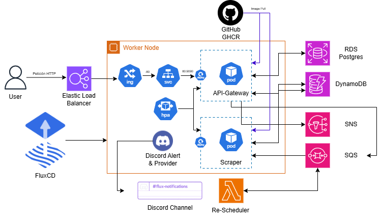

The user registers and logs in through the API Gateway. Once authenticated, they receive a JWT in a cookie granting access to the `/validate`, `/jobs` (GET, POST, DELETE), and `/jobs/:id` endpoints.

Upon registration, the user receives an Amazon SNS email asking them to subscribe in order to receive notifications. When a job is created (a product URL plus a target price), it is enqueued in SQS. The scraper consumes the queue using 5 parallel workers: it extracts the URL and price, scrapes the page, and compares the result with the target price. If the price is at or below the target, the user is notified via email.

The re-scheduler re-enqueues jobs that were processed by the scraper but have not yet reached the target price. Once the scraper deletes the message from the queue, the re-scheduler checks the last recorded price and, if the condition is not met, sends a new message to SQS for the next processing cycle.

The source code for the [API Gateway](https://github.com/azuar4e/api-gateway-tfg) and [Scraper](https://github.com/azuar4e/scraper-tfg) is available on GitHub. The re-scheduler code, being a smaller Lambda function, is included in the [Appendix](#appendix).

#### API Gateway

This microservice was built using [Gin](https://github.com/gin-gonic/gin), a lightweight Go web framework for REST APIs, along with the AWS SDK for Go.

The application entry point is `main.go`. Before initializing the router, an `init` function establishes connections to all external services:

```go
func init() {
    initializers.LoadEnvVariables()
    initializers.ConnectToPostgres()
    initializers.SyncDB()
    initializers.ConnectToDynamo()
    initializers.ConnectToSQS()
    initializers.ConnectToSNS()
}
```

The router and endpoints are configured in the main function:

```go
func main() {
    r := gin.Default()

    v1 := r.Group("/api/v1")
    // Public endpoints
    v1.POST("/signin", controllers.SigninHandler)
    v1.POST("/signup", controllers.RegisterHandler)

    v1.Use(middleware.AuthMiddleware())

    // Protected endpoints
    v1.POST("/jobs", handlers.CreateJobHandler)
    v1.GET("/jobs", handlers.GetJobsHandler)
    v1.DELETE("/jobs", handlers.DeleteJobsHandler)
    v1.GET("/jobs/:id", handlers.GetJobByIdHandler)
    v1.DELETE("/jobs/:id", handlers.DeleteJobHandler)
    v1.GET("/validate", controllers.Validate)

    r.Run(":9090")
}
```

The API listens on port `9090`, accessible externally through the ELB under the `/api/v1` prefix. The auth middleware is placed deliberately after the public authentication endpoints.

During registration (`/signup`), the user sends their credentials, the password is hashed and stored in PostgreSQL, and the user is subscribed to an SNS topic. On login (`/signin`), the password is validated and a signed JWT is generated:

```go
token := jwt.NewWithClaims(jwt.SigningMethodHS256, jwt.MapClaims{
    "sub": user.ID,
    "exp": time.Now().Add(time.Hour * 24 * 30).Unix(),
})

tokenString, err := token.SignedWith([]byte(os.Getenv("JWT_SECRET")))

// ...

c.SetSameSite(http.SameSiteLaxMode)
c.SetCookie("Authorization", tokenString, 3600*24*30, "", "", false, true)
c.JSON(http.StatusOK, gin.H{})
```

The auth middleware reads the token from the cookie and validates it:

```go
token, err := jwt.Parse(tokenString, func(token *jwt.Token) (any, error) {
    return []byte(os.Getenv("JWT_SECRET")), nil
}, jwt.WithValidMethods([]string{jwt.SigningMethodHS256.Alg()}))
if err != nil {
    c.AbortWithStatusJSON(http.StatusUnauthorized, gin.H{"error": "Invalid token: " + err.Error()})
    return
}
```

The DynamoDB data structure for jobs:

```go
type JobDynamoItem struct {
  PK          int64   `dynamodbav:"PK"` // user_id
  SK          int64   `dynamodbav:"SK"` // job_id
  URL         string  `dynamodbav:"url"`
  TargetPrice float64 `dynamodbav:"target_price"`
  LastPrice   float64 `dynamodbav:"last_price"`
  Status      string  `dynamodbav:"status"`
  CreatedAt   string  `dynamodbav:"created_at"`
  UpdatedAt   string  `dynamodbav:"updated_at"`
}
```

Handler tests are run in isolation using mocks for external dependencies, defining an interface that abstracts the `PutItem` operation:

```go
type DynamoInterface interface {
  PutItem(ctx context.Context, params *dynamodb.PutItemInput, optFns ...func(*dynamodb.Options)) (*dynamodb.PutItemOutput, error)
}
```

This allows injecting a mock implementation during tests without real AWS connections.

The repository also includes a GitHub Actions CI pipeline that automates test execution, container image builds, and publishing to GHCR (shown in the [microservices diagram](#micros-diagram)).

#### Scraper

This microservice uses [Playwright](https://github.com/playwright-community/playwright-go) for browser automation, along with the AWS SDK for Go.

Like the API Gateway, it initializes connections to DynamoDB, SQS, and SNS via an `init` function before the main logic runs.

The `main` function defines a concurrent processing strategy with five workers:

```go
func main() {
  messageChan := make(chan types.Message)

  for w := 1; w <= 5; w++ {
    go worker(w, messageChan)
  }

  for {
    output, err := initializers.SQS.ReceiveMessage(context.TODO(), &sqs.ReceiveMessageInput{
        QueueUrl:            aws.String(os.Getenv("SQS_QUEUE_URL")),
        MaxNumberOfMessages: 1,
        WaitTimeSeconds:     20,
    })
    // ...
    for _, m := range output.Messages {
      messageChan <- m
    }
  }
}

func worker(id int, messages <-chan types.Message) {
  for m := range messages {
    setJobStatus(m, "processing")
    handlers.ProcessMessageHandler(m)
    initializers.SQS.DeleteMessage(context.TODO(), &sqs.DeleteMessageInput{
      QueueUrl:      aws.String(os.Getenv("SQS_QUEUE_URL")),
      ReceiptHandle: m.ReceiptHandle,
    })
  }
}
```

Each worker sets the job status to `processing` before handling it, preventing the re-scheduler from re-enqueuing it prematurely. Extraction is done by launching a headless Firefox browser:

```go
pw, err := playwright.Run()
browser, err := pw.Firefox.Launch(playwright.BrowserTypeLaunchOptions{
    Headless: playwright.Bool(true),
})
page, err := browser.NewPage(playwright.BrowserNewPageOptions{
    Locale:    playwright.String("es-ES"),
    UserAgent: playwright.String("Mozilla/5.0 (Windows NT 10.0; Win64; x64) AppleWebKit/537.36 (KHTML, like Gecko) Firefox/122.0"),
})
```

Once the page is loaded, the service navigates to the job URL and locates the title and price selectors based on the domain (Amazon, PCComponentes). If the current price is at or below the target, the job moves to `notified` and an SNS notification is sent. Otherwise, the status is updated to `active` and the last observed price is stored for the next cycle.

#### Lambda Re-Scheduler

The re-scheduler is an AWS Lambda function responsible for re-enqueuing jobs that remain in `active` state after being processed by the scraper. It scans DynamoDB, identifies jobs that have not yet reached their target price, and sends a new message to SQS.

Its value is not in algorithmic complexity but in the architectural decision to decouple re-scheduling logic from the main scraping process, taking advantage of the serverless model.

---

### Infrastructure as Code (IaC)

Infrastructure provisioning is automated with **Terraform**. A key motivation was staying within the AWS Academy Learner Lab budget ($50 limit): with IaC, the entire infrastructure can be spun up and torn down in minutes.

The source code is available in the [GitHub repository](https://github.com/azuar4e/terraform-tfg).

Resources are organized into modules:

```plaintext
terraform/
    environments/
    modules/
        cloudwatch/
        dynamo/
        eks/
        networking/
        rds/
        route53/
```

These modules provision the resources shown in the diagram below:

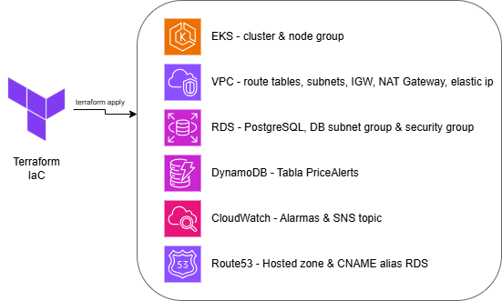

> **Note:** Due to scope constraints, the SNS topic, SQS queue, and Lambda re-scheduler were deployed manually. The Learner Lab environment regenerates ARNs each session, making Terraform management of those resources impractical without added complexity.

For the Lambda function, a new instance is created with Amazon Linux 2023 as the runtime and the existing `LabRole` as the execution role. The function code needs to be compiled first:

```bash
$env:GOOS="linux"
$env:GOARCH="amd64"
$env:CGO_ENABLED="0"
go build -o bootstrap ./cmd/

aws lambda update-function-code --function-name microservice-scheduler --zip-file fileb://lambda.zip
```

The trigger is configured via **Amazon EventBridge** with a rule that fires every minute, and the required environment variables are added to the function.

For SQS, two parameters are configured: maximum message size (256 KB) and `Receive message wait time` (20 seconds), to reduce the number of empty responses from the scraper's continuous polling.


For the SNS topic, a name (`PricesNotification`) is assigned and encryption is enabled; everything else stays at default.

For the `tfstate`, in a real environment it would be stored in an S3 bucket with state locking via DynamoDB, using the Cloud Posse `tfstate-backend` public module:

```hcl
module "terraform_state_backend" {
  source    = "cloudposse/tfstate-backend/aws"
  namespace = "tfg"
  stage     = "dev"
  name      = "azuar4e"
  attributes = ["state"]

  terraform_backend_config_file_path = "."
  terraform_backend_config_file_name = "backend.tf"
  force_destroy                      = false
}
```

The VPC is configured with two public and two private subnets across availability zones:

```hcl
resource "aws_subnet" "public-1a" {
  vpc_id            = aws_vpc.tfg-vpc.id
  cidr_block        = "10.0.1.0/24"
  availability_zone = "us-east-1a"
  tags = { Name = "public-1a" }
}

resource "aws_subnet" "private-1a" {
  vpc_id            = aws_vpc.tfg-vpc.id
  cidr_block        = "10.0.2.0/24"
  availability_zone = "us-east-1a"
  tags = { Name = "private-1a" }
}
# (same for 1b)
```

EKS is configured with secrets encryption via AWS KMS:

```hcl
resource "aws_eks_cluster" "main" {
  name     = "eks-cluster"
  role_arn = var.cluster_role_arn

  vpc_config {
    subnet_ids              = var.private_subnet_ids
    endpoint_public_access  = true
    endpoint_private_access = true
  }

  encryption_config {
    provider {
      key_arn = "arn:aws:kms:REGION:ACCOUNT_ID:alias/aws/eks"
    }
    resources = ["secrets"]
  }
}
```

RDS is configured as not publicly accessible, with a Security Group restricting access to EKS cluster traffic only:

```hcl
ingress {
  from_port       = 5432
  to_port         = 5432
  protocol        = "tcp"
  security_groups = [var.eks_cluster_security_group_id]
}
```

CloudWatch alarms are configured for Lambda errors, RDS/EKS CPU usage, and SQS queue depth, notifying a KMS-encrypted SNS topic:

```hcl
resource "aws_sns_topic" "alarms" {
  name              = "cloudwatch-alarms"
  kms_master_key_id = "alias/aws/sns"
}

resource "aws_cloudwatch_metric_alarm" "lambda-errors" {
  alarm_name          = "lambda-errors-alarm"
  comparison_operator = "GreaterThanOrEqualToThreshold"
  evaluation_periods  = 2
  metric_name         = "Errors"
  namespace           = "AWS/Lambda"
  period              = 120
  statistic           = "Sum"
  threshold           = 1
  alarm_actions       = [aws_sns_topic.alarms.arn]
  dimensions = {
    FunctionName = var.lambda_function_name
  }
}
```

Route53 exposes a stable alias for RDS (`db.dev.internal`), so microservice configuration does not need to change when the instance is recreated:

```hcl
resource "aws_route53_record" "db_record" {
  zone_id = aws_route53_zone.dev_internal.zone_id
  name    = "db.dev.internal"
  type    = "CNAME"
  ttl     = 60
  records = [var.rds_endpoint]
}
```

The infrastructure cost estimate, calculated with [Infracost](https://www.infracost.io/), comes to **\$187/month** with all resources running 24/7. In practice, only \$19 was spent during development thanks to spinning the infrastructure up and down as needed.

| Module | Resource | Monthly cost (USD) |
|--------|----------|--------------------|
| eks | EKS Cluster | $73.00 |
| eks | Node Group (2x t3.medium + 40GB gp2) | $64.74 |
| networks | NAT Gateway | $32.85 |
| rds | RDS PostgreSQL db.t3.micro + 20GB gp2 | $15.44 |
| cloudwatch | CloudWatch Alarms (4x standard) | $0.40 |
| route53 | Hosted Zone | $0.50 |
| terraform_state_backend | S3 + DynamoDB (Terraform state) | variable |
| dynamo | DynamoDB jobs table | variable |
| cloudwatch | SNS Topic Alarms | variable |
| **Monthly base total** | | **$186.93** |

> Resources marked as variable depend on usage (requests, storage, notifications) and have zero or minimal cost in the development environment. The base total corresponds to resources with a fixed price regardless of traffic.

---

### Kubernetes Orchestration

Kubernetes orchestration relies on Ingress, Services, Deployments, ConfigMaps, Secrets, metrics-server, and HPA, all deployed via FluxCD (see the [CI/CD Pipeline](#cicd-pipeline-and-automation) section).

The API listens on port `9090`, exposed via a ClusterIP Service:

```yaml
spec:
  ports:
  - port: 80
    protocol: TCP
    targetPort: 9090
  selector:
    app: api-gateway
  type: ClusterIP
```

Traffic ingress is managed by the [NGINX Ingress Controller](https://github.com/kubernetes/ingress-nginx), installed via HelmRelease and HelmRepository. The Ingress routes all incoming requests to the API Service:

```yaml
spec:
  ingressClassName: nginx
  rules:
  - http:
      paths:
      - backend:
           service:
             name: api-svc
             port:
               number: 80
        path: /
        pathType: Prefix
```

In `values.yaml`, the Ingress Controller is configured with a LoadBalancer Service, which triggers automatic ELB creation in AWS:

```yaml
values:
  controller:
    admissionWebhooks:
      enabled: false
    replicaCount: 1
    service:
      type: LoadBalancer
```

ConfigMaps are used for non-sensitive configuration variables; Secrets handle sensitive data like AWS credentials or external webhooks.

Secrets are created manually in the cluster and are not committed to the repository:

```bash
kubectl create secret generic discord-url -n flux-system \
  --from-literal=address="<DISCORD_WEBHOOK_URL>"

kubectl create secret generic aws-creds \
  --from-literal=AWS_ACCESS_KEY_ID=<AWS_ACCESS_KEY_ID> \
  --from-literal=AWS_SECRET_ACCESS_KEY=<AWS_SECRET_ACCESS_KEY> \
  --from-literal=AWS_SESSION_TOKEN=<AWS_SESSION_TOKEN> \
  --from-literal=AWS_DEFAULT_REGION=us-east-1

kubectl create secret generic db-credentials \
  --from-literal=DB="host=db.dev.internal user=dbadmin password=<PASSWORD> dbname=mydb port=5432 sslmode=require"
```

Three secrets in total: one for the Discord webhook, one for AWS credentials so the microservices can interact with AWS services, and one for the RDS PostgreSQL connection.

A metrics-server is also configured to expose CPU and memory metrics for pods to the Kubernetes API, which is a prerequisite for HPA to function.

---

### CI/CD Pipeline and Automation

The software lifecycle relies on two complementary mechanisms: **GitHub Actions** for continuous integration and **FluxCD** for continuous delivery. GitHub Actions validates code, runs tests, and builds container images; FluxCD implements the GitOps approach on EKS using a Git repository as the single source of truth.

The FluxCD configuration is available in the public [flux-repo-tfg](https://github.com/azuar4e/flux-repo-tfg) repository.

FluxCD is bootstrapped with:

```bash
flux bootstrap github \
  --owner=azuar4e \
  --repository=flux-repo-tfg \
  --branch=master \
  --path=./clusters/home \
  --token-auth \
  --components-extra=image-reflector-controller,image-automation-controller
```

Once bootstrapped, FluxCD deploys and keeps in sync all resources defined in the repository: microservice manifests, internal services, ingress rules, metrics-server, image registry configs, and the objects needed to automate version updates. Some of the deployed components are shown in the [microservices diagram](#micros-diagram).

The image auto-update policy:

```yaml
# In the Deployment manifest:
- image: ghcr.io/azuar4e/scraper-tfg:22 # {"$imagepolicy": "flux-system:scraper-tfg"}
```

```yaml
apiVersion: image.toolkit.fluxcd.io/v1
kind: ImagePolicy
metadata:
  name: scraper-tfg
  namespace: flux-system
spec:
  imageRepositoryRef:
    name: scraper-tfg
  filterTags:
    pattern: '^\d+$'
  policy:
    numerical:
      order: asc
```

An `ImageUpdateAutomation` resource then commits the manifest changes back to the GitOps repository whenever a new valid image version is detected.

With this setup, pushing to a microservice repository triggers GitHub Actions to build and publish the new image to GHCR; FluxCD detects the new version, auto-commits the updated manifest, reconciles the cluster, and sends a Discord notification.

---

### Service Communication

Inter-service communication follows an asynchronous, decoupled model. Instead of direct calls between microservices, SQS acts as the intermediary and SNS is the outbound notification channel.

The full flow:

1. The user calls the API Gateway, which enqueues the message in SQS.
2. The scraper reads from the queue and processes the message.
3. If the price target is met, the user is notified via SNS.
4. If not, the Lambda scans DynamoDB for `active` jobs and re-inserts them into SQS for the next cycle.


A `visibility timeout` of 30 seconds is configured in SQS to ensure a message is not consumed by multiple workers simultaneously. The scraper also sets the job status to `processing` in DynamoDB before handling it, preventing the re-scheduler from re-enqueuing it prematurely.

---

### Security

Security is split between `security-of-the-cloud` (AWS's responsibility: hardware, physical network, hypervisors...) and `security-in-the-cloud` (the developer's responsibility):

- **At-rest:** encryption enabled on RDS PostgreSQL and the DynamoDB table.
- **In-transit:** as a known limitation, TLS was not configured, so external communications happen over HTTP. Internal pod-to-pod communication also lacks TLS since no service mesh was implemented.

For **network filtering**, Security Groups on RDS restrict access to traffic coming from the EKS cluster Security Group only:

```hcl
ingress {
  from_port       = 5432
  to_port         = 5432
  protocol        = "tcp"
  security_groups = [var.eks_cluster_security_group_id]
}
```

Application access is controlled through the API Gateway with JWT authentication. At the infrastructure level, the public/private subnet separation ensures only components that need external exposure are reachable from the Internet. All inbound traffic is centralized through the Ingress Controller and ELB, reducing the attack surface.

Kubernetes configuration is managed through ConfigMaps and Secrets, keeping a clean separation between non-sensitive configuration parameters and sensitive credentials.

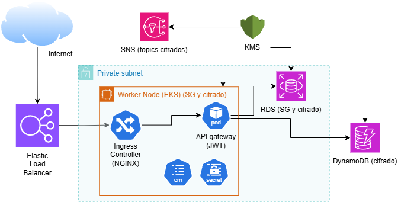

---

### Scalability and Resources

The system was designed with scalability and efficient resource usage in mind. Two main mechanisms were applied:

1. **Resource requests and limits** on Deployments to prevent a single pod from consuming all node resources.
2. **HPA** for the scraper and the API, dynamically adjusting the number of replicas based on load.

Limits defined for the API:

```yaml
resources:
  requests:
    cpu: "50m"
    memory: "32Mi"
  limits:
    cpu: "200m"
    memory: "128Mi"
```

And for the scraper (adjusted after an `OOMKilled` during testing):

```yaml
resources:
  requests:
    cpu: "300m"
    memory: "256Mi"
  limits:
    cpu: "900m"
    memory: "1Gi"
```

The HPA was configured with a 50% CPU threshold and a range of 1 to 10 replicas for the API, and 1 to 4 for the scraper. The EKS node group was designed with a minimum of 1 node, a desired count of 2, and a maximum of 3 `t3.medium` instances (2 vCPUs, 4 GB RAM), with the ability to scale up to 6 cores and 12 GB via the Cluster Autoscaler.

> Scaling the scraper by CPU is not ideal since it is an asynchronous service whose load depends on the number of messages in the SQS queue, not HTTP traffic. CPU is used as a proxy metric given the lack of a custom-metrics-based HPA. A future improvement would be adopting [KEDA](https://keda.sh/) to scale based on [SQS queue depth](https://keda.sh/docs/2.19/scalers/aws-sqs/).


---

## Validation and Testing

This section validates the correct behavior of the system, both at the functional level and from an infrastructure and deployment automation perspective.

---

### API Functional Validation

#### Endpoint /signup

The API correctly registers a new user.

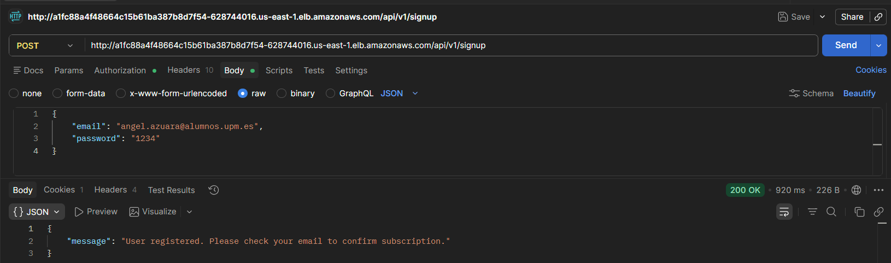

After registration, the API automatically subscribes the user to an SNS topic, triggering a confirmation email.


The user is listed as a subscriber once the invitation is accepted.

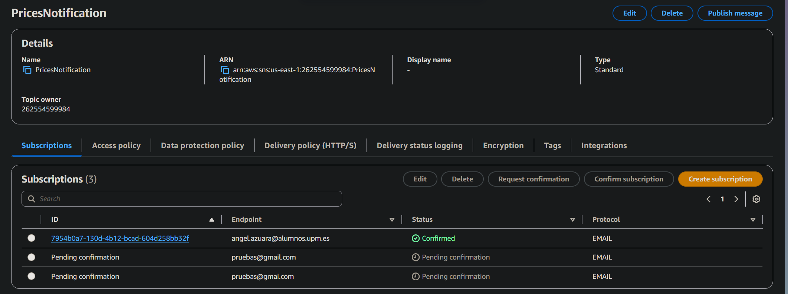

Error handling was also validated, such as a missing password field.


#### Endpoint /signin

The API correctly authenticates a user with valid credentials, generating a cookie containing the JWT token.

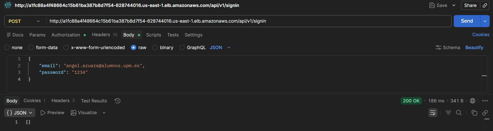


With incorrect credentials it returns an auth error, and without an active session it returns 401 Unauthorized.


#### Endpoint /validate

Checks whether the user is authenticated via the session cookie.

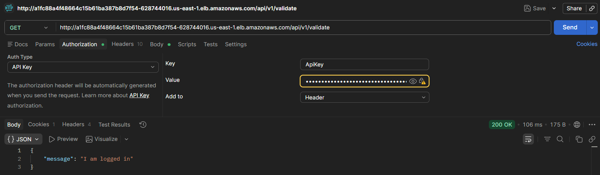

#### Endpoint /jobs

Allows creating, listing, and deleting jobs for the authenticated user.

When a job is created with a target price above the current product price, the system sends an email with the subject *Price Alert*, confirming the notification flow works correctly.


Missing parameters return a `400 Bad Request`:


Listing jobs:

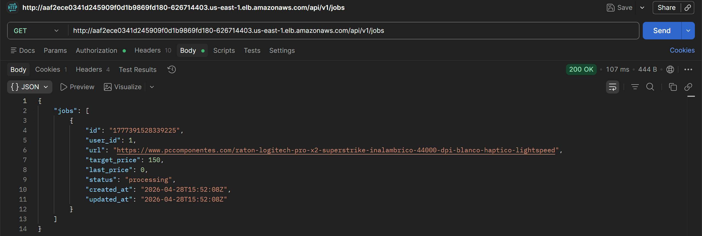

Deleting jobs:


#### Endpoint /jobs/:id

Retrieves or deletes a specific job by its identifier. Returns 404 Not Found if it does not exist.


---

### Asynchronous Job Processing

When a job is created, it is stored with `pending` status. Once processed by the scraper, the status changes to `active` and the last price is updated. At some point in between, `processing` status can be observed, indicating the scraper has read the job from the SQS queue.


---

### System Monitoring

AWS monitoring tools were used to validate the behavior of the asynchronous components.


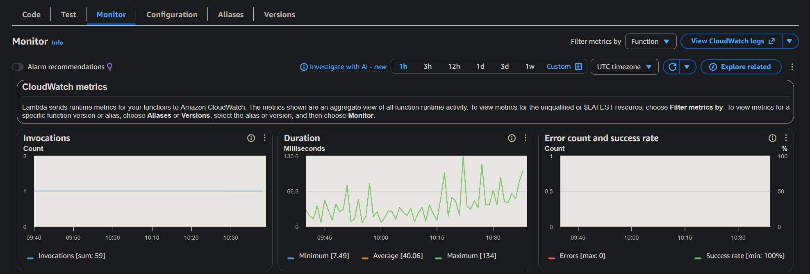

---

### Infrastructure Validation

CloudWatch alarms were configured to monitor the state of the deployed resources.

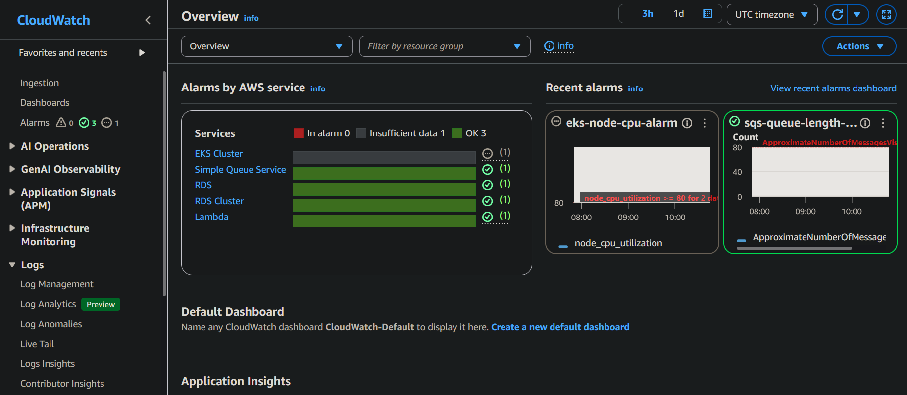

---

### Deployment Automation

Pushing a commit to the repository triggers GitHub Actions to build and publish the new image. FluxCD detects the new version, updates the manifest (auto-commit from the Flux bot), and sends a Discord notification confirming cluster reconciliation.


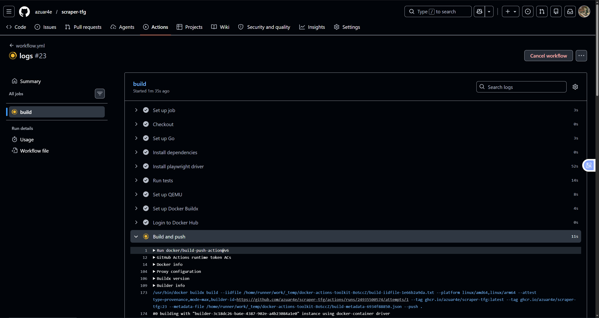
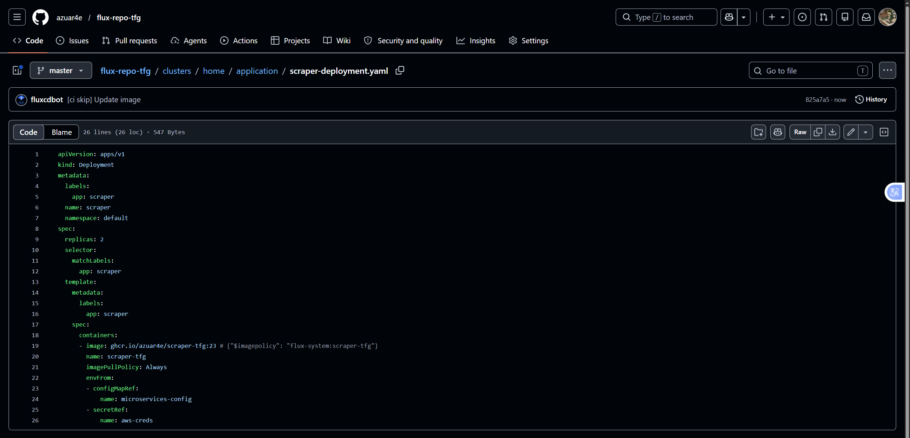


---

### Load and Performance Testing

Once the system was functionally validated, load tests were run with **k6** to analyze behavior under different demand levels.

As mentioned in the [Scalability and Resources](#scalability-and-resources) section, the scraper should ideally scale based on queue depth rather than CPU usage. These tests therefore primarily evaluate the API's response capacity.

#### Load Test

50 concurrent virtual users for 4 minutes sending `HTTP GET` requests to `/jobs`:

```javascript
export const options = {
  stages: [
    { duration: "30s", target: 50 },
    { duration: "3m", target: 50 },
    { duration: "30s", target: 0 },
  ],
};
```

**Result:** 100% successful checks across 6,837 requests, mean latency 541ms, median 114ms, p(95) 2.26s.


#### Stress Test

Progressive load scaling from 100 to 1,000 virtual users:

```javascript
export const options = {
  stages: [
    { duration: "30s", target: 100 },
    { duration: "1m",  target: 200 },
    { duration: "1m",  target: 500 },
    { duration: "1m",  target: 1000 },
    { duration: "30s", target: 0 },
  ],
};
```

**Result:** 80,145 requests at 333 req/s, mean latency 147ms, median 110ms. Only 0.61% failures (491 requests) at peak load with 1,000 concurrent VUs.


#### Spike Test

Sudden transition from 50 to 2,000 virtual users in 10 seconds:

```javascript
export const options = {
  stages: [
    { duration: "30s", target: 50 },
    { duration: "10s", target: 2000 },
    { duration: "1m",  target: 2000 },
    { duration: "10s", target: 50 },
    { duration: "30s", target: 0 },
  ],
};
```

**Result:** 71.54% failure rate, all timeouts, mean latency 18.5s. The HPA does not have enough time to react to such an abrupt spike — the expected behavior for this type of test.

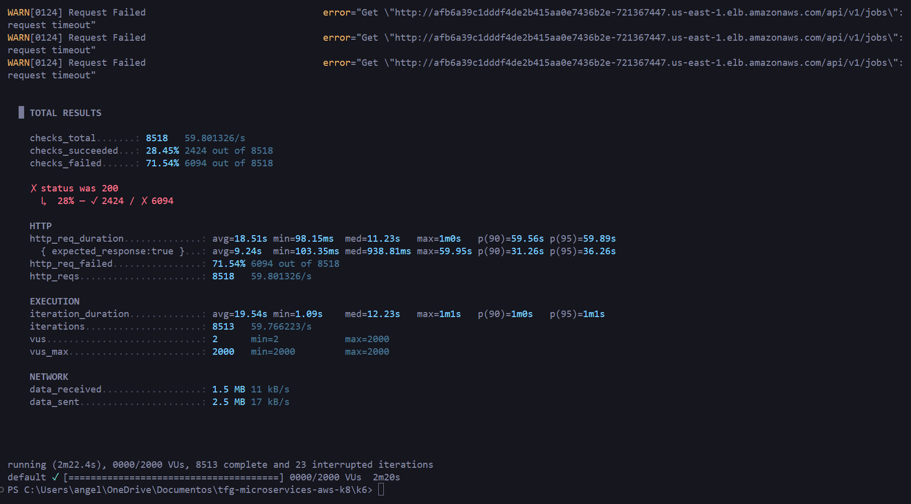

#### Summary

| Scenario | VUs | Requests | Error rate | Mean latency | P95 |
|----------|-----|----------|------------|--------------|-----|
| Load (sustained) | 50 | 6,837 | 0.00% | 541ms | 2,260ms |
| Stress (progressive) | 1,000 | 80,145 | 0.61% | 147ms | 151ms |
| Spike (avalanche) | 2,000 | 8,518 | 71.54% | 18,510ms | >60,000ms |

---

## Conclusions

This project illustrates the importance of microservices-based architectures and the cloud-native approach in modern software development.

The entire application lifecycle was covered end-to-end: from technology stack selection, containerization, and service validation automated via GitHub Actions, through to deployment on an EKS cluster using a GitOps tool like FluxCD, where a repository serves as the single source of truth for the desired cluster state.

Infrastructure provisioning was also automated using Infrastructure as Code, allowing the environment to be declared, spun up, and torn down reproducibly, with state stored in an S3 backend.

All the code is available in the GitHub repositories:

>👉 <https://github.com/azuar4e/api-gateway-tfg>
>
>👉 <https://github.com/azuar4e/scraper-tfg>
>
>👉 <https://github.com/azuar4e/flux-repo-tfg>
>
>👉 <https://github.com/azuar4e/terraform-tfg>

Thanks for reading, see you next time. Take care! 👋

---

## Appendix

```go
package main

import (
    "context"
    "encoding/json"
    "log"
    "os"

    "github.com/aws/aws-lambda-go/lambda"
    "github.com/aws/aws-sdk-go-v2/aws"
    "github.com/aws/aws-sdk-go-v2/feature/dynamodb/attributevalue"
    "github.com/aws/aws-sdk-go-v2/service/dynamodb"
    "github.com/aws/aws-sdk-go-v2/service/dynamodb/types"
    "github.com/aws/aws-sdk-go-v2/service/sqs"
    "github.com/azuar4e/lambda-scheduler-tfg/internal/initializers"
    "github.com/azuar4e/lambda-scheduler-tfg/internal/models"
)

func init() {
    initializers.LoadEnvVariables()
    initializers.ConnectToDynamo()
    initializers.ConnectToSQS()
}

func main() {

    lambda.Start(func(ctx context.Context) error {
        result, err := initializers.DY.Scan(context.TODO(), &dynamodb.ScanInput{
            TableName:        aws.String("PriceAlerts"),
            FilterExpression: aws.String("#s = :s"),
            ExpressionAttributeNames: map[string]string{
                "#s": "status",
            },
            ExpressionAttributeValues: map[string]types.AttributeValue{
                ":s": &types.AttributeValueMemberS{Value: "active"},
            },
        })

        if err != nil {
            return err
        }

        for _, item := range result.Items {
            var jobItem models.JobDynamoItem
            attributevalue.UnmarshalMap(item, &jobItem)
            job := jobItem.ToJob()
            body, err := json.Marshal(job)

            if err != nil {
                log.Printf("Error generating the json")
                continue
            }

            _, err = initializers.SQS.SendMessage(context.TODO(), &sqs.SendMessageInput{
                QueueUrl:    aws.String(os.Getenv("SQS_QUEUE_URL")),
                MessageBody: aws.String(string(body)),
            })

            if err != nil {
                log.Printf("Error queueing the job %s in SQS: %v\n", job.ID, err)
                continue
            }
        }
        return nil
    })
}
```
