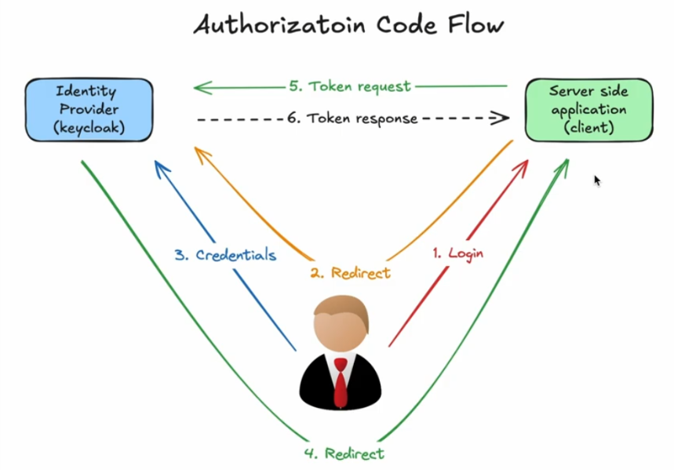
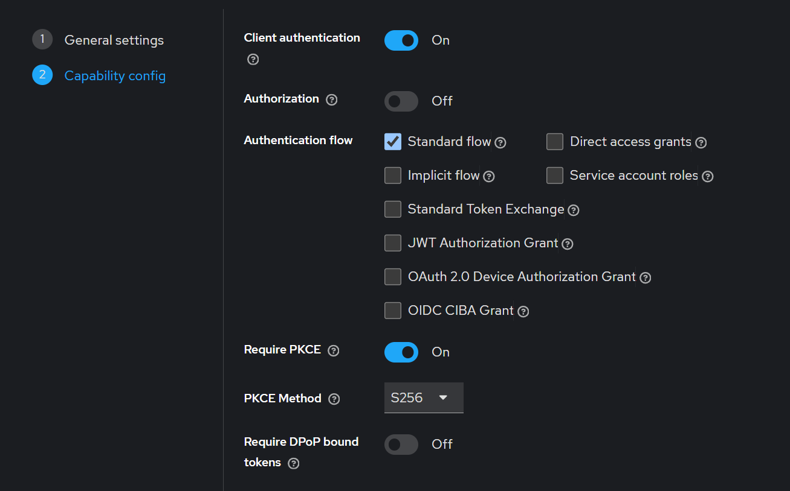
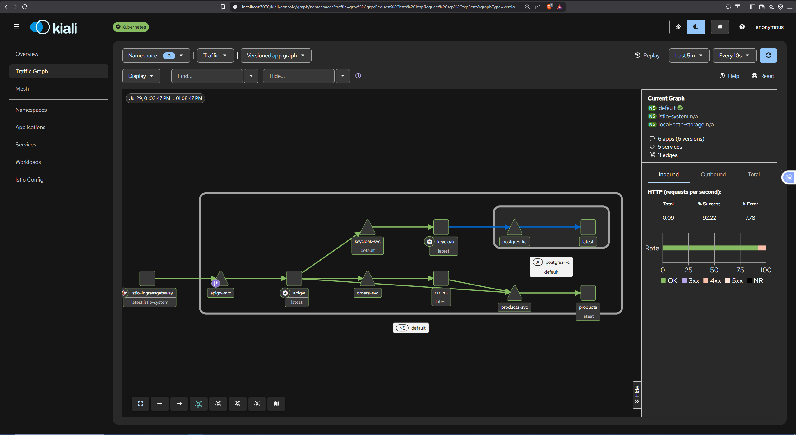
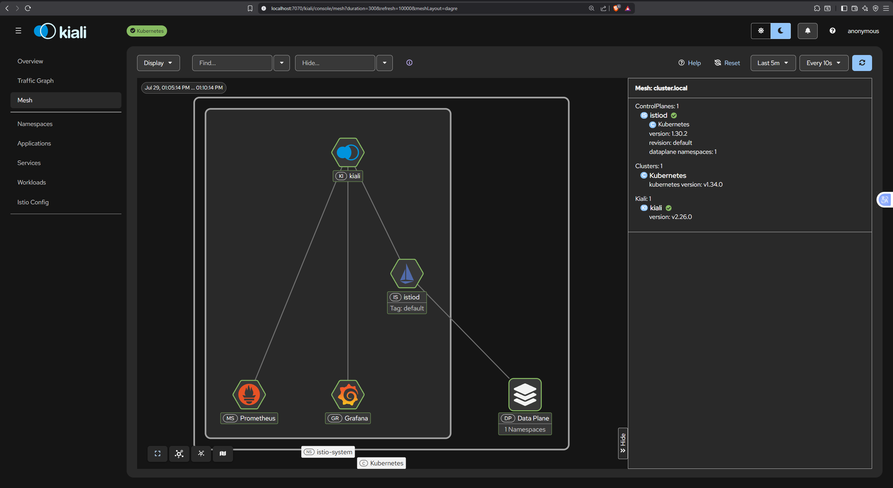
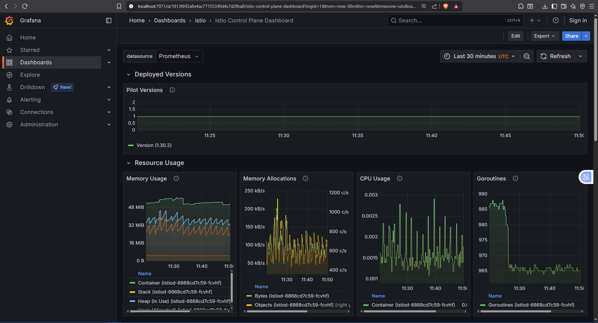

¿Alguna vez te has preguntado cómo gestionar la autenticación de usuarios delegándola en un *Identity Provider* (IdP), y cómo asegurar la comunicación entre tus microservicios sin tener que implementar esa lógica tú mismo? Esto es justo lo que vamos a ver en este artículo.

La motivación para esta publicación surge de la necesidad de dar solución a algunas de las limitaciones de mi [trabajo de fin de grado](https://azuar4e.github.io/es/posts/tfg/). Las dos principales carencias eran la autenticación de usuarios, que se hacía manualmente generando un JWT, y la ausencia de HTTPS en la comunicación entre microservicios. En este nuevo proyecto resolvemos ambas: delegamos la autenticación en un IdP real, y aseguramos las comunicaciones internas con mTLS de forma transparente a nivel de aplicación.

Para ello utilizamos un IdP gratuito, **Keycloak**, para gestionar el acceso de los usuarios, e **Istio** como *malla de servicios* (o *service mesh*). A alto nivel, Istio despliega un proxy Envoy como *sidecar* en cada pod, que intercepta el tráfico entrante y saliente y lo cifra automáticamente vía mTLS, sin que el código de tus microservicios tenga que saber nada de eso.

## Descripción General

Para llevar a cabo este trabajo, se ha diseñado como caso de uso un pequeño e-commerce basado en microservicios. La aplicación no utiliza persistencia de datos y la lógica de la misma es deliberadamente sencilla, ya que el objetivo principal del proyecto no es construir una aplicación de comercio electrónico completa, sino utilizar un ejemplo sencillo para centrarnos en los mecanismos de autenticación y comunicación segura entre servicios.

La aplicación está compuesta por tres microservicios principales: un API Gateway, un servicio de productos (``products``) y un servicio de pedidos (``orders``). El API Gateway actúa como punto de entrada a la aplicación y se encarga de redirigir las peticiones hacia los microservicios correspondientes. Además, es el responsable de gestionar el flujo de autenticación de los usuarios, como veremos más adelante en la sección dedicada al [flujo OAuth](#flujo-oauth-authorization-code).

El microservicio ``products`` mantiene en memoria un catálogo sencillo de productos y permite consultar los productos disponibles. Por su parte, el microservicio ``orders`` permite crear y consultar pedidos.

Una vez autenticado el usuario, el API Gateway valida sus credenciales y reenvía las peticiones al microservicio correspondiente. La comunicación entre estos se realiza a través de la malla de servicios de Istio, que proporciona autenticación mutua mediante mTLS entre los diferentes componentes de la aplicación. De esta forma, la seguridad de las comunicaciones queda desacoplada de la lógica de negocio de los microservicios.

Por parte de los microservicios, únicamente nos detendremos a analizar el flujo de código relacionado con la autenticación y la interacción con el IdP. El resto de la implementación puede consultarse en el [repositorio de GitHub](https://github.com/azuar4e/micros-sample).

La infraestructura utilizada para soportar el despliegue consiste en un clúster local de Kubernetes creado mediante Kind. Aunque el proyecto podría desplegarse en un entorno cloud realizando algunas modificaciones en la infraestructura, para los objetivos de este artículo no resulta relevante utilizar un proveedor concreto. El uso de un clúster local permite centrarnos en los conceptos fundamentales de Keycloak, OAuth 2.0, Istio y mTLS sin introducir complejidad adicional relacionada con un proveedor cloud.

A lo largo del artículo veremos cómo se integran estos componentes, desde el flujo de autenticación del usuario hasta la comunicación interna entre los microservicios, y cómo estas responsabilidades pueden delegarse en componentes especializados sin tener que implementar manualmente la seguridad dentro de cada servicio.

## Flujo OAuth: Authorization Code

[OAuth 2.0](https://auth0.com/es/intro-to-iam/what-is-oauth-2) es un estándar diseñado para que las aplicaciones obtengan acceso autorizado a recursos protegidos en nombre de un usuario o servicio. Existen varios flujos como las credenciales de cliente (*client credentials*) o el código de autorización (con y sin PKCE), que es en el que nos centraremos en este artículo.

En el flujo de concesión del código de autorización, el servidor de autorización devuelve un código de un solo uso, que es intercambiado por un token de acceso. Al implementar PKCE al flujo, añadimos una serie de pasos para la obtención del token, de modo que nos aseguramos de que, aunque el código de autorización sea interceptado por un atacante, este no pueda intercambiarlo por un token de acceso en lugar del usuario que lo solicitó.



Como se ilustra en la imagen, el flujo funciona de la siguiente manera:

1. El usuario hace *login* en la aplicacion (que es cliente del IdP).
2. La aplicación redirige al usuario al IdP, en este caso Keycloak, donde deberá poner sus credenciales.
3. El usuario pone sus credenciales en el IdP.
4. El IdP redirige al usuario a un endpoint de la aplicación cliente como por ejemplo ``/callback``, dejando en la URI el código y el estado bajo las claves `code` y `state`.
5. La aplicación cliente extrae de la URI ese código y lo utiliza para solicitar un token.
6. Si todo ha ido bien, el IdP responde con el token de acceso para el usuario.

Al implementar PKCE a este flujo, lo que se hace es que antes de redirigir al usuario al IdP para hacer el login, se genera un *state*, un *code verifier* y un *code challenge*. Básicamente, el state y el code verifier son cadenas de bytes aleatorias, mientras que el code challenge es el hash del verifier. Junto a la URL de autorización mandamos el code challenge y el algoritmo de hash empleado, de modo que si alguien capturase el código de autorización, no pudiese canjearlo.

### Keycloak

Como hemos comentado al inicio de esta publicación, Keycloak es un Identity Provider de código abierto, que nos permite centralizar la autenticación, autorización y gestión de usuarios de nuestra aplicación, de modo que queda desacoplada la seguridad de la lógica.

Su papel en el flujo OAuth lo acabamos de ver en la anterior sección, pero hay más. Dentro de un **realm** (un espacio aislado de gestión, útil para separar distintos entornos o aplicaciones), podemos definir clientes (la aplicación), los usuarios que pueden autenticarse, los roles asignados a esos usuarios, así como opciones de inicio de sesión, verificación de email, restauración de contraseña, entre otros.

### Implementación

Ahora os estaréis preguntando: ¿cómo se implementa todo esto? Pues bien, primero de todo, desde la API exponemos los siguientes endpoints:

``` Go
v1.GET("/authentication", auth.Login)
v1.GET("/callback", auth.Callback)

v1.Use(auth.AuthMiddleware(), auth.AuthzMiddleware("customer"))

v1.GET("/me", func(c *gin.Context) {
    userID, _ := c.Get("userID")
    email, _ := c.Get("userEmail")
    roles, _ := c.Get("roles")

    c.JSON(http.StatusOK, gin.H{
        "message": "I'm logged in!",
        "userID":  userID,
        "email":   email,
        "roles":   roles,
    })
})
```

El primero es el que vamos a usar para loguearnos, el segundo es donde el IdP nos redirige una vez hemos insertado las credenciales de usuario y donde nos dejará el código de autorización y el state, y el tercero es donde la aplicación nos deja, una vez ha canjeado el código por un token y lo ha colocado como cookie. Además, en este tercer endpoint mostramos información relevante del usuario para verificar que ha funcionado.

Ahora que tenemos esto vamos a la interfaz de Keycloak; en mi caso, como está todo desplegado en un clúster local, hago un port-forward del service para poder acceder.

```bash
kubectl port-forward svc/keycloak-svc 8080:8080
```

>Todos los manifiestos se pueden encontrar en el repositorio de GitHub.
>Para el despliegue de Keycloak hemos usado una base de datos de Postgres con un volumen persistente para almacenar la información.

Una vez hemos iniciado sesión vamos a crear un realm; para ello vamos a la pestaña que dice `Manage realms` y le damos a create. Una vez creado, lo seleccionamos y creamos un cliente. Para ello vamos a la pestaña que dice `Clients` y le damos a create, le ponemos el nombre que queramos en `Client ID`, en este caso `oidc-client`, y marcamos las siguientes opciones:



>La casilla de PKCE se podría dejar sin marcar, pero de este modo forzamos a que, si no se reciben los parámetros, dé error.

Por último, ponemos el endpoint de callback como URL de redirección:


>Aún no tenemos implementado el gateway de Istio para HTTPS, por lo que deberíamos poner el puerto ``9090``, que es en el que corre la API, en lugar del puerto ``8443``.

Ahora vamos a crear el usuario para el testeo (también se puede crear el usuario registrándose directamente). Para ello, vamos a Users y le damos a `Add User`; le ponemos un nombre y, una vez creado, en la pestaña de ``Credentials``, le ponemos una contraseña (desmarcando la casilla `Temporary`).

Adicionalmente podemos activar algunas opciones de inicio de sesión como las siguientes:


Por último, he creado un rol para mostrar su funcionalidad. Esto se puede hacer desde `Realm roles`, donde se le pone un nombre; en este caso, se lo asignamos al usuario que hemos creado.

Con esto hecho, ya hemos terminado con Keycloak. Ahora toca configurar la API: para eso creamos los handlers de los endpoints mostrados anteriormente, y el middleware para verificar que el usuario está autenticado y autorizado.

En cuanto a los handlers, primero creamos la estructura con la información del cliente.

```Go
func oauthConfig() *oauth2.Config {
    return &oauth2.Config{
        ClientID:     "oidc-client",
        ClientSecret: os.Getenv("CLIENT_SECRET"),
        Endpoint: oauth2.Endpoint{
            AuthURL:  "http://localhost:8080/realms/mini-e-commerce/protocol/openid-connect/auth",
            TokenURL: "http://keycloak-svc:8080/realms/mini-e-commerce/protocol/openid-connect/token",
        },
        RedirectURL: "https://localhost:8443/api/v1/callback",
        Scopes:      []string{"openid", "profile", "email"},
    }
}
```

>El ``AuthURL`` usa ``localhost`` porque quien lo visita es el navegador del usuario, que no puede resolver el DNS interno de Kubernetes (``keycloak-svc``). El ``TokenURL``, en cambio, usa ``keycloak-svc`` porque esa llamada la realiza directamente el propio ``api-gateway``, corriendo dentro del clúster, que sí resuelve ese nombre como DNS interno.
>Nuevamente, aquí aun no tenemos implementado istio así que deberíamos sustituir el puerto `8443` por el `9090`.

Luego declaramos las siguientes funciones auxiliares que usaremos para el PKCE:

```Go
func randomBytesInHex(count int) (string, error) {
    buf := make([]byte, count)
    _, err := io.ReadFull(rand.Reader, buf)
    if err != nil {
        return "", fmt.Errorf("Could not generate %d random bytes: %v", count, err)
    }

    return hex.EncodeToString(buf), nil
}

func AuthorizationURL(config *oauth2.Config) (*AuthURL, error) {
    codeVerifier, verifierErr := randomBytesInHex(32) // 64 character string here
    if verifierErr != nil {
        return nil, fmt.Errorf("Could not create a code verifier: %v", verifierErr)
    }
    sha2 := sha256.New()
    io.WriteString(sha2, codeVerifier)
    codeChallenge := base64.RawURLEncoding.EncodeToString(sha2.Sum(nil))

    state, stateErr := randomBytesInHex(24)
    if stateErr != nil {
        return nil, fmt.Errorf("Could not generate random state: %v", stateErr)
    }

    authUrl := config.AuthCodeURL(
        state,
        oauth2.SetAuthURLParam("code_challenge_method", "S256"),
        oauth2.SetAuthURLParam("code_challenge", codeChallenge),
    )

    return &AuthURL{
        URL:          authUrl,
        State:        state,
        CodeVerifier: codeVerifier,
    }, nil
}
```

La primera es la encargada de generar la cadena de bytes aleatorios en hexadecimal, mientras que la segunda crea el ``AuthURL``, con el ``state``, el ``codeVerifier`` y el ``codeChallenge`` hasheado usando ``S256``, como le hemos especificado antes a Keycloak.

Ahora, desde el handler del login, guardamos esta estructura usando un mutex (para comprobar los valores devueltos más adelante), y redirigimos al usuario al `AuthURL`.

```Go
func Login(c *gin.Context) {
    cfg := oauthConfig()

    auth, err := AuthorizationURL(cfg)

    if err != nil {
        c.JSON(http.StatusInternalServerError, err.Error())
        return
    }

    pendingAuths.Lock()
    pendingAuths.m[auth.State] = auth
    pendingAuths.Unlock()

    c.Redirect(http.StatusTemporaryRedirect, auth.URL)
}
```

Y en el handler del callback sacamos de la URL el estado y el código, los validamos (verificamos que el código no está vacío y que los estados coinciden) y canjeamos el código por un token de acceso, que colocaremos como cookie, haciendo redirect al endpoint `/me` mostrado antes.

```Go
func Callback(c *gin.Context) {
    state := c.Query("state")
    code := c.Query("code")

    if code == "" {
        c.JSON(http.StatusBadRequest, gin.H{"error": "Missing Code"})
        return
    }

    pendingAuths.Lock()
    auth, ok := pendingAuths.m[state]
    if ok {
        delete(pendingAuths.m, state)
    }
    pendingAuths.Unlock()

    if !ok || subtle.ConstantTimeCompare([]byte(auth.State), []byte(state)) == 0 {
        c.JSON(http.StatusBadRequest, gin.H{"error": "Invalid State"})
        return
    }

    cfg := oauthConfig()

    token, err := cfg.Exchange(
        c.Request.Context(),
        code,
        oauth2.SetAuthURLParam("code_verifier", auth.CodeVerifier),
    )

    if err != nil {
        c.JSON(http.StatusInternalServerError, err.Error())
        return
    }

    c.SetCookie("AccessToken", token.AccessToken, 3600, "/", "localhost", false, true)
    c.Redirect(http.StatusFound, "/api/v1/me")
}
```

En cuanto al middleware, tenemos dos funciones que se ejecutan antes de acceder a los endpoints protegidos. La primera se encarga de extraer de la cookie el token de acceso, validarlo, y añadir al contexto las claims del mismo:

```Go
type Claims struct {
    Sub         string `json:"sub"`
    Email       string `json:"email"`
    RealmAccess struct {
        Roles []string `json:"roles"`
    } `json:"realm_access"`
}

var oidcVerifier *oidc.IDTokenVerifier

func InitAuth(ctx context.Context) error {
    ctx = oidc.InsecureIssuerURLContext(ctx, "http://localhost:8080/realms/mini-e-commerce")

    provider, err := oidc.NewProvider(ctx, "http://keycloak-svc:8080/realms/mini-e-commerce")
    if err != nil {
        return fmt.Errorf("could not init oidc provider: %w", err)
    }

    oidcVerifier = provider.Verifier(&oidc.Config{SkipClientIDCheck: true})

    return nil
}

func AuthMiddleware() gin.HandlerFunc {
    return func(c *gin.Context) {
        rawToken, err := c.Cookie("AccessToken")
        if err != nil || rawToken == "" {
            c.AbortWithStatusJSON(http.StatusUnauthorized, gin.H{"error": "No authorization cookie found"})
            return
        }

        idToken, err := oidcVerifier.Verify(c.Request.Context(), rawToken) // reutiliza el verifier ya creado
        if err != nil {
            c.AbortWithStatusJSON(http.StatusUnauthorized, gin.H{"error": "invalid token", "details": err.Error()})
            return
        }

        var claims Claims
        if err := idToken.Claims(&claims); err != nil {
            c.AbortWithStatusJSON(http.StatusInternalServerError, gin.H{"error": "could not parse claims"})
            return
        }

        c.Set("userID", claims.Sub)
        c.Set("userEmail", claims.Email)
        c.Set("roles", claims.RealmAccess.Roles)
        c.Next()
    }
}

```

La segunda se encarga de validar los roles. A modo de ejemplo ilustrativo se creó un rol llamado `customer` y se asignó al usuario, y con esta función simplemente verificamos si este se encuentra entre los roles del usuario. Es una lógica muy sencilla, pero que nos permite ver cómo se puede trabajar con roles.

```Go
func AuthzMiddleware(role string) gin.HandlerFunc {
    return func(c *gin.Context) {
        roles, _ := c.Get("roles")
        rolesArr := roles.([]string)

        for _, r := range rolesArr {
            if r == role {
                c.Next()
                return
            }
        }

        c.AbortWithStatusJSON(http.StatusForbidden, gin.H{"error": "insufficient permissions"})
    }
}
```

Con esto ya estaría implementada la capa de seguridad de la aplicación. Como podemos ver, solo se requiere un par de funciones para poder aplicar el flujo OAuth, y a cambio nos proporciona grandes ventajas.

## Malla de Servicios (Service Mesh)

Según [Red Hat](https://www.redhat.com/es/topics/microservices/what-is-a-service-mesh), la malla de servicios es una capa de infraestructura que, dentro de una aplicación, se encarga de la comunicación entre servicios. Algunas de sus funciones son el enrutamiento de tráfico y la seguridad.

Puede considerarse un patrón de arquitectura de microservicios. A medida que crece el número de micros, la comunicación se vuelve más difícil de gestionar mediante código; aquí es donde la malla de servicios entra en acción. Esta se integra en la aplicación como un conjunto de proxies de red que actúan como intermediarios en la comunicación entre servicios. En este contexto, cada servicio tiene su propio proxy, que se ejecuta como un *sidecar* dentro del mismo pod, interceptando todo el tráfico entrante y saliente para aplicar de forma transparente políticas de seguridad (como mTLS), enrutamiento y observabilidad, sin que el código de la aplicación tenga que implementarlas. En nuestro caso, usaremos **Istio** como implementación de malla de servicios, y **Envoy** como proxy que se despliega en cada *sidecar*.

### Istio y Envoy

Como acabamos de mencionar, [Istio y Envoy](https://istio.io/latest/docs/ops/deployment/architecture/) son las soluciones que vamos a implementar. Istio es la malla de servicios en sí; en su arquitectura cuenta con un *control plane* (llamado `istiod`) que maneja y configura los proxies para enrutar el tráfico, y un *data plane*, que está compuesto por un conjunto de Envoys, que es el proxy que se despliega como *sidecar* en cada pod, que controla toda la comunicación red entre micros, y que además recopilan y reportan datos de telemetría sobre todo el tráfico de la red.

Para que un pod reciba su sidecar de Envoy automáticamente, basta con etiquetar el namespace donde vive con `istio-injection=enabled`, y a partir de ese momento, cualquier pod nuevo que se despliegue ahí recibirá el proxy inyectado junto a su contenedor principal.

En este proyecto usaremos dos piezas concretas de Istio para reforzar la seguridad entre microservicios: `PeerAuthentication`, que fuerza que todo el tráfico interno vaya cifrado con mTLS, y `AuthorizationPolicy`, que nos permite restringir qué servicios pueden comunicarse entre sí (por ejemplo, que solo `apigw` pueda llamar a `order-service`), basándose en la identidad criptográfica de cada servicio, no en su dirección IP.

## Despliegue y Configuración

Dicho todo esto, pasamos a la implementación de la malla de servicios para la seguridad de la comunicación entre micros. Primero de todo tenemos que instalar istio, para ello podemos seguir los pasos que vienen en la [documentación](https://istio.io/latest/docs/setup/additional-setup/download-istio-release/). Una vez tenemos instalado `istioctl`, lo instalamos en el clúster. Para ello hacemos:

```Bash
istioctl install --set profile=demo -y
```

>`demo` es uno de los perfiles predefinidos de `istioctl`.

Y como hemos mencionado antes, para que se despliegue el sidecar en los pods de la aplicación, aplicamos la etiqueta `istio-injection=enabled` al namespace y reiniciamos los deployments:

```Bash
kubectl label namespace default istio-injection=enabled
kubectl rollout restart deployment -n default
```

Como podemos ver en la siguiente imagen, ahora tendremos 2 contenedores por pod, uno que corre la imagen del microservicio, y otro que es el sidecar con el Envoy proxy.


Con esto ya tendríamos mTLS "disponible" en modo *PERMISSIVE*, pero para forzar que todo el tráfico vaya cifrado, desplegamos el manifiesto de tipo `PeerAuthentication` que lo que hace es que en la comunicación, mTLS sea estricto:

```yaml
apiVersion: security.istio.io/v1
kind: PeerAuthentication
metadata:
  name: default
  namespace: default
spec:
  mtls:
    mode: STRICT
```

Podemos aprovechar para instalar los addons de Istio que vienen en la carpeta de la instalación y que veremos a continuación, en la sección de [Addons](#addons). Para ello hacemos:

```Bash
kubectl apply -f ..\..\istio-installation\istio-1.30.2-win-amd64\istio-1.30.2\samples\addons\
```

Por último, quedaría implementar TLS desde el exterior, y aquí es donde usamos el gateway de Istio. Para ello, tenemos que configurarlo:

Primero de todo vamos a crear un certificado autofirmado, esto se debe a que en este escenario de desarrollo no necesitamos de una autoridad que lo valide. También generamos la clave privada sin contraseña.

```Bash
openssl req -x509 -newkey rsa:2048 -keyout key.pem -out cert.pem -days 365 -nodes -subj "/CN=localhost"
```

Una vez obtenemos estos dos archivos, creamos un secreto de tipo TLS con ellos, que se le pasará al gateway de Istio.

```Bash
kubectl create secret tls api-gateway-tls-secret --key=key.pem --cert=cert.pem -n istio-system
```

Ahora necesitamos de dos manifiestos: el primero para configurar el *Gateway*, y el segundo, un *VirtualService* que redirige el tráfico recibido hacia nuestra API.

Es importante entender que el recurso `Gateway` no despliega ningún proxy nuevo — es configuración declarativa que se aplica sobre el proxy Envoy del *Ingress Gateway* que ya se instaló junto con Istio (identificado mediante el `selector`). En él especificamos el puerto y protocolo que queremos exponer (HTTPS en el puerto 443), y el secreto TLS de donde Envoy debe leer el certificado.

```yaml
apiVersion: networking.istio.io/v1
kind: Gateway
metadata:
  name: api-gateway-ingress
spec:
  selector:
    istio: ingressgateway
  servers:
    - port:
        number: 443
        name: https
        protocol: HTTPS
      tls:
        mode: SIMPLE
        credentialName: api-gateway-tls-secret
      hosts:
        - "*"
```

>El campo `hosts` acepta un comodín (`*`) en desarrollo, ya que no contamos con un dominio real; en producción, se especificaría el dominio concreto de la aplicación.

Por sí solo, el `Gateway` no sabe a dónde enviar el tráfico que acepta; eso lo define el `VirtualService`, que enruta las peticiones entrantes hacia el `Service` de nuestra API dentro del clúster.

```yaml
apiVersion: networking.istio.io/v1
kind: VirtualService
metadata:
  name: api-gateway-vs
spec:
  hosts:
    - "*"
  gateways:
    - api-gateway-ingress
  http:
    - route:
        - destination:
            host: apigw-svc
            port:
              number: 9090
```

Ahora para probar que todo funciona vamos a iniciar sesión con el usuario que hemos creado y vamos a extraer la cookie (el token de acceso).

Para ello, exponemos el Gateway de Istio:

```Bash
kubectl port-forward -n istio-system svc/istio-ingressgateway 8443:443
```

Y ahora en el navegador directamente ponemos el endpoint de autenticación, esto es, el `https://localhost:8443/api/v1/authentication`.


>Nótese que Keycloak sigue expuesto con port-forward.

Esto nos redirige a la pestaña de inicio de sesión.


Una vez introducidas las credenciales, nos redirige al callback, que a su vez nos redirige a `https://localhost:8443/api/v1/me`, donde mostramos información del usuario. Si abrimos las herramientas de desarrollador, podremos ver la cookie con el token de acceso en la pestaña `Application`, y podremos extraerla para hacer las demás peticiones desde una herramienta como Postman o Bruno.

## Addons

Antes de pasar a las pruebas de los endpoints, merece la pena detenerse a ver a alto nivel los *addons* que Istio nos proporciona. Esta sección da para un post aparte, por eso haremos un repaso de los más destacados.

>En este escenario local, para probarlos, además de tenerlos desplegados (recuerda que el perfil `demo` de Istio los instala automáticamente), tenemos que exponer con `port-forward` el *Service* de cada recurso.

### Kiali

[Kiali](https://kiali.io/) es la consola para la malla de servicios de Istio. Nos permite configurar, visualizar y solucionar problemas.

Algunas de sus funciones son las siguientes:

1. Primero de todo, nos proporciona una vista general de los clústeres donde Istio se está ejecutando.


2. Si nos vamos a la pestaña de `Traffic Graph`, nos mostrará un gráfico de cómo fluye el tráfico dentro de nuestra aplicación en tiempo real (para que un servicio aparezca aquí, su Deployment necesita la etiqueta `app: <nombre>`).


3. También tenemos una pestaña para la malla, que, a diferencia de la anterior, nos da una vista más de infraestructura, mostrando los componentes que forman la malla de servicios. Útil para verificar que la infraestructura está sana.


### Prometheus + Grafana

[Prometheus](https://prometheus.io/) es un sistema de monitorización que recolecta y almacena métricas numéricas a lo largo del tiempo. En el contexto de Istio, cada sidecar Envoy expone automáticamente métricas (latencia, número de peticiones, tasa de errores, bytes transferidos) que Prometheus recoge periódicamente sin que tengas que instrumentar tu código Go para nada de esto.

Por otro lado, [Grafana](https://grafana.com/) es la capa de visualización, que se conecta con Prometheus como fuente de datos y permite construir dashboards sobre las métricas recolectadas. En este caso, como hemos instalado Istio con el perfil demo, ya trae dashboards preconfigurados.

Merece la pena mencionar que Kiali, por debajo, también se apoya en Prometheus para mostrar parte de la información que hemos visto en la sección anterior (como los datos de tráfico del *Traffic Graph*). Así que, aunque no lo veamos directamente, ya estábamos usando Prometheus de forma indirecta.

En cuanto a los dashboards preconfigurados, podemos verlos en la pestaña `Dashboards`.


Si abrimos uno, por ejemplo el del Control Plane, podemos ver datos como el uso de CPU, el número de Goroutines, asignaciones de memoria, entre otros.


## Pruebas

Para finalizar, ponemos a prueba el flujo completo: autenticación contra Keycloak, y las llamadas a los distintos endpoints de la API a través del Ingress Gateway de Istio con HTTPS.

>El *Access Token* que extrajimos del navegador lo introducimos manualmente como cabecera ``Cookie``, con el mismo nombre (``AccessToken``) que usa nuestra API al establecerla tras el login.


>*GET del listado de productos (`/products`).*


>*POST de un order (`/orders`).*


>*GET de un order por id (`/orders/:id`).*

---

## Conclusiones

En este artículo hemos aprendido cómo podemos implementar HTTPS y mTLS para la comunicación dentro de una infraestructura cloud basada en microservicios, utilizando una malla de servicios y desacoplando la autenticación de usuarios de la lógica de negocio de nuestra aplicación.

Con esto, resolvemos las dos limitaciones de mi TFG que mencionábamos al principio: ya no gestionamos manualmente la generación de JWTs, sino que delegamos esa responsabilidad en un IdP real, y la comunicación entre microservicios ya no viaja en texto plano, sino cifrada y autenticada automáticamente gracias a Istio.

Quedan fuera del alcance de este proyecto algunos aspectos que darían para futuras iteraciones, como el uso de certificados emitidos por una autoridad real (en lugar de autofirmados), o persistencia real de los datos. También sería interesante extrapolar todo este despliegue a un entorno de producción real, como un clúster gestionado en la nube (EKS, GKE), con un dominio propio y certificados válidos.

Recordad que todo el código y manifiestos usados los teneís disponibles en el [repositorio de GitHub](https://github.com/azuar4e/micros-sample).

Gracias por leer, nos vemos en la próxima, ¡Cuidaos! 👋