## Introducción

En este artículo explico una implementación de una REST API para el manejo de una biblioteca de libros. Esta implementación está escrita en *Java* y utiliza el Framework *Spring*. El proyecto pertenece a la asignatura **Sistemas Orientados a Servicios** del grado en **Ingeniería Informática**. Todo el código fuente está disponible en mi [repositorio de GitHub](https://github.com/azuar4e/RESTful-Service).

---

## Vista general

El servicio RESTful nos permite gestionar **préstamos de libros** en una biblioteca. Para ello usamos **tres entidades** principales: libros, usuarios y préstamos. En la siguiente imagen vemos el **modelo Entidad-Relación** utilizado:


> **Nota:** la relacion `libros-prestamos` se supone que es una relación de `1-1`, pero en nuestra implementación es una `1-n` ya que se permiten múltiples préstamos por libro mientras que este esté disponible.

## Diseño de la API

La URL raíz de la aplicación es `http://localhost:8080/biblioteca.api/`.

La API expone tres recursos:

- `/libros`
- `/users`
- `/prestamos`

Cada uno permite operaciones CRUD completas (`Create`, `Read`, `Update`, `Delete`), utilizando los métodos HTTP estándar (`GET`, `POST`, `PUT`, `DELETE`).

Los siguientes **endpoints** están disponibles:

### 📚 Libros

- `GET /libros`
- `GET /libros/{isbn}`
- `GET /libros/{isbn}/unidades` – Número de copias disponibles
- `GET /libros?titulo_contiene={titulo}` – Búsqueda por título
- `GET /libros?disponible={true|false}` – Búsqueda por disponibilidad
- `POST /libros`
- `PUT /libros/{isbn}`
- `DELETE /libros/{isbn}`

---

### 📄 Préstamos

- `GET /prestamos`
- `GET /prestamos/{id}`
- `POST /prestamos`
- `PUT /prestamos/{id}` – Devolver libro o verificar préstamo (establece el atributo ``devuelto`` en ``true`` o `verificar_devolucion` en ``true``)
- `DELETE /prestamos/{id}`

---

### 👤 Usuarios

- `GET /users`
- `GET /users/{matricula}` – ID del estudiante
- `GET /users/{matricula}/prestamos` – Préstamos del estudiante
- `PUT /users/{matricula}/prestamos/{id}` – Ampliar préstamo (establece el atributo ``ampliar`` en ``true``)  
- `GET /users/{matricula}/actividad` – Actividad del estudiante
- `POST /users`
- `PUT /users/{matricula}`
- `DELETE /users/{matricula}`

---

## Arquitectura

El proyecto sigue el patrón **Controller-Service-Repository**, con la siguiente estructura:

- **Modelo:** Representa la información de la base de datos mediante entidades, relaciones y atributos (las tablas).
- **Repositorio:** Se encarga de interactuar directamente con la base de datos.
- **Servicio:** Contiene la lógica de la aplicación y se comunica con el repositorio para procesar datos.
- **Controlador:** Gestiona las peticiones y respuestas HTTP, conectando al cliente con la lógica del servicio.

Como podemos ver en la siguiente imagen, esa es la estructura del proyecto:


En la carpeta **Excepciones** se declaran todos los tipos de error para cada recurso con el correspondiente código de error HTTP.

> Todo el código que se muestre a continuación será relativo a los *préstamos* ya que es la entidad que relaciona libros y usuarios y por tanto es la más representativa del funcionamiento general de la API.

### Modelos

Lo primero es definir las entidades que componen la base de datos. Para ello dentro de la carpeta **models** declaramos dos clases para cada entidad:

- Una en la que definimos la tabla y los atributos que la componen.
- Otra con el ``ModelAssembler`` que nos permite añadir enlaces ``HATEOAS`` a los recursos.

A continuación se muestra el modelo de la entidad `Prestamo`, en el cual hacemos uso de:

- **Lombok** (`@Data`, `@NoArgsConstructor`, `@AllArgsConstructor`) para generar automáticamente getters, setters y constructores.
- **JPA** (`@Entity`, `@Table`, `@Id`, etc.) para mapear la clase a una tabla en la base de datos.
- **Spring HATEOAS** (`extends RepresentationModel<Prestamo>`) para añadir enlaces HATEOAS a los recursos con el `ModelAssembler`.

```Java
package es.upm.sos.biblioteca.models;
import java.time.LocalDate;
import org.springframework.hateoas.RepresentationModel;
import com.fasterxml.jackson.annotation.JsonBackReference;
import jakarta.persistence.*;
import lombok.*;

@Entity
@Table(name = "Prestamo")
@Data
@NoArgsConstructor
@AllArgsConstructor

public class Prestamo extends RepresentationModel<Prestamo> {
    @Id
    @GeneratedValue(strategy = GenerationType.IDENTITY)
    private int id;

    @ManyToOne
    @JoinColumn(name = "usuario_id")
    @JsonBackReference
    private Usuario usuario;

    @ManyToOne
    @JoinColumn(name = "libro_id")
    private Libro libro;

    @Column(name = "fecha_prestamo", nullable = false)
    private LocalDate fecha_prestamo;

    @Column(name = "fecha_devolucion", nullable = false)
    private LocalDate fecha_devolucion;

    @Column(columnDefinition = "boolean default false")
    private boolean devuelto;

    @Column(columnDefinition = "boolean default false")
    private boolean verificar_devolucion;

    @Column(name = "ampliar", columnDefinition = "boolean default false")
    private boolean ampliar;
}
```

`@Id` es el identificador de la entidad, y lo autogeneramos mediante `@GeneratedValue`.

`usuario` y `libro` representan relaciones *ManyToOne* con sus respectivas entidades.

- En el caso del usuario usamos `@JsonBackReference` para evitar serializaciones cíclicas. Esto es porque en el **modelo** de ``Usuario`` hay un atributo llamado `prestamos` que apunta a los préstamos del usuario; en ese atributo usamos `@JsonManagedReference`. El que tiene el managed reference es el que muestra la información en los JSON devueltos, es decir, que cuando se devuelve un usuario se muestra la información de sus préstamos, pero cuando se devuelve un prestamo no se muestra la información del usuario.

Para el resto de atributos, usamos `@Column` para indicar que es un atributo de la tabla correspondiente y definimos si pueden ser nulos, si toman valores por defecto, etc.

En cuanto al `ModelAssembler` lo definimos como sigue:

```Java
package es.upm.sos.biblioteca.models;
import static org.springframework.hateoas.server.mvc.WebMvcLinkBuilder.linkTo;
import static org.springframework.hateoas.server.mvc.WebMvcLinkBuilder.methodOn;
import org.springframework.hateoas.server.mvc.RepresentationModelAssemblerSupport;
import org.springframework.stereotype.Component;
import es.upm.sos.biblioteca.controllers.PrestamosController;

@Component

public class PrestamoModelAssembler extends RepresentationModelAssemblerSupport<Prestamo, Prestamo> {
    public PrestamoModelAssembler(){
        super(PrestamosController.class, Prestamo.class);
    }
    
    @Override
    public Prestamo toModel(Prestamo entity) {
        entity.add(linkTo(methodOn(PrestamosController.class).getPrestamo(entity.getId())).withSelfRel());
        return entity;
    }
}
```

En el método `toModel` se añade un enlace a sí mismo (`self`) usando ``linkTo`` y ``methodOn`` apuntando al método del controlador que devuelve un préstamo por su identificador (`getPrestamo(id)`).

Esto nos permite que al devolver un objeto `Prestamo`, el JSON incluya un enlace tal que:

```json
"_links": {
  "self": {
    "href": "http://localhost:8080/biblioteca.api/prestamos/1"
  }
}
```

### Repositorios

A continuación definimos los repositorios correspondientes a cada entidad. Como bien hemos dicho antes, estos se encargan de interactuar directamente con la base de datos.

Para los repositorios hacemos uso de:

- **JPA**: Usamos anotaciones como ``@Repository`` y ``@Query``, y extendemos ``JpaRepository<Prestamo, Integer>`` para obtener acceso a los métodos de persistencia más comunes (como ``save``, ``findAll``, ``findById``, etc.), además de poder definir consultas personalizadas.

```Java
package es.upm.sos.biblioteca.repository;
import es.upm.sos.biblioteca.models.Libro;
import es.upm.sos.biblioteca.models.Prestamo;
import java.time.LocalDate;
import java.util.Optional;

import org.springframework.data.domain.*;
import org.springframework.data.jpa.repository.JpaRepository;
import org.springframework.data.jpa.repository.Query;
import org.springframework.data.repository.query.Param;
import org.springframework.stereotype.Repository;


@Repository
public interface PrestamosRepository extends JpaRepository<Prestamo, Integer> {

    Optional<Prestamo> findById(Integer id);

    Page<Prestamo> findByUsuarioMatriculaAndDevueltoFalse(@Param("matricula") String matricula, Pageable pageable);

    @Query("SELECT p FROM Prestamo p WHERE p.usuario.matricula = :matricula AND p.devuelto = false AND p.fecha_devolucion > CURRENT_DATE ORDER BY p.fecha_prestamo DESC")
    Page<Prestamo> getPrestamosActuales(@Param("matricula") String matricula, Pageable paginable);
     
    @Query("SELECT p FROM Prestamo p WHERE p.usuario.matricula = :matricula AND p.devuelto = true ORDER BY p.fecha_devolucion DESC")
    Page<Prestamo> getUltimosLibrosDevueltos(@Param("matricula") String matricula, Pageable pageable);

    Prestamo findByLibroIsbn(String isbn);
}
```

Los métodos de persistencia mencionados anteriormente no requieren de ninguna consulta SQL ni JPQL explícita: Spring Data los infiere automáticamente a partir del nombre del método. El resto de métodos son consultas personalizadas.

- `getPrestamosActuales` nos devuelve los préstamos de un usuario que aun no han sido devueltos y cuya fecha de devolución aun no ha pasado, ordenados por fecha de préstamo descendente.
- `getUltimosLibrosDevueltos` nos devuelve los últimos libros devueltos por un usuario, ordenados por fecha de devolución descendente.

### Servicios

Seguidamente se describen los servicios que componen la aplicación. Estos contienen la lógica de negocio y se comunican con los repositorios para procesar datos.

Se utiliza la anotación ``@Service`` para indicar que esta clase forma parte de la capa de servicios de la aplicación, además del ``@AllArgsConstructor`` de `lombok`.

> Como el archivo es muy extenso, pongo un fragmento de él. Para facilitar la lectura, se han *eliminado algunos imports* relacionados con modelos y excepciones.

```Java
package es.upm.sos.biblioteca.services;

import java.time.LocalDate;
import java.util.Objects;
import java.util.Optional;

import org.springframework.stereotype.Service;
import org.slf4j.Logger;
import org.slf4j.LoggerFactory;
import org.springframework.data.domain.*;
import jakarta.transaction.Transactional;
import lombok.*;

@Service
@AllArgsConstructor
public class ServicioPrestamos{    
    private final PrestamosRepository repository;
    private final LibrosRepository repoLibro;
    private final UsuariosRepository userRepo;
    private static final Logger logger = LoggerFactory.getLogger(ServicioPrestamos.class);

    public Page<Prestamo> getPrestamos(int page, int size){
    Pageable paginable = PageRequest.of(page, size);
      return repository.findAll(paginable);
    }

    public Prestamo getPrestamoId(int id) {
      Optional<Prestamo> prestamo = repository.findById(id);

      if (prestamo.isEmpty()) { throw new PrestamoNotFoundException(id, null, null); }

      return prestamo.get();
    }

    @Transactional
    public void postPrestamo(Prestamo prestamo) {
      Libro libro = repoLibro.findByIsbn(prestamo.getLibro().getIsbn());
      Usuario usuario = userRepo.getUsuario(prestamo.getUsuario().getMatricula());
      int cantidad = libro.getDisponibles();
      logger.info("Servicio postPrestamo");
      Optional<Prestamo> prestamoExistente = repository.findById(prestamo.getId());
      logger.info("Cantidad: "+cantidad);
      if (prestamoExistente.isPresent()) { throw new PrestamoConflictException(prestamo.getId()); }
      if(cantidad == 0) { throw new LibroNoDisponibleException(libro.getIsbn()); }
      if (usuario.getPor_devolver() != 0) { throw new UsuarioDevolucionesPendientesException(prestamo.getUsuario().getMatricula()); }
      if (usuario.getSancion() != null) { throw new UsuarioSancionadoException(prestamo.getUsuario().getMatricula()); } 
      if(prestamo.getFecha_devolucion().isBefore(prestamo.getFecha_prestamo())) { throw new FechasNoValidasException(prestamo.getFecha_prestamo(), prestamo.getFecha_devolucion()); }
      libro.setDisponibles(cantidad-1);
      logger.info("Cantidad: "+ libro.getDisponibles());
      repoLibro.save(libro);
      repository.save(prestamo);
    }
}
```

He incluido tres métodos distintos, del más sencillo al más complejo:

- `getPrestamos`: nos devuelve todos los préstamos de la base de datos. Solo declaramos un `Pageable` para poder utilizar la paginación, y devolvemos lo que retorne el repositorio.
- `getPrestamoId`: nos devuelve un préstamo por su identificador. Utilizamos un `Optional` para gestionar la posible ausencia del recurso, lanzando una excepción personalizada (que recibirá el controlador) en caso de que no se encuentre el préstamo.
- `postPrestamo`: nos permite crear un nuevo préstamo. Al ser un método que modifica la base de datos, se anota como `@Transactional`. Se reciben los datos desde el controlador (en formato JSON), se extraen las entidades asociadas y se realizan múltiples validaciones: existencia del préstamo, disponibilidad del libro, situación del usuario, y consistencia entre fechas. Si todo es correcto, se actualiza la cantidad de ejemplares disponibles y se guarda el préstamo.

### Controladores

Por último, se describen los controladores que componen la aplicación. Estos se encargan de gestionar las peticiones y respuestas HTTP, conectando al cliente con la lógica del servicio.

Se utiliza la anotación ``@RestController`` para indicar que esta clase forma parte de la capa de controladores de la aplicación, además del ``@AllArgsConstructor`` de `lombok` y del ``@RequestMapping`` para indicar el **entry point** al recurso.

> Igual que en el caso de los servicios, pongo un fragmento del controlador, eliminando algunos imports.

```Java
package es.upm.sos.biblioteca.controllers;
import jakarta.validation.Valid;
import org.springframework.data.domain.Page;
import org.springframework.data.web.PagedResourcesAssembler;
import static org.springframework.hateoas.server.mvc.WebMvcLinkBuilder.linkTo;
import static org.springframework.hateoas.server.mvc.WebMvcLinkBuilder.methodOn;
import lombok.AllArgsConstructor;
import org.springframework.http.HttpStatus;
import org.springframework.http.ResponseEntity;
import org.springframework.web.bind.annotation.*;
import org.slf4j.Logger;
import org.slf4j.LoggerFactory;


@RestController
@RequestMapping("/biblioteca.api/prestamos")
@AllArgsConstructor
public class PrestamosController {
    private ServicioPrestamos servicio;
    private PagedResourcesAssembler<Prestamo> pagedResourcesAssembler;
    private PrestamoModelAssembler prestamoModelAssembler;
    private static final Logger logger = LoggerFactory.getLogger(PrestamosController.class);

    @GetMapping
    public ResponseEntity<Object> getPrestamos(
        @RequestParam(defaultValue = "0", required = false) int page,
        @RequestParam(defaultValue = "3", required = false) int size) {
        Page<Prestamo> prestamos = servicio.getPrestamos(page, size);
        return ResponseEntity.ok(pagedResourcesAssembler.toModel(prestamos, prestamoModelAssembler));
    }    

    @PutMapping("/{id}")
    public ResponseEntity<Object> devolverLibro_verificarDevolucion(@PathVariable int id, @Valid @RequestBody Prestamo prestamo){

        if(prestamo.isDevuelto()){
            //parte a devolver
            try{
                servicio.devolverLibro(id, prestamo);
                return ResponseEntity.noContent().build();
            }
            catch (PrestamoNotFoundException e) {
                return ResponseEntity.status(HttpStatus.NOT_FOUND).body(e);
            } catch (PrestamoDevueltoException e) {
             return ResponseEntity.status(HttpStatus.CONFLICT).body(e);
            } catch (PrestamoFechaPrestamoNoCoincideException | PrestamoFechaDevolucionNoCoincideException | UsuarioNoCoincideException | LibroNoCoincideException e) {
                return ResponseEntity.status(HttpStatus.BAD_REQUEST).body(e);
            }

        } else{
            //parte de verificar devolucion
            try{
                servicio.verificarDevolucion(id, prestamo);
                return ResponseEntity.noContent().build();
            }
            catch(PrestamoVerificadoException e){
                return ResponseEntity.status(HttpStatus.CONFLICT).body(e);
            } catch (PrestamoNotFoundException e) {
                return ResponseEntity.status(HttpStatus.NOT_FOUND).body(e);
            } catch (PrestamoFechaPrestamoNoCoincideException | PrestamoFechaDevolucionNoCoincideException | UsuarioNoCoincideException | LibroNoCoincideException e) {
                return ResponseEntity.status(HttpStatus.BAD_REQUEST).body(e);
            }

        }
    }

    @DeleteMapping("/{id}")
    public ResponseEntity<Object> deletePrestamo(@PathVariable int id) {
        try{
            servicio.deletePrestamo(id);
            return ResponseEntity.noContent().build();
        }   
        catch (PrestamoNotFoundException e) {
            return ResponseEntity.status(HttpStatus.NOT_FOUND).body(e.getMessage()); 
        }
    }
}
```

Igual que antes, he incluido tres métodos distintos, del más sencillo al más complejo:

- `getPrestamos`: llamamos al método del servicio con los parámetros de la petición (el `page` y el `size`) que por defecto son 0 y 3, y devolvemos el resultado de la llamada.
- `devolverLibro_verificarDevolucion`: nos permite devolver un libro o verificar la devolución de un préstamo. Este método como si que puede lanzar excepciones, lo envolvemos en un `try-catch` para poder devolver el mensaje de error en caso de que ocurra alguna excepción, separando las excepciones en función del código de error HTTP que devuelva.
- `deletePrestamo`: nos permite eliminar un préstamo. Llamamos al método del servicio con el identificador del préstamo y devolvemos el resultado de la llamada. Si no existía el préstamo, captura la excepción y devuelve código de estado HTTP 404 Not Found.

### Excepciones

Para gestionar los errores de manera controlada y coherente, definimos un sistema de excepciones personalizado. Para cada recurso de la aplicación, se crea un paquete específico que contiene dos tipos de archivos:

- **Clases de excepción personalizadas**, una por cada tipo de error que pueda producirse en ese recurso.
- Un **manejador centralizado de excepciones**, que captura las excepciones lanzadas y devuelve una respuesta HTTP en formato JSON al cliente.

Un ejemplo de clase de excepción sería el siguiente:

```Java
package es.upm.sos.biblioteca.Excepciones.Prestamos;

public class PrestamoNotFoundException extends RuntimeException {
    public PrestamoNotFoundException(Integer id, String matricula, String isbn) {
        super(construirMensaje(id, matricula, isbn));
    }

    public static String construirMensaje(Integer id, String matricula, String isbn) {
        if (id ==  null) {
            return "No se pudo encontrar el prestamo con matricula "+matricula+" e isbn "+isbn+".";
        } else {
            return "No se pudo encontrar el prestamo con id "+id+".";
        }
    }
}
```

Se define una excepción que se lanza si no se encuentra el préstamo. El método `construirMensaje` nos permite construir el mensaje de error de forma dinámica, dependiendo de si se especificó el identificador del recurso o no.

Por otro lado, tenemos el archivo de manejador de excepciones (en este caso `PrestamosExcepciones.java`), anotado con `@RestControllerAdvice` para capturar y manejar las excepciones relacionadas con préstamos y devolver una respuesta HTTP en formato JSON:

```Java
package es.upm.sos.biblioteca.Excepciones.Prestamos;

import es.upm.sos.biblioteca.Excepciones.ErrorMessage;
import org.springframework.http.HttpStatus;
import org.springframework.web.bind.annotation.ExceptionHandler;
import org.springframework.web.bind.annotation.ResponseStatus;
import org.springframework.web.bind.annotation.RestControllerAdvice;

@RestControllerAdvice//Captura excepciones de toda la aplicación y devuelve JSON
public class PrestamosExcepciones {

    @ExceptionHandler(PrestamoNotFoundContentException.class)
    @ResponseStatus(HttpStatus.NOT_FOUND)
    ErrorMessage PrestamoNotFoundContentException(PrestamoNotFoundContentException ex) {
        return new ErrorMessage(ex.getMessage());
    }

    @ExceptionHandler(FechaDevolucionException.class)
    @ResponseStatus(HttpStatus.CONFLICT)
    ErrorMessage FechaDevolucionException(FechaDevolucionException ex) {
        return new ErrorMessage(ex.getMessage());
    }

    @ExceptionHandler(PrestamoNotFoundException.class)
    @ResponseStatus(HttpStatus.NOT_FOUND)
    ErrorMessage PrestamoNotFoundException(PrestamoNotFoundException ex) {
        return new ErrorMessage(ex.getMessage());
    }

    @ExceptionHandler(PrestamoConflictException.class)
    @ResponseStatus(HttpStatus.CONFLICT)
    ErrorMessage PrestamoConflictException(PrestamoConflictException ex) {
        return new ErrorMessage(ex.getMessage());
    }

    @ExceptionHandler(PrestamoVerificadoException.class)
    @ResponseStatus(HttpStatus.CONFLICT)
    ErrorMessage PrestamoVerificadoException(PrestamoVerificadoException ex) {
        return new ErrorMessage(ex.getMessage());
    }

    @ExceptionHandler(LibroNoDisponibleException.class)
    @ResponseStatus(HttpStatus.FORBIDDEN)
    ErrorMessage LibroNoDisponibleException(LibroNoDisponibleException ex) {
        return new ErrorMessage(ex.getMessage());
    }

    @ExceptionHandler(UsuarioDevolucionesPendientesException.class)
    @ResponseStatus(HttpStatus.FORBIDDEN)
    ErrorMessage UsuarioDevolucionesPendientesException(UsuarioDevolucionesPendientesException ex) {
        return new ErrorMessage(ex.getMessage());
    }

    @ExceptionHandler(UsuarioSancionadoException.class)
    @ResponseStatus(HttpStatus.FORBIDDEN)
    ErrorMessage UsuarioSancionadoException(UsuarioSancionadoException ex) {
        return new ErrorMessage(ex.getMessage());
    }

    @ExceptionHandler(PrestamoDevueltoException.class)
    @ResponseStatus(HttpStatus.CONFLICT)
    ErrorMessage PrestamoDevueltoException(PrestamoDevueltoException ex) {
        return new ErrorMessage(ex.getMessage());
    }

    @ExceptionHandler(PrestamoFechaPrestamoNoCoincideException.class)
    @ResponseStatus(HttpStatus.BAD_REQUEST)
    ErrorMessage PrestamoFechaPrestamoNoCoincideException(PrestamoFechaPrestamoNoCoincideException ex) {
        return new ErrorMessage(ex.getMessage());
    }

    @ExceptionHandler(PrestamoFechaDevolucionNoCoincideException.class)
    @ResponseStatus(HttpStatus.BAD_REQUEST)
    ErrorMessage PrestamoFechaDevolucionNoCoincideException(PrestamoFechaDevolucionNoCoincideException ex) {
        return new ErrorMessage(ex.getMessage());
    }

    @ExceptionHandler(UsuarioNoCoincideException.class)
    @ResponseStatus(HttpStatus.BAD_REQUEST)
    ErrorMessage UsuarioNoCoincideException(UsuarioNoCoincideException ex) {
        return new ErrorMessage(ex.getMessage());
    }

    @ExceptionHandler(LibroNoCoincideException.class)
    @ResponseStatus(HttpStatus.BAD_REQUEST)
    ErrorMessage LibroNoCoincideException(LibroNoCoincideException ex) {
        return new ErrorMessage(ex.getMessage());
    }
}
```

En cada método del manejador:

- Indicamos con la anotación `@ExceptionHandler` la clase de la excepción que se desea capturar.
- Con en la anotación `@ResponseStatus` se especifica el código de error HTTP que devuelve.
- Devolvemos un objeto `ErrorMessage` con el mensaje de error, el cual se devuelve en formato JSON.

---

## Cliente

Para crear el cliente que consumirá la API RESTful, creamos un nuevo proyecto **Spring**. Estructuramos el código en *dos carpetas*:

- `models`: contiene las entidades, sus versiones paginables, y algunas clases auxiliares como `href`, `ResourceLink` y `Pagelinks`.
- `service`: define los métodos que realizan las operaciones sobre la API RESTful (``post``, ``get``, ``put``, ``delete``).

Fuera de estas carpetas, en el mismo nivel, se encuentra el archivo `ClienteApplication.java`, el cual es el punto de entrada del cliente, y en el que invocamos a los métodos definidos en `service`.

Para empezar, en la carpeta `models` definimos los atributos de cada clase. Por ejemplo, la de `Prestamo` sería igual que antes, pero añadiendo el atributo `_links`:

```Java
package es.upm.sos.biblioteca.cliente.models;

import java.time.LocalDate;
import com.fasterxml.jackson.annotation.JsonProperty;
import lombok.*;

@NoArgsConstructor
@AllArgsConstructor
@Data
public class Prestamo {
    private int id;
    private Usuario usuario;
    private Libro libro;
    private LocalDate fecha_prestamo;
    private LocalDate fecha_devolucion;
    private boolean devuelto;
    private boolean verificar_devolucion;
    private boolean ampliar;
    @JsonProperty("_links")
    private ResourceLink _links;
}
```

La clase ``ResourceLink`` se compone de un objeto `Href`, que encapsula una URL como ``string``. En cuanto a `Pagelinks`, es una clase que contiene referencias para la navegación paginada de resultados:

```Java
package es.upm.sos.biblioteca.cliente.models;

import lombok.*;

@NoArgsConstructor
@AllArgsConstructor
@Data

public class PageLinks {
    private Href first;
    private Href self;
    private Href next;
    private Href last;
}
```

Dentro de la carpeta `service`, tenemos un único archivo `BibliotecaService.java` que implementa los métodos para interactuar con los distintos endpoints de la API RESTful.

> Como en anteriores ocasiones, para facilitar la lectura pongo un fragmento representativo del archivo completo.

```Java
package es.upm.sos.biblioteca.cliente.service;

import java.time.LocalDate;
import java.util.Map;
import org.springframework.http.HttpStatus;
import org.springframework.http.MediaType;

import org.springframework.http.HttpStatusCode;
import org.springframework.web.reactive.function.client.WebClient;
import es.upm.sos.biblioteca.cliente.models.Libro;
import es.upm.sos.biblioteca.cliente.models.Prestamo;
import es.upm.sos.biblioteca.cliente.models.Usuario;
import reactor.core.publisher.Mono;

public class BibliotecaService {

    private final WebClient webClient = WebClient.builder().baseUrl("http://localhost:8080/biblioteca.api").build();

    public void getUsuario(String matricula){
        Usuario user = webClient.get().uri("/users/{matricula}",matricula).retrieve()
        .onStatus(HttpStatusCode::is4xxClientError, response -> response.bodyToMono(String.class)
        .doOnNext(body -> System.err.println("Error 4xx: " + body)).then(Mono.empty())
        )
        .onStatus(HttpStatusCode::is5xxServerError,response -> response.bodyToMono(String.class)
        .doOnNext(body -> System.err.println("Error 5xx"+body)).then(Mono.empty())
        )
        .bodyToMono(Usuario.class)
        .block();

        if(user != null){
            String selfLink = user.get_links().getFirstHref();
            System.out.println("Usuario con matricula: "+user.getMatricula()+ 
            " y correo: "+user.getCorreo() + " se encuentra disponible en el link: "+ selfLink);
        } else {
            System.out.println("Usuario no encontrado");
        }
    }

    public int postPrestamo(Usuario user, Libro libro, LocalDate fechaPrestamo,
    LocalDate fechaDevolucion, boolean devuelto, boolean verificarDevolucion, boolean ampliar) {

        Prestamo prestamo = new Prestamo();
        prestamo.setUsuario(user);
        prestamo.setLibro(libro);
        prestamo.setFecha_prestamo(fechaPrestamo);
        prestamo.setFecha_devolucion(fechaDevolucion);
        prestamo.setDevuelto(devuelto);
        prestamo.setVerificar_devolucion(verificarDevolucion);
        prestamo.setAmpliar(ampliar);

        try {
            String referencia = webClient.post()
            .uri("/prestamos")
            .contentType(MediaType.APPLICATION_JSON)
            .body(Mono.just(prestamo), Prestamo.class)
            .retrieve()
            .onStatus(HttpStatusCode::is4xxClientError, response -> response.bodyToMono(String.class)
                .doOnNext(body -> System.err.println("Error 4xx: "+body))
                .then(Mono.empty()))
            .toBodilessEntity()
            .map(response -> {
                if (response.getHeaders().getLocation() != null){
                    return response.getHeaders().getLocation().toString();
                } else {
                    throw new RuntimeException("No se recibió URL en la cabecera Location");
                }
            })
            .block();

            if (referencia != null) {
                System.out.println(referencia);
                String[] partes = referencia.split("/");
                return Integer.parseInt(partes[partes.length - 1]);
            }
            return -1;
        } catch (RuntimeException e) {
            System.err.println("Error: "+e.getMessage());
            return -1;
        }
    }

    public void putLibro(String isbn, String titulo, String autores, String edicion, 
    String editorial, int disponibles, int unidades){

        Libro libro = new Libro();
        libro.setIsbn(isbn);
        libro.setTitulo(titulo);
        libro.setAutores(autores);
        libro.setEdicion(edicion);
        libro.setEditorial(editorial);
        libro.setDisponibles(disponibles);
        libro.setUnidades(unidades);
        webClient.put()
        .uri("/libros/{isbn}", isbn)
        .contentType(MediaType.APPLICATION_JSON)
        .body(Mono.just(libro),Usuario.class)
        .retrieve()
        .onStatus(HttpStatusCode::is4xxClientError, response -> response.bodyToMono(String.class)
        .doOnNext(body -> System.err.println("Error 4xx: " + body)).then(Mono.empty())
        )
        .onStatus(HttpStatusCode::is5xxServerError,response -> response.bodyToMono(String.class)
        .doOnNext(body -> System.err.println("Error 5xx"+body)).then(Mono.empty())
        ).toBodilessEntity()
        .block();
    }

    public void deleteUsuario(String matricula) {
        webClient.delete()
        .uri("/users/{matricula}", matricula)
        .retrieve()
        .onStatus(HttpStatusCode::is4xxClientError, response -> response.bodyToMono(String.class)
        .doOnNext(body -> System.err.println("Error 4xx: " + body))
        .then(Mono.empty()))
        .toBodilessEntity()
        .block();

        System.out.println("El Usuario con matricula " + matricula + " ha sido eliminado.");
    }
}
```

He incluido las cuatro operaciones CRUD para ilustrar los distintos casos de uso. Como se puede observar, se invoca a `webClient` con la operación a realizar, se pasa la URI con su parámetro (si aplica), se envía la petición con `retrieve()`, se gestiona el posible error con `onStatus()` y `doOnNext()`, y finalmente se procesa la respuesta con ``bodyToMono()`` o `toBodilessEntity()`, seguido de ``block()`` para obtener el resultado de forma síncrona.

En cuanto al `ClienteApplication.java`, consiste en una batería de pruebas que se encargan de probar cada método de la API RESTful. Aquí muestro un fragmento del código de este archivo:

```Java
package es.upm.sos.biblioteca.cliente;

import java.time.LocalDate;
import java.util.ArrayList;
import java.util.List;

import org.springframework.boot.SpringApplication;
import org.springframework.boot.autoconfigure.SpringBootApplication;
import es.upm.sos.biblioteca.cliente.models.*;
import es.upm.sos.biblioteca.cliente.service.BibliotecaService;

@SpringBootApplication
public class ClienteApplication {
    static BibliotecaService servicio = new BibliotecaService();
    public static void main(String[] args) {
        System.out.println("===== INICIO DEL TEST DE OPERACIONES =====");
        SpringApplication.run(ClienteApplication.class, args);
        System.out.println("\n\n[+] POST de Usuarios\n");
        System.out.println("Añadir 2 usuarios");
        String[] nombres = {"Ana", "Luis"};
        String[] correos = {"correo1@correo.com", "correo2@correo.com"};
        int matricula = 1;
        for (int i = 0; i < 2; i++) {
            System.out.println("Añadiendo Usuario con matricula: " + matricula + " y nombre: " + nombres[i]);
            String aux = matricula + "";
            servicio.postUsuario(aux, nombres[i], correos[i], "1990-01-01", null, 0);
            matricula++;
        }

        System.out.println("\n\n[+] GET de Usuarios\n");
        System.out.println("\t[-] GET de Usuario con matricula 1");
        servicio.getUsuario("1");
        System.out.println("\n\t[-] GET de Usuario con matricula 2");
        servicio.getUsuario("2");

        //___________________________________________________________________________________________________________________________________________________________________
        //___________________________________________________________________________________________________________________________________________________________________

        System.out.println("\n\n[+] POST de libros\n");
        System.out.println("Añadir cuatro libros");
        String[] isbn = {"1","2","3", "4"};
        String[] titulos = {"King pantera", "Amongus","Terrence McKenna", "pedro sanchez ~ final electrica"};
        String[] autores = {"King", "Miguel de Cervantes", "Abderraman III", "Kevin Roldan"};
        String ediciones = "1";
        String editoriales = "1";
        
        for (int i = 0; i < 4; i++) {
            System.out.println("Añadiendo Libro con isbn: " + isbn[i] + " y titulo: " + titulos[i]);
            servicio.postLibro(isbn[i], titulos[i], autores[i], ediciones, editoriales, 2, 2);
        }

        System.out.println("\n\n[+] GET de Libros\n");
        System.out.println("\n\t[-] GET de Libros con isbn 1");
        servicio.getLibro("1");
        System.out.println("\n\t[-] GET de Libros con isbn 4");
        servicio.getLibro("4");

        System.out.println("\n\t[-] GET de Libros con filtrado por titulo => 'pedro'");
        servicio.getPorTitulo("pedro");
        System.out.println("\n\t[-] GET unidades del Libro con isbn 1");
        Integer unidades = servicio.getLibroUnidades("1");
        System.out.println("Unidades del libro con isbn 1: " + unidades);

        //___________________________________________________________________________________________________________________________________________________________________
        //___________________________________________________________________________________________________________________________________________________________________

        System.out.println("\n\n[+] POST de prestamos\n");
        List<Prestamo> prestamo1 = new ArrayList<>();
        Usuario user1 = new Usuario("1","Ana","correo1@correo.com","1990-01-01",null,0, prestamo1, null);
        Libro libro1 = new Libro("1", titulos[0], autores[0], "1", "1", 2, 2, null);
        Libro libro2 = new Libro("2",titulos[1], autores[1], "1", "1", 2, 2, null);
        Libro libro3 = new Libro("3",titulos[2], autores[2], "1", "1", 2, 2, null);

        LocalDate fechaPrestamo = LocalDate.now();
        LocalDate fechaDevolucion = LocalDate.now();
        int[] ids = new int[3];

        System.out.println("Añadiendo Prestamo con usuario: " + user1.getMatricula() + " y libro: " + libro1.getIsbn());
        ids[0] = servicio.postPrestamo(user1, libro1, fechaPrestamo, fechaDevolucion.plusWeeks(1), false, false, false);
        System.out.println("Añadiendo Prestamo con usuario: " + user1.getMatricula() + " y libro: " + libro2.getIsbn());
        ids[1] = servicio.postPrestamo(user1, libro2, fechaPrestamo, fechaDevolucion.plusWeeks(1), false, false, false);
        System.out.println("Añadiendo Prestamo con usuario: " + user1.getMatricula() + " y libro: " + libro3.getIsbn());
        ids[2] = servicio.postPrestamo(user1, libro3, fechaPrestamo.minusMonths(1), fechaDevolucion.minusMonths(1), false, false, false);

        System.out.println("\n\n[+] GET de Prestamos\n");
        servicio.getPrestamo(ids[0]);
    }
}
```

Como se puede apreciar, se realizan las operaciones estándar para la creación y consulta de **usuarios**, **libros** y **préstamos**, cubriendo así los casos típicos de uso de la aplicación.

Para verlo en acción podéis consultar la sección [Ejemplo de uso](#ejemplo-de-uso).

---

## Uso

Para ejecutar el proyecto usamos `Docker`. Ya que tenemos un `Dockerfile` y un `docker-compose.yaml`, podemos ejecutar el servicio con el siguiente comando:

```bash
docker-compose up -d
```

(O sin el flag `-d`). Esto lanzará *dos contenedores*:

- Uno para el backend de la aplicación, accesible desde el puerto `8080`.
- Otro para la base de datos `PostgreSQL`.

Ahora para ejecutar el cliente tenemos dos opciones, o bien nos vamos al archivo y lo ejecutamos directamente o podemos hacer uso del `script.sh` que se encuentra en el directorio raíz del repositorio. Este script lanzará el servicio (si no está corriendo) y ejecutará el cliente.

> **Nota:** Asegúrate de estar en la raíz del proyecto para que el script funcione correctamente.

## Ejemplo de uso

En esta sección se muestran algunos ejemplos de como interactuar con la API, todos extraídos del [cliente](#cliente). En mi caso uso `Postman`, pero puedes usar cualquier cliente REST.

> Para la ejecución del cliente se utilizan **break points** después de cada bloque de operaciones.

Iniciamos la ejecución del cliente:


Creamos 2 usuarios (POST):


Hacemos el GET de cada uno:

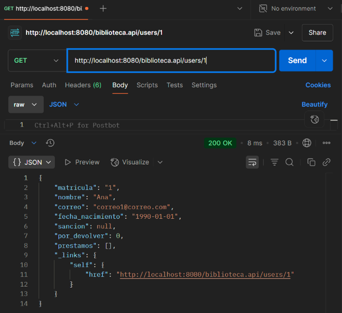 

Creamos 3 libros (POST):


Se muestran los 3 primeros libros (page=0&size=3).

A continuación, las operaciones GET de la anterior captura (las mostradas por consola).

GET del libro con ISBN 1:


GET del libro con ISBN 4:


GET del libro filtrado por nombre:


GET de las unidades del libro con ISBN 1:


Creamos 3 préstamos (POST):


GET del préstamo con id=1:

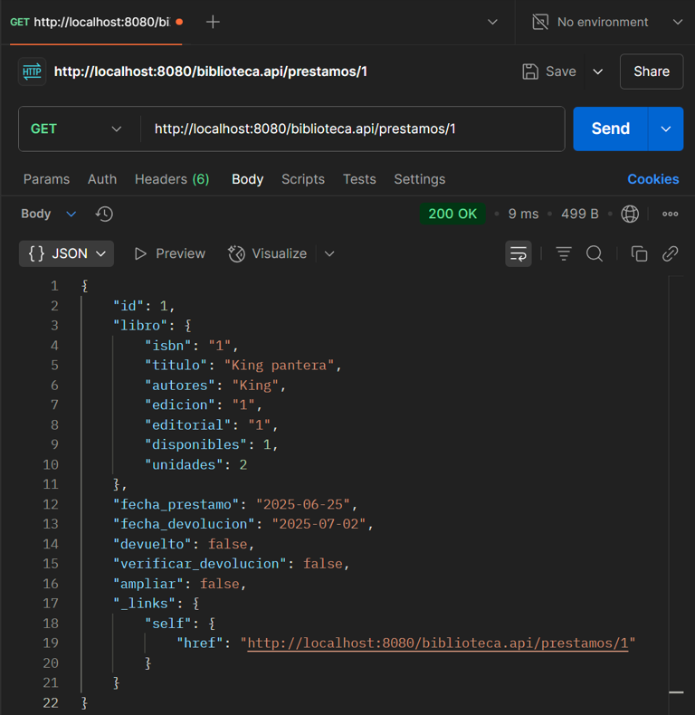

Actualizamos un usuario y un libro (PUT):


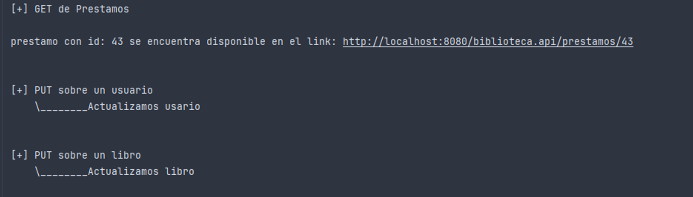

Verificamos el cambio del usuario en el Postman:


Verificamos el cambio del libro en el Postman:


Borramos el usuario con matrícula 2:


Verificamos la existencia del usuario 2:


Hacemos todas las operaciones GET posibles:


Verificamos el GET de los usuarios, en este caso solo hay uno ya que el otro lo borramos:


Verificamos el GET de los libros:


Verificamos el GET de los préstamos:


Verificamos el GET de los préstamos de un usuario:


Ahora vamos a hacer todos los PUT posibles sobre los préstamos, esto es, ampliar un préstamo, devolver un préstamo y verificar la devolución de un préstamo.

Ampliamos un préstamo (PUT):

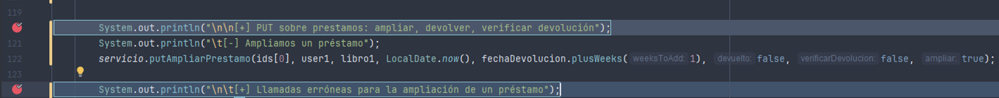


Verificamos que la ampliación de la fecha de devolución se haya realizado correctamente.
La fecha de devolución original del préstamo era LocalDate.now().plusWeeks(1). Dado que hoy es **25/06**, la fecha inicialmente era **02/07**. Tras realizar la ampliación (dos semanas adicionales), la nueva fecha de devolución esperada es **16/07**.


Ahora probamos 2 casos que deberían devolver error:


Como se puede ver saltan los errores correspondientes. Si lo probamos en Postman nos sale lo mismo:

 

Devolver un préstamo (PUT):

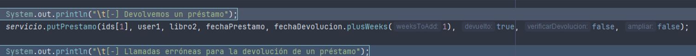

Verificamos:

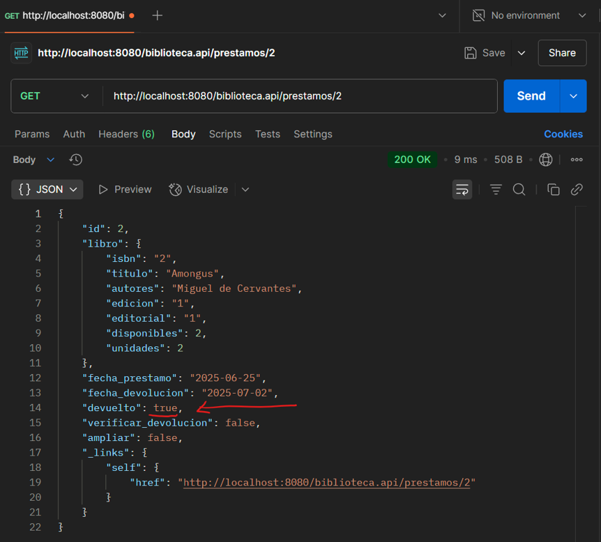

Ahora probamos 3 casos que deberían devolver error:


Como se observa, saltan los tres errores. Comprobamos en el Postman:

409 Conflict => ya ha sido devuelto:


400 Bad Request => El prestamos con id: 1 tiene un libro diferente a la que se ha enviado. El ISBN del libro es 1 y el ISBN del libro que se ha enviado es 3.

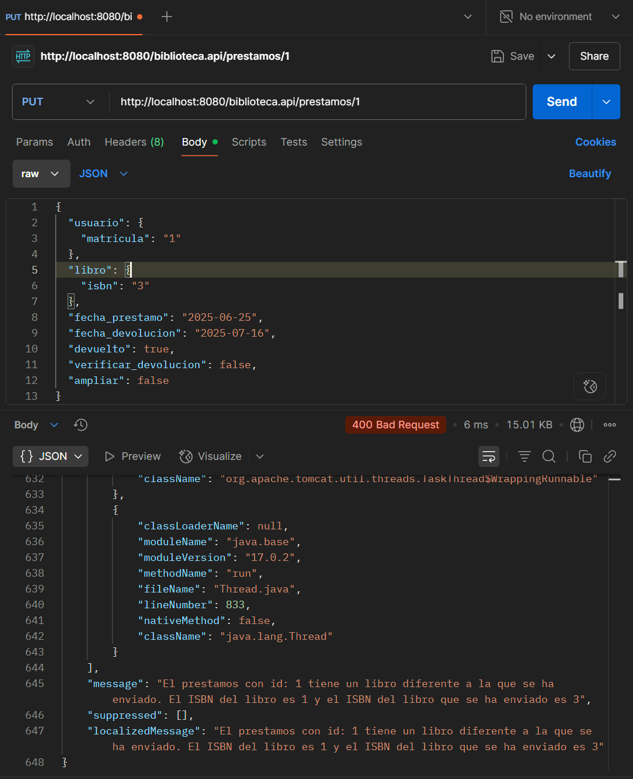

404 Not Found => No se pudo encontrar el préstamo con id 3.


Verificar una devolución (PUT):


Verificamos:


Al ser un préstamo caducado sin devolver, debería incrementarse el número de libros que tiene el usuario por devolver.


Efectivamente, ha aumentado. Si ahora lo devolviese, el por_devolver decrementaría a 0 y se aplicaría la sanción.

Hacemos 3 llamadas erróneas de verificar devolución:


Como se observa, saltan los 3 errores. Comprobamos con el Postman:

409 Conflict => El prestamo con id: 3 no se puede verificar -> o bien ya se ha verificado o bien ya se ha devuelto o bien el prestamo aun no ha caducado.


400 Bad Request => El prestamos con id: 3 tiene una fecha de prestamo diferente a la que se ha enviado. La fecha del prestamo es 2025-05-25 y la fecha del prestamo que se ha enviado es 2025-05-20.


404 Not Found => No se pudo encontrar el prestamo con id 4.


Ahora probamos a solicitar un préstamo con el usuario con libros pendientes de devolución y una vez devueltos.


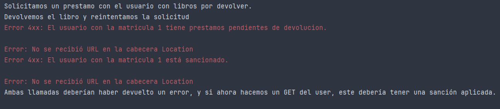

Como se puede comprobar, efectivamente ambos dan error. Comprobamos en el postman:

 

Para terminar, probamos diferentes métodos GET:


Verificamos por orden según aparecen en la consola y código:


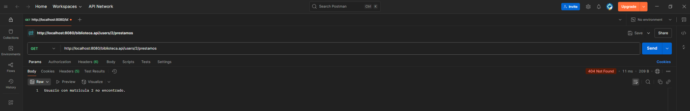


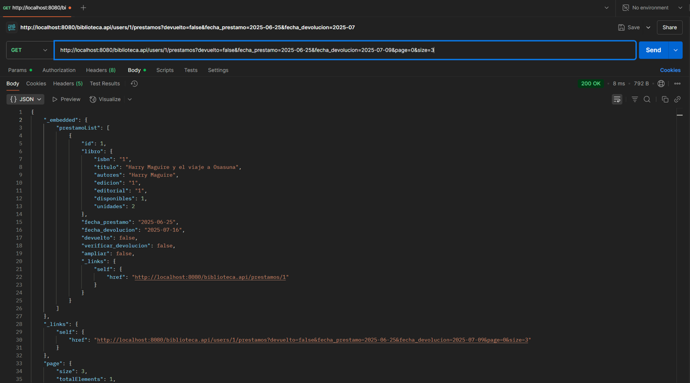

Devueltos:

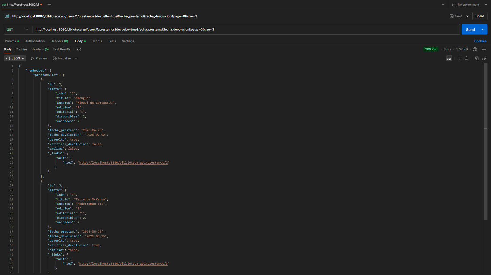

Actividad:


Borramos los préstamos (DELETE):


Borramos los Libros (DELETE):


Borramos los Usuarios (DELETE):


Y fin del cliente.

## Conclusión

Este proyecto es un buen ejemplo de cómo podemos crear una API RESTful con *Spring Boot*. Es bastante completo, ya que abarca distintos aspectos como la arquitectura, el uso de patrones REST, el manejo centralizado de excepciones o la creación de un cliente para consumir la API.

Como siempre, puedes encontrar el código fuente en mi [repositorio de GitHub](https://github.com/azuar4e/RESTful-Service).

Have a nice life! 👋
