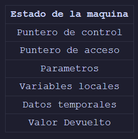
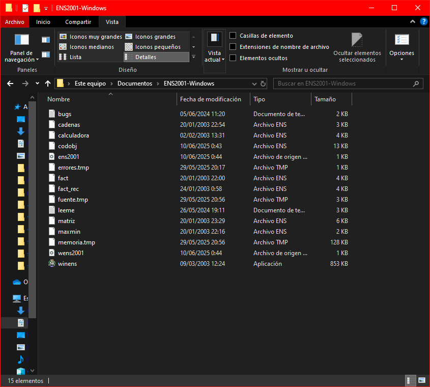
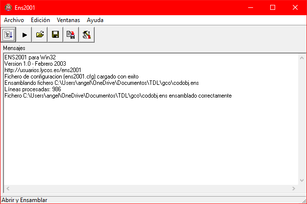
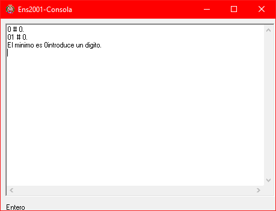
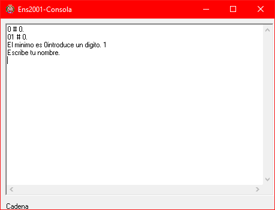

## Introducción

En este artículo explico el funcionamiento de un compilador, desde el procesamiento del fichero fuente hasta la traducción a código objeto. Este post está basado en un trabajo universitario para la asignatura [Traductores de Lenguajes](https://dlsiis.fi.upm.es/traductores/index.html). Todo el código fuente está disponible en mi repositorio de GitHub (enlace al final, en la sección [Herramientas](#herramientas)).

El traductor genera, a partir de un archivo de código escrito en el [Lenguaje Boreal](https://dlsiis.fi.upm.es/traductores/IntroBoreal.html), previamente validado por el procesador, un archivo `.ens` con el **código objeto** del programa, escrito en el lenguaje [ENS2001](https://dlsiis.fi.upm.es/traductores/Documentos/ENS2001.pdf).

El proyecto se divide en **dos partes principales**:

- **Procesador de lenguajes**, escrito en *Java*, proporcionado por la asignatura y extendido por nosotros.
- **Traductor de lenguajes**, desarrollado desde cero en *Python*.

> **Nota:** Esta implementación solo cubre:
>
> - Las sentencias IF-THEN e IF-THEN-ELSE.
> - El operador mínimo MIN.
> - Los procedimientos PROCEDURE con paso de parámetros por *valor* y por *referencia*.
> - Los operadores ``*``, ``AND`` y ``=`` (comparación, **no** asignación).
>
>⚠️ El resto de operadores no están cubiertos.
>
>⚠️ Tampoco se realiza ninguna optimización sobre el código objeto (ensamblador).

## Procesador de Lenguajes

El procesador de lenguajes es el responsable de validar que un fichero fuente no tenga errores de tipo **léxico**, **sintáctico** o **semántico**.  

Este módulo se divide en **cuatro etapas**:

- **Analizador léxico**
- **Analizador sintáctico**
- **Analizador semántico**
- **Generador de código intermedio**, que en  realidad pertenece al traductor pero forma parte del código del procesador.

---

Antes de comenzar, es importante conocer los siguientes conceptos:

- **Tabla de símbolos**: es la encargada de almacenar los identificadores de las variables, constantes, procedimientos, etc.

E.g.

```text
TABLA PRINCIPAL #1:
*LEXEMA: 'S1'
	Atributos:
	+ Tipo: 'cadena'
	+ Despl: 4
	+ Param: 0
*LEXEMA: 'IMPRIME'
	Atributos:
	+ Tipo: 'procedimiento'
	+ numParam: 2
	+ TipoParam0: 'entero'
	+ TipoParam1: 'entero'
	+ ModoParam0: 'valor'
	+ ModoParam1: 'valor'
	+ TipoRetorno: '-'
	+ EtiqFuncion: 'EtiqProc2'
```

- **Parse**: es el encargado de almacenar el orden con el que se ejecutan las reglas de la gramática.

E.g.

```text
ascendente  2 21 20 19 20 20 18 17 17 17 17 15 9 100 20 100 20 ...
```

> **ascendente** indica el tipo de analizador sintáctico utilizado.

- **Tokens**: puede ser cualquier cosa: un `for`, un `;`, el nombre de una variable, etc. El archivo fuente es dividido en tokens, que son almacenados en otro fichero bajo este nombre.

E.g.

```text
<VAR,->
<ID,1>
<DOSPUNTOS,->
<STRING,->
<PYC,->
<ID,2>
<DOSPUNTOS,->
...
```

- Por último, el **tipo de procesador**. En este caso, usamos uno *ascendente*, pero también existen *descendentes*, *descendentes con tablas*, etc.

---

### Analizador léxico

Para los **errores léxicos**, utilizamos un **autómata** que recorre el fichero fuente carácter a carácter. A medida que se avanza, se van evaluando los estados del autómata y, si todo va bien, se genera un archivo de **tokens** como salida.

Si se encuentra algún símbolo que no encaja en el autómata, se considera un **error léxico**.

E.g. de un autómata:


Un caso típico de error léxico es una **cadena sin cerrar**. La siguiente imagen muestra un autómata que reconoce cadenas entre comillas:


Aquí, `C` representa cualquier carácter. Para alcanzar el estado final y reconocer una cadena correctamente, necesitamos que termine con un `"`.

También se consideran errores léxicos situaciones como:

- Una cadena que supera la longitud máxima permitida
- Un número fuera de rango
- Caracteres no válidos en el lenguaje

Entre otros.

---

### Analizador sintáctico

Para los **errores sintácticos**, se analizan las estructuras del lenguaje mediante reglas gramaticales. Estos errores aparecen cuando la secuencia de tokens no sigue la sintaxis esperada. Aquí entra los conceptos de **first** y **follow**. Para explicarlos, mostramos un fragmento de una gramática:

``` text
Producciones = {
Pprima -> P
P -> B P
P -> F P
P -> lambda
B -> var T id Bprima ;
B -> S
B -> if ( E ) W
B -> lambda
W -> id Sprima
W -> output E ;
W -> input id ;
W -> return X ;
W -> Begin C End J
J -> else Begin C End
J -> lambda
Bprima -> = E
Bprima -> lambda
S -> id Sprima
S -> output E ;
S -> input id ;
S -> return X ;
Sprima -> = E ;
Sprima -> ( L ) ;
...
}
```

Un **terminal** es un símbolo que aparece tal cual en el lenguaje fuente (`;`, `if`, `var`...).  
Un **no terminal** representa una regla o construcción de la gramática (`T`, `B`, `P`...).

- El conjunto **first** de un no terminal son todos los terminales con los que puede comenzar.  
  Por ejemplo, el `first(W)` sería: `id`, `output`, `input`, `return`, `{` (Begin).

- El conjunto **follow** de un no terminal son los terminales que pueden aparecer **justo después** de él en una derivación.  
  Por ejemplo, si `X` siempre va seguido de `;`, entonces `follow(X) = { ; }`.

Si una regla puede derivar en **lambda** (vacío), su `follow` también incluye lo que podría venir tras ese punto en la producción.  
e.g. en `P → B P` y `P → lambda`, como `P` puede ser vacío, `follow(B)` incluye lo que sigue a `P`, e incluso el símbolo de fin `$`.

Un **error sintáctico** se produce cuando el token actual **no pertenece al conjunto `first`** de la regla esperada.  
Por ejemplo, si se espera una producción de `W` y el siguiente token es `if` (que no está en `first(W)`), se trata de un error.

> Ejemplo típico: un `else` sin su `if`, o una expresión mal cerrada.

---

### Analizador semántico

Para los **errores semánticos**, utilizamos **acciones semánticas**, en las que se definen cosas como:

- Herencia de atributos
- Inserciones en la tabla de símbolos
- Validaciones de tipos

Por ejemplo, en una regla como `W → output E ;`, podríamos tener una acción semántica del estilo `{ W.tipo := E.tipo }`, que asigna a `W` el tipo de `E`.  
En el código, esto se reflejaría evaluando ese caso y actualizando la pila de atributos.

Un error semántico típico sería que el tipo heredado no coincida con el esperado.

---

### Generador de código intermedio

Volviendo al traductor, el generador de código intermedio es una extensión del procesador en la que definimos nuevas acciones semánticas para poder generar el fichero con el **código intermedio**, en este caso, en el formato de un [fichero de cuartetos](https://dlsiis.fi.upm.es/traductores/Documentos/formato_fichero_cuartetos.pdf) definido por la asignatura.

Para esto, en nuestra implementación definimos *2 nuevas clases*, `gci.java` y `cuarteto.java`.

En la primera definimos las siguientes funciones:

`emite`, que es la que genera los cuartetos:

``` Java
public static cuarteto emite (String operador, Object arg1, Object arg2, Object resultado) {
    cuarteto c = new cuarteto(operador, arg1, arg2, resultado);
    printCuarteto(c);
    return c;
}
```

`nuevatemp`, que crea una nueva variable temporal del tipo especificado y la inserta en la tabla de símbolos:

``` Java
public static tupla<String, Integer> nuevatemp(String tipo) {
    String nuevatemp = "t" + conttemp;
    conttemp++;

    if (ASem.tsGlobal) {
        Integer pos = Procesador.gestorTS.addEntradaTSGlobal(nuevatemp);
        if (!tipo.equals("tipo_error")) {
            Procesador.gestorTS.setTipo(pos, tipo);
        }
        Procesador.gestorTS.setTipo(pos, tipo);
        Procesador.gestorTS.setValorAtributoEnt(pos, "desplazamiento", ASem.despGlobal);
        tupla<String, Integer> tupla = new tupla<>("VAR_GLOBAL", ASem.despLocal);
        switch (tipo) {
            case "lógico":
                ASem.despGlobal += 1;
                break;
            case "entero":
                ASem.despGlobal += 1;
                break;
            case "cadena":
                ASem.despGlobal += 64;
                break;
            default:
                break;
        }
        return tupla;
    } else {
        Integer pos = Procesador.gestorTS.addEntradaTSLocal(nuevatemp);
        if (!tipo.equals("tipo_error")) {
            Procesador.gestorTS.setTipo(pos, tipo);
        }
        Procesador.gestorTS.setTipo(pos, tipo);
        Procesador.gestorTS.setValorAtributoEnt(pos, "desplazamiento", ASem.despLocal);
        tupla<String, Integer> tupla = new tupla<>("VAR_LOCAL", ASem.despLocal);
        switch (tipo) {
            case "lógico":
                ASem.despLocal += 1;
                break;
            case "entero":
                ASem.despLocal += 1;
                break;
            case "cadena":
                ASem.despLocal += 64;
                break;
            default:
                break;
        }
        return tupla;
    }
}
```

`nuevaetiq`, que crea una nueva etiqueta utilizada para los saltos condicionales e incondicionales:

```Java
public static tupla<String, String> nuevaetiq(String nombre) {
    String nuevaetiq;
    if (nombre == null){
        nuevaetiq = "Etiq" + contetiq;
        contetiq++;
    } else {
        nuevaetiq = nombre;
    }

    tupla<String, String> tupla = new tupla<>("ET", nuevaetiq);
    return tupla;
}
```

En la clase `cuarteto` definimos el objeto **cuarteto** y un método `toString` para su representación:

``` Java
public cuarteto(String operador, Object arg1, Object arg2, Object resultado) {
    this.operador = operador;
    this.arg1 = arg1;
    this.arg2 = arg2;
    this.resultado = resultado;
}
```

---

En cuanto a las acciones semánticas para la generación de código intermedio, se definen en la clase `ASem.java` junto a las acciones del propio analizador semántico.

A continuación un fragmento de código para la acción `processRule(94, "Z -> id LL");`

```Java
if (llAtb.getLongs() == 0) {
    if (idTipo.equals("procedimiento")){
        gci.emite("CALL", Procesador.gestorTS.getValorAtributoCad(idAtb.getPos(), "etiqueta"), null, null);
    } else {
        if (paramRef2.get(idAtb.getPos()) != null && paramRef2.get(idAtb.getPos()).equals("referencia")) {res.setReferencia("referencia");}
        if (identificadores.get(idAtb.getPos()) == null) {
            res.setLugar(new gci.tupla<>("VAR_LOCAL", procesador.Procesador.gestorTS.getValorAtributoEnt(idAtb.getPos(), "desplazamiento")));
        } else {
            if (identificadores.get(idAtb.getPos())) {
                res.setLugar(new gci.tupla<>("VAR_GLOBAL", procesador.Procesador.gestorTS.getValorAtributoEnt(idAtb.getPos(), "desplazamiento")));
            } else {
                res.setLugar(new gci.tupla<>("VAR_LOCAL", procesador.Procesador.gestorTS.getValorAtributoEnt(idAtb.getPos(), "desplazamiento")));
            }
        }
    }
    
} else {
    LinkedList<Integer> referencias = paramRef.get(idAtb.getPos());
    LinkedList<String> tipos = paramTipo.get(idAtb.getPos());

    for (int i = llAtb.getLongs() - 1; i >= 0; i--) {
        if (referencias.get(i) == 0) {
            if (tipos.get(i).equals("cadena")) {
                gci.emite("PARAM_CAD", llAtb.getParam(i), null, null);
            } else {
                gci.emite("PARAM", llAtb.getParam(i), null, null);
            }
        } else {
            if (tipos.get(i).equals("cadena")) {
                gci.emite("PARAM_REF_CAD", llAtb.getParam(i), null, null);
            } else {
                gci.emite("PARAM_REF", llAtb.getParam(i), null, null);
            }
        }
    }
    String ret = Procesador.gestorTS.getValorAtributoCad(idAtb.getPos(), "tipoRetorno");
    switch(ret) {
        case "entero":
            gci.emite("CALL_FUN", Procesador.gestorTS.getValorAtributoCad(idAtb.getPos(), "etiqueta"), null, res.getLugar());
            break;
        case "cadena":
            gci.emite("CALL_FUN_CAD", Procesador.gestorTS.getValorAtributoCad(idAtb.getPos(), "etiqueta"), null, res.getLugar());
            break;
        default:
            gci.emite("CALL", Procesador.gestorTS.getValorAtributoCad(idAtb.getPos(), "etiqueta"), null, null);
            break;
    }
}
```

La acción semántica se divide en dos ramas:

1. **Si no hay parámetros (`llAtb.getLongs() == 0`)**:
   - Si `id` es un procedimiento → emitir `CALL`.
   - Si es una variable → crear tupla con su ámbito (local o global) y desplazamiento en la tabla de símbolos, y asignarlo a `res.setLugar()` para que se herede por el resto del arbol y sea accesible en otras reglas.

2. **Si hay parámetros**:
   - Emitir los parámetros uno a uno según tipo y paso por valor/referencia.
   - Emitir `CALL_FUN`, `CALL_FUN_CAD` o `CALL` según el tipo de retorno. En este caso solo puede ser `CALL` ya que el traductor está diseñado únicamente para procedimientos (sin valor de retorno).

>``res`` es un objeto de la clase atributos y es lo que retorna el método de la acción. Las acciones también reciben objetos de la clase atributos que se obtienen desde la pila de atributos del analizador semántico.

---

## Traductor de lenguajes

Una vez validado el archivo fuente, se nos generan los archivos `tokens.txt`, `parse.txt`, `errores.txt`, `ts.txt` y adicionalmente, el archivo `cuartetos.txt`. A continuación, el **generador de código objeto**, en base al *fichero de cuartetos*, genera un archivo `.ens`.

Como hemos hecho con anterioridad, antes de adentrarnos en el código debemos saber:

Que un **registro de activación** (RA) es una zona de memoria consecutiva en la que se almacena la información de activación de un subprograma (cada uno tiene el suyo propio).



- El **estado de la máquina** (EM) es el estado antes de llamar a un subprograma.

- El **puntero de control** (pc) apunta al RA del subprograma llamador. Se usa al finalizar el subprograma.

- El **puntero de acceso** (pa) apunta al registro de activacion del subprograma donde está declarado el subprograma actual. Si ``b`` esta definido en ``a``, el pa de ``b`` apunta a ``a``. Se utiliza para acceder a variables no locales cuando hay anidamiento de funciones.

---

### Ficheros empleados

En esta implementación hacemos uso de tres ficheros:

- **`_ens.py`**: maneja la creación y escritura del archivo `.ens`.
- **`_gco.py`**: archivo principal; traduce cada cuarteto a instrucciones `.ens`.
- **`_calcprev.py`**: calcula tamaños de RA's y zona de datos estáticos (globales).

### Funcionamiento

`_ens.py`: este módulo contiene una única función que abre el archivo ``.ens`` en **modo escritura** y añade líneas según sea necesario:

```python
archivo = None

def escribir(linea):
    global archivo
    if archivo is None:
        archivo = open("codobj.ens", 'w')
    archivo.write(linea)
```

`_calcprev.py`: Este script recorre la tabla de símbolos (``ts.txt``) para calcular:

- El tamaño de la **zona de datos estáticos**.

- Los tamaños de cada **registro de activación** (RA).

- Las **referencias** necesarias para parámetros por referencia.

Utilizamos *dos funciones auxiliares*, una para leer cada línea de la tabla de símbolos y otra para obtener el tamaño de cada tipo.

```python
def leer():
    global archivo
    if archivo is None:
        archivo = open("ts.txt", 'r')
        
    return archivo.readline() 

def reserva(tipo) -> int:
    if tipo == 'entero':
        return 1
    elif tipo == 'logico':
        return 1
    elif tipo == 'cadena':
        return 64
    else:
        return 0
```

Luego en el ``main()`` hacemos un bucle que:

1. Lee línea a línea la tabla de símbolos.

2. Para la **tabla local**:

    - **Calcular** el tamaño del RA sumando los tamaños obtenidos con `reserva(...)`.  
    - **Registrar** los desplazamientos de los parámetros pasados por referencia.

3. Para la **tabla global**:

    - **Suma** tamaños de variables globales.

    - **Suma** el tamaño del retorno si es una funciones/procedimientos.

4. Finalmente, genera las directivas de inicio de memoria y las etiquetas ``EQU`` para cada RA:

```python
def main():
    global cadfinal
    linea = leer()
    tamestaticos = 0
    ras = 1

    while linea:
        if re.match(locales, linea):
            coleccion[f"ra{ras}"] = {}
            desp = 1
            while linea.strip() != separador.strip():
                if re.match(lexema, linea):
                    while not re.match(tipo, linea):
                        linea = leer()
                    desp += reserva(re.match(tipo, linea).group(1))
                    linea = leer()
                    d = re.match(de, linea).group(1)
                    linea = leer()
                    p = re.match(pr, linea).group(1)
                    if int(p) == 1:
                        if referencias.get(f"ra{ras}") == None:
                            referencias[f"ra{ras}"] = []
                        referencias[f"ra{ras}"].append(int(d) + 1)
                linea = leer()

            coleccion[f"ra{ras}"] = desp
            ras+=1

        if re.match(globales, linea):
            rasaux = 1
            while linea:
                if re.match(lexema, linea):
                    while not re.match(tipo, linea):
                        linea = leer()
                    t = re.match(tipo, linea).group(1)
                    if t != 'funcion' and t != 'procedimiento':
                        tamestaticos += reserva(t)

                    else:
                        while not re.match(retorno, linea):
                            linea = leer()

                        aux = coleccion[f"ra{rasaux}"]
                        aux += reserva(re.match(retorno, linea).group(1))

                        coleccion[f"ra{rasaux}"] = aux
                        rasaux += 1

                linea = leer()
            break

        linea = leer()


    cadfinal = ""
    if tamestaticos > 0:
        cadfinal = f"\t\t\tinicio_estaticas: RES {tamestaticos}\n"
    cadfinal += "\t\t\tinicio_pila: NOP\n"

    if tamestaticos > 0:
        escribir("\t\t\tMOVE #inicio_estaticas, .IY\n")
    escribir("\t\t\tMOVE #inicio_pila, .IX\n")
    
    # generamos las etiquetas para los registros de activacion
    for ra in coleccion:
        escribir(f"\t\t\t{ra}: EQU {coleccion[ra]}\n")
    escribir("\n\t\t\tBR /main\n")
```

> **Nota:** La variable ``cadfinal`` no se escribe aquí porque su contenido se añade al final del fichero ``.ens``.

Por último tenemos `_gco.py`, el archivo principal. A continuación pongo un extracto para entender su funcionamiento:

```python
patron_mul = r"""
\(MUL,\s*
    ((?:\{[^{}]*\}|[^,()])+)  ,\s*
    ((?:\{[^{}]*\}|[^,()])+)  ,\s*
    ((?:\{[^{}]*\}|[^,()])+) 
\)
"""


patron_and = r"""
\(AND,\s*
    ((?:\{[^{}]*\}|[^,()])+)  ,\s*
    ((?:\{[^{}]*\}|[^,()])+)  ,\s*
    ((?:\{[^{}]*\}|[^,()])+) 
\)
"""

patron_asig = r"""
\(ASIG,\s*
    ((?:\{[^{}]*\}|[^,()])+)  ,\s*
    ((?:\{[^{}]*\}|[^,()])+)  ,\s*
    ((?:\{[^{}]*\}|[^,()])+) 
\)
"""
```

Tenemos una sección con los patrones para detectar cada posible cuarteto, para esto hacemos uso de la librería `re`.

También usamos estos patrones para extraer desplazamientos, nombres, espacios y detectar el programa principal.

```python
p = r"\"\s*\""
ptloc = r"{VAR_LOCAL, (.+)}"
ptglob = r"{VAR_GLOBAL, (.+)}"
ptp = r"EtiqProc(\d+)"
ptf = r"EtiqFunc(\d+)"
ptm = r"main"
```

En cuanto a las funciones, utilizamos las siguientes:

- `leer`: utilizada para leer cada cuarteto.

```python
def leer():
    global archivo
    if archivo is None:
        archivo = open("cuartetos.txt", 'r')

    return archivo.readline()
```

- `declarar_cads`: nos permite declarar los literales de cadenas al final del fichero de salida. Al final del bucle principal, llamamos a esta funcion con el atributo `cadena` None y `write` como `True`.

```python
def declarar_cads(cadena, write):
    global cads, cds
        
    if cadena is not None and not re.match(p, cadena):

        if cads is None:
            cads = f"\ncadena{cds}:\t" + cadena
        else:
            cads = cads + f"\ncadena{cds}:\t" + cadena

    if write and cads is not None:
        cads += "\n\n"
        escribir(cads)
        return True
```

- `leer_cadena_ens`: con esta función podemos pasar caracter a caracter la cadena declarada a un registro, o de un registro a otro. Esto es fundamental ya que a diferencia de con los enteros, para las cadenas tenemos que mover todo su contenido caracter a caracter.

```python
def leer_cadena_ens(cadena, escad):
    global bucles
    if escad:
        codobj = f"""
            MOVE #{cadena}, .R7
            DEC .R2
            DEC .R7
bucle{bucles}:	    INC .R2
            INC .R7
            MOVE [.R7], [.R2]
            CMP [.R7], #0
            BNZ $bucle{bucles}
        """
    else:
        codobj = f"""
            DEC .R3
            DEC .R2
bucle{bucles}:	    INC .R3
            INC .R2
            MOVE [.R2], [.R3]
            CMP [.R2], #0
            BNZ $bucle{bucles}
        """

    bucles += 1
    escribir(codobj)
```

- `paramcad`: análoga a la anterior, esta se usa únicamente cuando el parámetro de un subprograma es una cadena.

```python
def paramcad(des, desra):
    global bucles
    codobj = f"""
            ADD #{des}, .IX
            MOVE .A, .R2
            ADD #{desra}, .IX
            MOVE .A, .R3
            DEC .R3
            DEC .R2
bucle{bucles}:	    INC .R3
            INC .R2
            MOVE [.R2], [.R3]
            CMP [.R2], #0
            BNZ $bucle{bucles}
        """
    bucles += 1
    escribir(codobj)
```

- `transformar_dir`: encargada de mover las direcciones de memoria pasadas como parámetros a los registros correspondientes. Estas pueden ser entre una y tres. Básicamente, recibe algo como `{VAR_GLOBAL, 3}` y esto mueve lo que hay en la dirección `#3[.IY]` a un registro como `R2`. Esto porque es global, si fuera local sería `#3[.IX]`.

```python
def transformar_dir(dir1, dir2, dir3):
    ptglob = r"{VAR_GLOBAL, (.+)}"
    ptloc = r"{VAR_LOCAL, (.+)}"
    
    nreg = 2
    escribir("\n")
    for dir in [dir1, dir2, dir3]:
        if dir is None:
            continue
        
        elif re.match(ptglob, dir):
            cad = f"\t\t\tADD #{re.match(ptglob, dir).group(1)}, .IY\n\t\t\tMOVE .A, .R{nreg}\n"
            nreg += 1
            escribir(cad)
        
        elif re.match(ptloc, dir): # al ser local se le suma el tamaño del EM y PA
            desp = int(re.match(ptloc, dir).group(1)) + 1
            cad = f"\t\t\tADD #{desp}, .IX\n\t\t\tMOVE .A, .R{nreg}\n"
            if raact in _calcprev.referencias and desp in _calcprev.referencias[raact]:
                cad += f"\t\t\tMOVE [.R{nreg}], .R{nreg}\n"
                
            nreg += 1
            escribir(cad)
    escribir("\n")
```

Por último, el buble principal, que es el encargado de llamar a las funciones anteriores, y de iterar sobre cada cuarteto recibido. Dado que este bucle ocupa 600 líneas, pongo el comienzo para que se vea claro su funcionamiento.

```python
def main():
    global cds, contador_llamadas, primeraetiq, contparam, where, contmin, param_min, raact, esetiq
    _calcprev.main()

    linea = leer()
    while linea:
        if re.match(patron_mul, linea, re.VERBOSE):
            esetiq = False
            coincidencia = re.match(patron_mul, linea, re.VERBOSE)
            transformar_dir(coincidencia.group(1), coincidencia.group(2), coincidencia.group(3))
            cadena = "\t\t\tMUL [.R2], [.R3]\n"
            escribir(cadena)
            cadena = "\t\t\tMOVE .A, [.R4]\n"
            escribir(cadena)
        
        elif re.match(patron_and, linea, re.VERBOSE):
            esetiq = False
            coincidencia = re.match(patron_and, linea, re.VERBOSE)
            transformar_dir(coincidencia.group(1), coincidencia.group(2), coincidencia.group(3))
            cadena = "\t\t\tAND .R2, .R3"
            escribir(cadena)
            escribir("\n")
            cadena = "\t\t\tMOVE .A, .R4"
            escribir(cadena)
            escribir("\n")
```

Como se puede observar, es un bucle muy sencillo en el que vamos evaluando cada caso y generando el código objeto correspondiente.

---

## Ejecución

En esta sección se explica cómo ejecutar el código generado por el traductor, y se prueban diferentes ejemplos para entender su funcionamiento.

> **Nota:** Solo se cubre la explicación para Windows, ya que en Linux el ensamblador no tiene interfaz y resulta menos didáctico.

### Prerequisitos

1. Asegurarse de que se haya compilado el proyecto (ver sección [Uso](#uso)).
2. Fichero `codobj.ens` generado (código objeto).

### Descarga

Para ello tenemos que descargarnos el ensamblador (disponible en la sección [Herramientas](#herramientas)). Al descomprimir el archivo, obtenemos una carpeta `ENS2001-Windows` como la siguiente:



A excepción del fichero `codobj.ens`, que es el que vamos a ensamblar, el resto de archivos vienen por defecto. Se incluyen algunos ejemplos y dos ficheros que se recomienda leer: `leeme.txt` y `bugs.txt`.

### Ensamblador

El ensamblador es el ejecutable que viene seleccionado en la captura de arriba (`winens`).

Una vez ejecutado, veremos una interfaz como la siguiente:


Para ver con claridad lo que va haciendo el ensamblador se recomienda abrir las siguientes ventanas:


- La **ventana del código fuente** muestra el orden en el que se ejecutan las instrucciones del código objeto. En este caso como aun no se ha cargado ningun archivo, están todas las direcciones en `NOP`.

    

- La **ventana de registros** muestra el estado de los registros de la máquina.

    

- La **ventana de la pila** muestra el contenido de la pila de datos.

    

Para cargar el archivo `codobj.ens` hacemos `Archivo > Abrir y Ensamblar`. Si todo va bien, nos dirá que ha sido ensamblado correctamente:



Ahora ya estamos listos para ejecutar el ensamblador. Al darle al ▶️ se ejecutará el ensamblador y nos mostrará el resultado. Si nuestro código ejecuta funciones de escritura en consola, esta se abrirá. En nuestro caso hemos ensamblado el fichero `expr.txt` (disponible en el repositorio de GitHub), y el resultado es el siguiente:



Introducimos un dígito como nos pide y le damos al enter.



Escribimos nuestro nombre:


Y tras esto, el programa finaliza su ejecución correctamente.

---

## Uso

En esta sección se detallan los pasos necesarios para instalar las dependencias, compilar el proyecto y ejecutar cada componente.

### Instalación de dependencias

Para instalar la biblioteca del procesador (`ts-lib.jar`) en el repositorio local de Maven, ejecuta el siguiente comando:

```powershell
mvn install:install-file -Dfile=".\lib\ts-lib.jar" -DgroupId=tslib -DartifactId=ts-lib -Dversion="1.0" -Dpackaging=jar
```

O si estás en Linux o macOS:

```bash
mvn install:install-file -Dfile="./lib/ts-lib.jar" -DgroupId=tslib -DartifactId=ts-lib -Dversion="1.0" -Dpackaging=jar
```

### Compilación del procesador

Una vez instalada la librería, genera el ejecutable del procesador con:

```powershell
mvn clean package
```

### Ejecución del procesador

Después de compilar, puedes ejecutar el procesador con el siguiente comando (sustituyendo la ruta por la del archivo Boreal):

```bash
java -jar .\target\tdl-1.0-SNAPSHOT-jar-with-dependencies.jar .\ruta\al\ficheroBoreal.txt
```

### Ejecución del traductor

Desde la carpeta ``gco/``, donde se encuentra el ejecutable del traductor, ejecuta:

```powershell
.\_gco ..\tdl\src\test\resources\ficheroboreal.txt
```

O si estás en Linux o macOS:

```bash
./_gco ../tdl/src/test/resources/ficheroboreal.txt
```

Esto generará todos los archivos del procesador, así como el fichero ``cuartetos.txt`` (código intermedio) y ``codobj.ens`` (código objeto).

### Ejecución del código objeto

Para ejecutar el archivo ``.ens``, es necesario descargar el ensamblador (disponible en la sección Herramientas), compilarlo y ejecutarlo con el fichero ``codobj.ens`` generado.

---

## Herramientas

Tanto el procesador de lenguajes como los ensambladores simbólicos para ensamblar el código objeto (ENS2001) se encuentran en el siguiente enlace:

>👉 <https://dlsiis.fi.upm.es/traductores/Herramientas.html>

Podéis encontrar el código fuente de esta implementación en mi repositorio de GitHub:

>👉 <https://github.com/azuar4e/TDL>

---

## Conclusión

El proyecto es una gran oportunidad para aprender y profundizar sobre el funcionamiento de un compilador. Aunque este esta basado en un lenguaje y un ensamblador que en el día a día no se utilizan, nos sirve como ejemplo didáctico y sencillo para explicar los conceptos clave.

Nuevamente el código fuente lo podeís encontrar en mi repositorio de GitHub.

¡Tener una buena vida!
