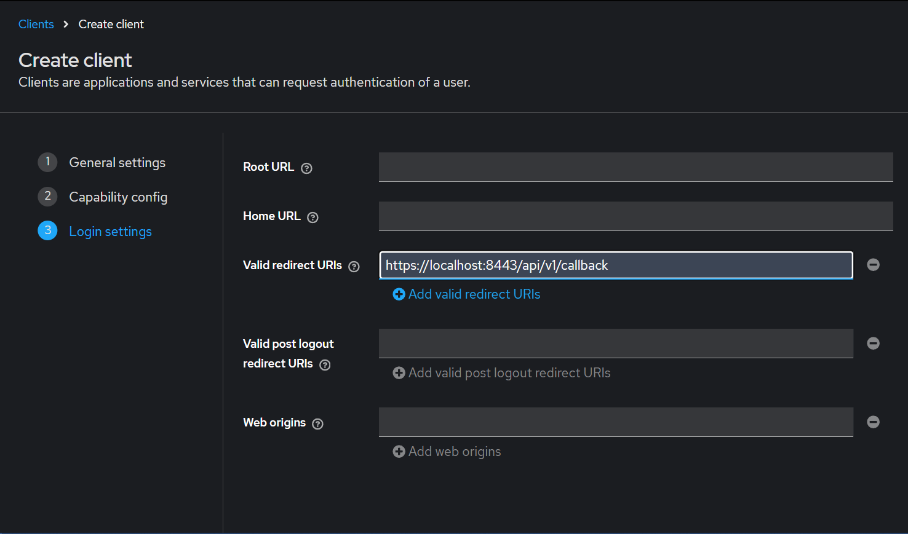
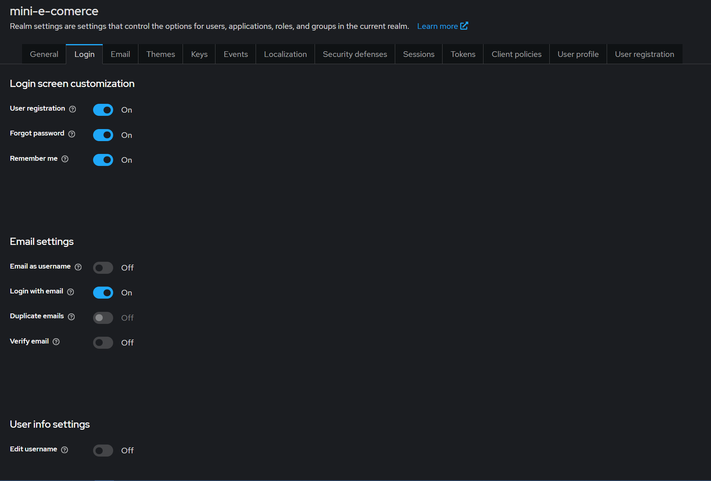
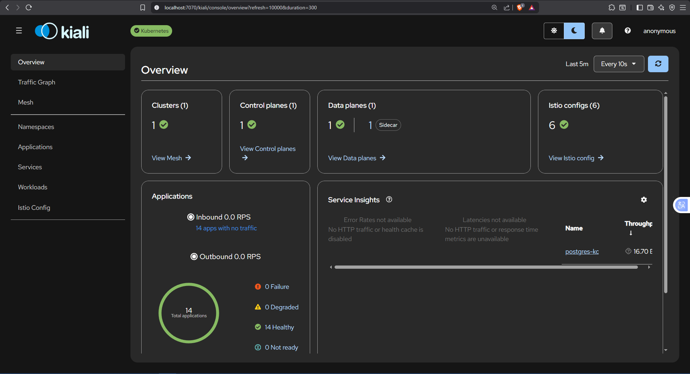
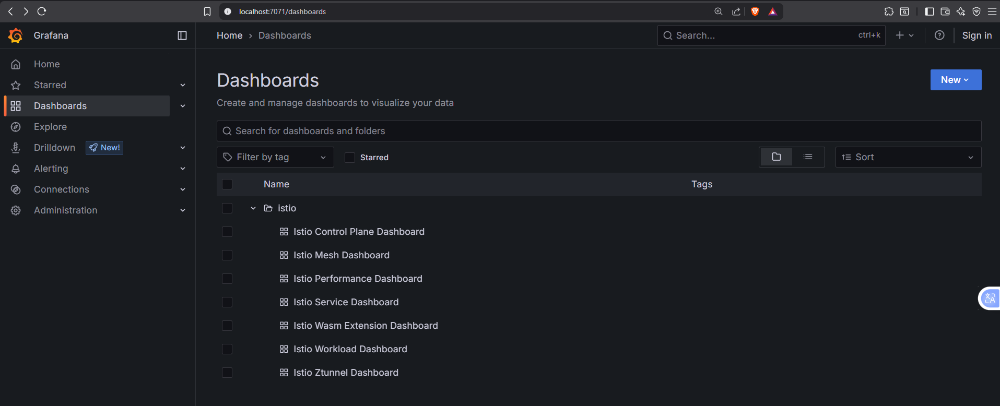

# Zero Trust on Kubernetes: Securing Microservices With Istio MTLS and Keycloak


Have you ever wondered how to handle user authentication by delegating it to an *Identity Provider* (IdP), and how to secure communication between your microservices without having to implement that logic yourself? That's exactly what we're going to look at in this article.

The motivation for this post comes from the need to address some of the limitations of my [bachelor's thesis](https://azuar4e.github.io/es/posts/tfg/). The two main shortcomings were user authentication, which was handled manually by generating a JWT, and the lack of HTTPS in communication between microservices. In this new project we solve both: we delegate authentication to a real IdP, and we secure internal communications with mTLS transparently at the application level.

To do this we use a free IdP, **Keycloak**, to manage user access, and **Istio** as a *service mesh*. At a high level, Istio deploys an Envoy proxy as a *sidecar* in each pod, which intercepts incoming and outgoing traffic and automatically encrypts it via mTLS, without your microservices code having to know anything about it.

## Overview

For this project, a small e-commerce app based on microservices was designed as the use case. The application doesn't use data persistence and its logic is deliberately simple, since the main goal of the project isn't to build a complete e-commerce application, but to use a simple example to focus on authentication mechanisms and secure communication between services.

The application is made up of three main microservices: an API Gateway, a products service (``products``), and an orders service (``orders``). The API Gateway acts as the entry point to the application and is responsible for routing requests to the corresponding microservices. It's also responsible for managing the user authentication flow, as we'll see later in the section on the [OAuth flow](#authorization-code-oauth-flow).

The ``products`` microservice keeps a simple product catalog in memory and allows querying the available products. The ``orders`` microservice, in turn, allows creating and querying orders.

Once the user is authenticated, the API Gateway validates their credentials and forwards requests to the corresponding microservice. Communication between these takes place through the Istio service mesh, which provides mutual authentication via mTLS between the application's different components. This way, the security of communications is decoupled from the microservices business logic.

On the microservices side, we'll only stop to analyze the code flow related to authentication and interaction with the IdP. The rest of the implementation can be found in the [GitHub repository](https://github.com/azuar4e/micros-sample).

The infrastructure used to support the deployment consists of a local Kubernetes cluster created with Kind. Although the project could be deployed to a cloud environment with some modifications to the infrastructure, using a specific cloud provider isn't relevant for the goals of this article. Using a local cluster lets us focus on the fundamental concepts of Keycloak, OAuth 2.0, Istio, and mTLS without introducing extra complexity tied to a cloud provider.

Throughout the article we'll see how these components fit together, from the user authentication flow to internal communication between microservices, and how these responsibilities can be delegated to specialized components without having to manually implement security within each service.

## Authorization Code OAuth Flow

[OAuth 2.0](https://auth0.com/es/intro-to-iam/what-is-oauth-2) is a standard designed so that applications can obtain authorized access to protected resources on behalf of a user or service. There are several flows, such as client credentials or authorization code (with and without PKCE), which is the one we'll focus on in this article.

In the authorization code grant flow, the authorization server returns a single-use code, which is exchanged for an access token. When PKCE is added to the flow, a series of extra steps are introduced when obtaining the token, so that even if the authorization code is intercepted by an attacker, they can't exchange it for an access token in place of the user who requested it.


As shown in the image, the flow works as follows:

1. The user logs in to the application (which is a client of the IdP).
2. The application redirects the user to the IdP, in this case Keycloak, where they must enter their credentials.
3. The user enters their credentials at the IdP.
4. The IdP redirects the user to an endpoint of the client application, such as ``/callback``, leaving the code and state in the URI under the `code` and `state` keys.
5. The client application extracts that code from the URI and uses it to request a token.
6. If everything went well, the IdP responds with the access token for the user.

When adding PKCE to this flow, what happens is that before redirecting the user to the IdP to log in, a *state*, a *code verifier*, and a *code challenge* are generated. Basically, the state and code verifier are random byte strings, while the code challenge is the hash of the verifier. Along with the authorization URL we send the code challenge and the hashing algorithm used, so that if someone captured the authorization code, they wouldn't be able to redeem it.

### Keycloak

As mentioned at the start of this post, Keycloak is an open-source Identity Provider that lets us centralize our application's authentication, authorization, and user management, decoupling security from the business logic.

We've just seen its role in the OAuth flow in the previous section, but there's more. Within a **realm** (an isolated management space, useful for separating different environments or applications), we can define clients (the application), the users who can authenticate, the roles assigned to those users, as well as login options, email verification, password recovery, among others.

### Implementation

Now you're probably wondering: how is all of this implemented? Well, first of all, from the API we expose the following endpoints:

``` Go
v1.GET("/authentication", auth.Login)
v1.GET("/callback", auth.Callback)

v1.Use(auth.AuthMiddleware(), auth.AuthzMiddleware("customer"))

v1.GET("/me", func(c *gin.Context) {
    userID, _ := c.Get("userID")
    email, _ := c.Get("userEmail")
    roles, _ := c.Get("roles")

    c.JSON(http.StatusOK, gin.H{
        "message": "I'm logged in!",
        "userID":  userID,
        "email":   email,
        "roles":   roles,
    })
})
```

The first one is what we use to log in, the second is where the IdP redirects us once we've entered the user credentials and where it leaves us the authorization code and state, and the third is where the application leaves us once it has exchanged the code for a token and set it as a cookie. In this third endpoint we also show relevant user information to verify that it worked.

Now that we have this, let's go to the Keycloak interface; in my case, since everything is deployed on a local cluster, I do a port-forward of the service to access it.

```bash
kubectl port-forward svc/keycloak-svc 8080:8080
```

>All manifests can be found in the GitHub repository.
>For deploying Keycloak we used a Postgres database with a persistent volume to store the information.

Once we've logged in, let's create a realm; to do this we go to the tab labeled `Manage realms` and click create. Once created, we select it and create a client. To do this we go to the `Clients` tab and click create, give it whatever name we want in `Client ID`, in this case `oidc-client`, and check the following options:


>The PKCE checkbox could be left unchecked, but this way we force an error if the parameters aren't received.

Finally, we set the callback endpoint as the redirect URL:



>We don't yet have the Istio gateway implemented for HTTPS, so we should use port ``9090``, which is the port the API runs on, instead of port ``8443``.

Now let's create the test user (you can also create the user by registering directly). To do this, we go to Users and click `Add User`; we give it a name and, once created, on the ``Credentials`` tab, we set a password (unchecking the `Temporary` box).

We can additionally enable some login options such as the following:



Finally, I created a role to demonstrate its functionality. This can be done from `Realm roles`, where we give it a name; in this case, we assign it to the user we created.

With that done, we're finished with Keycloak. Now it's time to configure the API: for that we create the handlers for the endpoints shown earlier, and the middleware to verify that the user is authenticated and authorized.

As for the handlers, first we create the struct with the client information.

```Go
func oauthConfig() *oauth2.Config {
    return &oauth2.Config{
        ClientID:     "oidc-client",
        ClientSecret: os.Getenv("CLIENT_SECRET"),
        Endpoint: oauth2.Endpoint{
            AuthURL:  "http://localhost:8080/realms/mini-e-commerce/protocol/openid-connect/auth",
            TokenURL: "http://keycloak-svc:8080/realms/mini-e-commerce/protocol/openid-connect/token",
        },
        RedirectURL: "https://localhost:8443/api/v1/callback",
        Scopes:      []string{"openid", "profile", "email"},
    }
}
```

>The ``AuthURL`` uses ``localhost`` because it's visited by the user's browser, which can't resolve Kubernetes' internal DNS (``keycloak-svc``). The ``TokenURL``, on the other hand, uses ``keycloak-svc`` because that call is made directly by the ``api-gateway`` itself, running inside the cluster, which does resolve that name via internal DNS.
>Again, since Istio isn't implemented yet here, we should replace port `8443` with `9090`.

Then we declare the following helper functions that we'll use for PKCE:

```Go
func randomBytesInHex(count int) (string, error) {
    buf := make([]byte, count)
    _, err := io.ReadFull(rand.Reader, buf)
    if err != nil {
        return "", fmt.Errorf("Could not generate %d random bytes: %v", count, err)
    }

    return hex.EncodeToString(buf), nil
}

func AuthorizationURL(config *oauth2.Config) (*AuthURL, error) {
    codeVerifier, verifierErr := randomBytesInHex(32) // 64 character string here
    if verifierErr != nil {
        return nil, fmt.Errorf("Could not create a code verifier: %v", verifierErr)
    }
    sha2 := sha256.New()
    io.WriteString(sha2, codeVerifier)
    codeChallenge := base64.RawURLEncoding.EncodeToString(sha2.Sum(nil))

    state, stateErr := randomBytesInHex(24)
    if stateErr != nil {
        return nil, fmt.Errorf("Could not generate random state: %v", stateErr)
    }

    authUrl := config.AuthCodeURL(
        state,
        oauth2.SetAuthURLParam("code_challenge_method", "S256"),
        oauth2.SetAuthURLParam("code_challenge", codeChallenge),
    )

    return &AuthURL{
        URL:          authUrl,
        State:        state,
        CodeVerifier: codeVerifier,
    }, nil
}
```

The first one generates the random byte string in hexadecimal, while the second creates the ``AuthURL``, with the ``state``, the ``codeVerifier``, and the ``codeChallenge`` hashed using ``S256``, as we specified earlier to Keycloak.

Now, from the login handler, we save this struct using a mutex (to check the returned values later), and redirect the user to the `AuthURL`.

```Go
func Login(c *gin.Context) {
    cfg := oauthConfig()

    auth, err := AuthorizationURL(cfg)

    if err != nil {
        c.JSON(http.StatusInternalServerError, err.Error())
        return
    }

    pendingAuths.Lock()
    pendingAuths.m[auth.State] = auth
    pendingAuths.Unlock()

    c.Redirect(http.StatusTemporaryRedirect, auth.URL)
}
```

And in the callback handler we extract the state and code from the URL, validate them (checking that the code isn't empty and that the states match), and exchange the code for an access token, which we'll set as a cookie, redirecting to the `/me` endpoint shown earlier.

```Go
func Callback(c *gin.Context) {
    state := c.Query("state")
    code := c.Query("code")

    if code == "" {
        c.JSON(http.StatusBadRequest, gin.H{"error": "Missing Code"})
        return
    }

    pendingAuths.Lock()
    auth, ok := pendingAuths.m[state]
    if ok {
        delete(pendingAuths.m, state)
    }
    pendingAuths.Unlock()

    if !ok || subtle.ConstantTimeCompare([]byte(auth.State), []byte(state)) == 0 {
        c.JSON(http.StatusBadRequest, gin.H{"error": "Invalid State"})
        return
    }

    cfg := oauthConfig()

    token, err := cfg.Exchange(
        c.Request.Context(),
        code,
        oauth2.SetAuthURLParam("code_verifier", auth.CodeVerifier),
    )

    if err != nil {
        c.JSON(http.StatusInternalServerError, err.Error())
        return
    }

    c.SetCookie("AccessToken", token.AccessToken, 3600, "/", "localhost", false, true)
    c.Redirect(http.StatusFound, "/api/v1/me")
}
```

As for the middleware, we have two functions that run before accessing the protected endpoints. The first one extracts the access token from the cookie, validates it, and adds the token's claims to the context:

```Go
type Claims struct {
    Sub         string `json:"sub"`
    Email       string `json:"email"`
    RealmAccess struct {
        Roles []string `json:"roles"`
    } `json:"realm_access"`
}

var oidcVerifier *oidc.IDTokenVerifier

func InitAuth(ctx context.Context) error {
    ctx = oidc.InsecureIssuerURLContext(ctx, "http://localhost:8080/realms/mini-e-commerce")

    provider, err := oidc.NewProvider(ctx, "http://keycloak-svc:8080/realms/mini-e-commerce")
    if err != nil {
        return fmt.Errorf("could not init oidc provider: %w", err)
    }

    oidcVerifier = provider.Verifier(&oidc.Config{SkipClientIDCheck: true})

    return nil
}

func AuthMiddleware() gin.HandlerFunc {
    return func(c *gin.Context) {
        rawToken, err := c.Cookie("AccessToken")
        if err != nil || rawToken == "" {
            c.AbortWithStatusJSON(http.StatusUnauthorized, gin.H{"error": "No authorization cookie found"})
            return
        }

        idToken, err := oidcVerifier.Verify(c.Request.Context(), rawToken) // reuses the already-created verifier
        if err != nil {
            c.AbortWithStatusJSON(http.StatusUnauthorized, gin.H{"error": "invalid token", "details": err.Error()})
            return
        }

        var claims Claims
        if err := idToken.Claims(&claims); err != nil {
            c.AbortWithStatusJSON(http.StatusInternalServerError, gin.H{"error": "could not parse claims"})
            return
        }

        c.Set("userID", claims.Sub)
        c.Set("userEmail", claims.Email)
        c.Set("roles", claims.RealmAccess.Roles)
        c.Next()
    }
}

```

The second one validates the roles. As an illustrative example, a role called `customer` was created and assigned to the user, and with this function we simply check whether it's among the user's roles. It's very simple logic, but it lets us see how you can work with roles.

```Go
func AuthzMiddleware(role string) gin.HandlerFunc {
    return func(c *gin.Context) {
        roles, _ := c.Get("roles")
        rolesArr := roles.([]string)

        for _, r := range rolesArr {
            if r == role {
                c.Next()
                return
            }
        }

        c.AbortWithStatusJSON(http.StatusForbidden, gin.H{"error": "insufficient permissions"})
    }
}
```

With this, the application's security layer is now implemented. As we can see, only a couple of functions are needed to apply the OAuth flow, and in exchange it gives us great advantages.

## Service Mesh

According to [Red Hat](https://www.redhat.com/es/topics/microservices/what-is-a-service-mesh), a service mesh is an infrastructure layer that, within an application, handles communication between services. Some of its functions are traffic routing and security.

It can be considered a microservices architecture pattern. As the number of microservices grows, communication becomes harder to manage through code; this is where the service mesh comes into play. It integrates into the application as a set of network proxies that act as intermediaries in communication between services. In this context, each service has its own proxy, which runs as a *sidecar* within the same pod, intercepting all incoming and outgoing traffic to transparently apply security policies (such as mTLS), routing, and observability, without the application code having to implement them. In our case, we'll use **Istio** as the service mesh implementation, and **Envoy** as the proxy deployed in each *sidecar*.

### Istio and Envoy

As we just mentioned, [Istio and Envoy](https://istio.io/latest/docs/ops/deployment/architecture/) are the solutions we're going to implement. Istio is the service mesh itself; its architecture has a *control plane* (called `istiod`) that manages and configures the proxies to route traffic, and a *data plane*, made up of a set of Envoys, the proxy deployed as a *sidecar* in each pod, which control all network communication between microservices, and which also collect and report telemetry data on all network traffic.

For a pod to automatically receive its Envoy sidecar, it's enough to label the namespace it lives in with `istio-injection=enabled`, and from then on, any new pod deployed there will receive the proxy injected alongside its main container.

In this project we'll use two specific Istio pieces to strengthen security between microservices: `PeerAuthentication`, which forces all internal traffic to be encrypted with mTLS, and `AuthorizationPolicy`, which lets us restrict which services can communicate with each other (for example, that only `apigw` can call `order-service`), based on each service's cryptographic identity, not its IP address.

## Deployment and Configuration

With all that said, let's move on to implementing the service mesh for securing communication between microservices. First of all we need to install Istio; we can follow the steps in the [documentation](https://istio.io/latest/docs/setup/additional-setup/download-istio-release/). Once we have `istioctl` installed, we install it on the cluster. To do this we run:

```Bash
istioctl install --set profile=demo -y
```

>`demo` is one of the predefined installation profiles of `isitoctl`

And as mentioned before, for the sidecar to be deployed in the application's pods, we apply the `istio-injection=enabled` label to the namespace and restart the deployments:

```Bash
kubectl label namespace default istio-injection=enabled
kubectl rollout restart deployment -n default
```

As we can see in the following image, we now have 2 containers per pod, one running the microservice's image, and another that is the sidecar with the Envoy proxy.


With this we'd already have mTLS "available" in *PERMISSIVE* mode, but to force all traffic to be encrypted, we deploy a `PeerAuthentication` manifest that makes mTLS strict in the communication:

```yaml
apiVersion: security.istio.io/v1
kind: PeerAuthentication
metadata:
  name: default
  namespace: default
spec:
  mtls:
    mode: STRICT
```

We can take the opportunity to install the Istio add-ons that come in the installation folder and that we'll look at next, in the [Add-ons](#add-ons) section. To do this we run:

```Bash
kubectl apply -f ..\..\istio-installation\istio-1.30.2-win-amd64\istio-1.30.2\samples\addons\
```

Finally, we still need to implement TLS from the outside, and this is where we use the Istio gateway. To do this, we have to configure it:

First, let's create a self-signed certificate, since in this development scenario we don't need an authority to validate it. We also generate the private key without a password.

```Bash
openssl req -x509 -newkey rsa:2048 -keyout key.pem -out cert.pem -days 365 -nodes -subj "/CN=localhost"
```

Once we have these two files, we create a TLS-type secret with them, which will be passed to the Istio gateway.

```Bash
kubectl create secret tls api-gateway-tls-secret --key=key.pem --cert=cert.pem -n istio-system
```

Now we need two manifests: the first to configure the *Gateway*, and the second, a *VirtualService* that routes the received traffic to our API.

It's important to understand that the `Gateway` resource doesn't deploy any new proxy — it's declarative configuration applied on top of the Envoy proxy of the *Ingress Gateway* that was already installed together with Istio (identified via the `selector`). In it we specify the port and protocol we want to expose (HTTPS on port 443), and the TLS secret from which Envoy should read the certificate.

```yaml
apiVersion: networking.istio.io/v1
kind: Gateway
metadata:
  name: api-gateway-ingress
spec:
  selector:
    istio: ingressgateway
  servers:
    - port:
        number: 443
        name: https
        protocol: HTTPS
      tls:
        mode: SIMPLE
        credentialName: api-gateway-tls-secret
      hosts:
        - "*"
```

>The `hosts` field accepts a wildcard (`*`) in development, since we don't have a real domain; in production, the specific domain of the application would be specified.

On its own, the `Gateway` doesn't know where to send the traffic it accepts; that's defined by the `VirtualService`, which routes incoming requests to our API's `Service` within the cluster.

```yaml
apiVersion: networking.istio.io/v1
kind: VirtualService
metadata:
  name: api-gateway-vs
spec:
  hosts:
    - "*"
  gateways:
    - api-gateway-ingress
  http:
    - route:
        - destination:
            host: apigw-svc
            port:
              number: 9090
```

Now, to test that everything works, let's log in with the user we created and extract the cookie (the access token).

To do this, we expose the Istio Gateway:

```Bash
kubectl port-forward -n istio-system svc/istio-ingressgateway 8443:443
```

And now, directly in the browser, we go to the authentication endpoint, that is, `https://localhost:8443/api/v1/authentication`.


>Note that Keycloak is still exposed via port-forward.

This redirects us to the login tab.


Once the credentials are entered, we're redirected to the callback, which in turn redirects us to `https://localhost:8443/api/v1/me`, where user information is shown. If we open the developer tools, we can see the cookie with the access token in the `Application` tab, and we can extract it to make the other requests from a tool like Postman or Bruno.

## Add-ons

Before moving on to testing the endpoints, it's worth pausing to take a high-level look at the *add-ons* Istio provides us with. This section could be a post of its own, so we'll just cover the most notable ones.

>In this local scenario, to test them, besides having them deployed (remember that Istio's `demo` profile installs them automatically), we need to expose each resource's *Service* with `port-forward`.

### Kiali

[Kiali](https://kiali.io/) is the console for the Istio service mesh. It lets us configure, visualize, and troubleshoot.

Some of its functions are as follows:

1. First of all, it gives us an overview of the clusters where Istio is running.


2. If we go to the `Traffic Graph` tab, it shows us a graph of how traffic flows within our application in real time (for a service to appear here, its Deployment needs the `app: <name>` label).


3. We also have a tab for the mesh, which, unlike the previous one, gives us more of an infrastructure view, showing the components that make up the service mesh. Useful for verifying that the infrastructure is healthy.


### Prometheus + Grafana

[Prometheus](https://prometheus.io/) is a monitoring system that collects and stores numerical metrics over time. In Istio's context, each Envoy sidecar automatically exposes metrics (latency, number of requests, error rate, bytes transferred) that Prometheus periodically collects without you having to instrument your Go code for any of this.

On the other hand, [Grafana](https://grafana.com/) is the visualization layer, which connects to Prometheus as a data source and lets you build dashboards on top of the collected metrics. In this case, since we installed Istio with the demo profile, it already comes with preconfigured dashboards.

It's worth mentioning that Kiali, under the hood, also relies on Prometheus to show part of the information we saw in the previous section (such as the traffic data in the *Traffic Graph*). So, even though we don't see it directly, we were already using Prometheus indirectly.

As for the preconfigured dashboards, we can see them in the `Dashboards` tab.


If we open one, for example the Control Plane one, we can see data such as CPU usage, number of Goroutines, memory allocations, among others.


## Testing

To wrap up, let's put the full flow to the test: authentication against Keycloak, and calls to the API's different endpoints through the Istio Ingress Gateway with HTTPS.

>The *Access Token* we extracted from the browser was entered manually as a `Cookie` header, with the same name (``AccessToken``) our API uses when setting it after login.


>*GET of the product list (`/products`).*


>*POST of an order (`/orders`).*


>*GET of an order by id (`/orders/:id`).*

---

## Conclusions

In this article we've learned how to implement HTTPS and mTLS for communication within a microservices-based cloud infrastructure, using a service mesh and decoupling user authentication from our application's business logic.

With this, we solve the two limitations of my thesis mentioned at the beginning: we no longer manually handle JWT generation, but instead delegate that responsibility to a real IdP, and communication between microservices no longer travels in plain text, but is automatically encrypted and authenticated thanks to Istio.

Some aspects remain out of scope for this project that would make for future iterations, such as using certificates issued by a real authority (instead of self-signed ones), or real data persistence. It would also be interesting to extrapolate this whole deployment to a real production environment, such as a managed cloud cluster (EKS, GKE), with its own domain and valid certificates.

Remember that all the code and manifests used are available in the [GitHub repository](https://github.com/azuar4e/micros-sample).

Thanks for reading, see you next time, take care! 👋


---

> Author: [Angel Azuara Eizaguirre](https://www.linkedin.com/in/angel-azuara/)  
> URL: https://azuar4e.github.io/en/posts/micros-sec-istio/  

