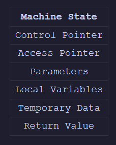
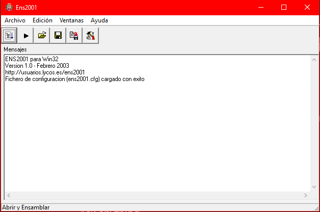
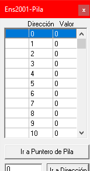
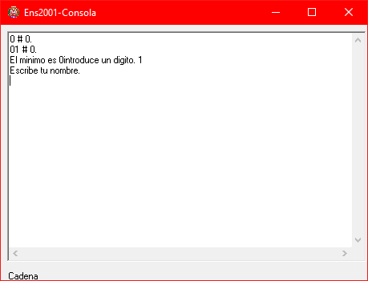

# Language Translator


## Introduction

In this article, I explain how a compiler works, from processing the source file to translating it into object code. This post is based on a university project for the course [Language Translators](https://dlsiis.fi.upm.es/traductores/index.html). All source code is available in my GitHub repository (link at the end, in the [Tools](#tools) section).

The translator takes a source file written in the [Boreal Language](https://dlsiis.fi.upm.es/traductores/IntroBoreal.html), previously validated by the processor, and generates an `.ens` file with the **object code** of the program, written in the [ENS2001 Language](https://dlsiis.fi.upm.es/traductores/Documentos/ENS2001.pdf).

The project is divided into **two main parts**:

- **Language processor**, written in *Java*, provided by the course and extended by us.
- **Language translator**, developed from scratch in *Python*.

> **Note:** This implementation only covers:
>
> - The sentences ``IF-THEN`` and ``IF-THEN-ELSE``.
> - The minimum operator ``MIN``.
> - The procedures ``PROCEDURE`` with parameter passing by *value* and by *reference*.
> - The operators ``*``, ``AND`` and ``=`` (comparison operator, **not** assignment).
>
>⚠️ The *rest of the operators* are **not covered**.
>
>⚠️ No optimization is performed on the generated object code (assembly).
>
>⚠️ **The original Boreal language and the ENS2001 assembler materials may not be available temporarily.**
>This post focuses on my implementation of the compiler, not on the distribution of the original materials. If you need to consult them, you can try accessing it later or search for archived versions.
>
> **Additional Note:** All the code in this implementation is written in Spanish, as the course was taught in Spanish. However, this shouldn't be a problem, as the concepts are explained in English.

## Language Processor

The language processor is responsible for validating that a source file has no **lexical**, **syntactic** or **semantic** errors.

This module is divided into **four phases**:

- **Lexical analyzer**
- **Syntactic analyzer**
- **Semantic analyzer**
- **Intermediate code generator**, which in reality belongs to the translator but is part of the processor's code.

---

Before starting, it is important to know the following concepts:

- **Symbol table**: is responsible for storing identifiers of variables, constants, procedures, etc.

E.g.

```text
TABLA PRINCIPAL #1:
*LEXEMA: 'S1'           // lexeme
    Atributos:          //attributes
    + Tipo: 'cadena'    //type
    + Despl: 4          //offset
    + Param: 0
*LEXEMA: 'IMPRIME'
    Atributos:
    + Tipo: 'procedimiento'
    + numParam: 2
    + TipoParam0: 'entero'          //parameter type
    + TipoParam1: 'entero'
    + ModoParam0: 'valor'           //parameter mode (value or reference)
    + ModoParam1: 'valor'
    + TipoRetorno: '-'              //return type
    + EtiqFuncion: 'EtiqProc2'      //procedure label
```

- **Parse**: is responsible for storing the order in which the grammar rules are executed.

E.g.

```text
bottom-up  2 21 20 19 20 20 18 17 17 17 17 15 9 100 20 100 20 ...
```

> **bottom-up** indicates the type of parser used by the syntactic analyzer.

- **Tokens**: can be anything — a `for`, a `;`, the name of a variable, etc. The source file is split into tokens, which are stored in a separate file with this name.

E.g.

```text
<VAR,->
<ID,1>
<DOSPUNTOS,-> // collon
<STRING,->
<PYC,-> // semicolon
<ID,2>
<DOSPUNTOS,->
...
```

- Finally, the **type of parser**. In this case, we use a *bottom-up* parser, but there are also *top-down parsers*, *table-driven top-down parsers*, and others.

---

### Lexical analyzer

For **lexical errors**, we use a **finite automaton** that goes through the source file character by character. As it advances, it evaluates the states of the automaton, and if everything goes well, a **tokens** file is generated as output.

If any symbol does not fit the automaton, it is considered a **lexical error**.

E.g. of an automaton:


A typical case of a lexical error is an **unterminated string**. The following image shows an automaton that recognizes strings enclosed in quotes:


Here, `C` represents any character. To reach the final state and correctly recognize a string, we need to end with a `"`.

Lexical errors also include situations such as:

- A string that exceeds the maximum allowed length
- A number out of range
- Invalid characters in the language

Among others.

---

### Syntactic analyzer

For **syntactic errors**, we analyze the language structure through grammar rules. These errors appear when the sequence of tokens does not follow the expected syntax. This is where the concepts of first and follow come into play. To explain them, we show a fragment of a grammar:

``` text
Productions = {
Pprima -> P
P -> B P
P -> F P
P -> lambda
B -> var T id Bprima ;
B -> S
B -> if ( E ) W
B -> lambda
W -> id Sprima
W -> output E ;
W -> input id ;
W -> return X ;
W -> Begin C End J
J -> else Begin C End
J -> lambda
Bprima -> = E
Bprima -> lambda
S -> id Sprima
S -> output E ;
S -> input id ;
S -> return X ;
Sprima -> = E ;
Sprima -> ( L ) ;
...
}
```

A **terminal** is a symbol that appears exactly as in the source language (`;`, `if`, `var`...).  
A **non-terminal** represents a rule or construction of the grammar (`T`, `B`, `P`...).

- The set **first** of a non-terminal are all the terminals with which it can start.
    For example, the `first(W)` would be: `id`, `output`, `input`, `return`, `{` (Begin).

- The set **follow** of a non-terminal is all the terminals that can appear **inmediately after** it in a derivation.
    For example, if `X` always follows `;`, then `follow(X) = { ; }`.

If a rule can derive **lambda** (empty string), its `follow` also includes what could come after that point in the production.
E.g. in `P → B P` and `P → lambda`, since `P` can be empty, `follow(B)` includes what follows `P`, even the end-o-input symbol `$`.

A **syntactic error** occurs when the current token **does not belong to the `first` set** of the expected rule.  
For example, if we expect a production of `W` and the next token is `if` (which is not in `first(W)`), it is a syntactic error.

> Tipical example: an `else` without its `if`, or an expression that is not closed.

---

### Semantic analyzer

For **semantic errors**, we use **semantic actions**, which define things such as:

- Attribute inheritance
- Insertions into the symbol table
- Type validations

For example, in a rule like `W → output E ;`, For example, in a rule like `{ W.tipo := E.tipo }`, which asigns `W` the type of `E`.

In the code, this would be reflected by evaluating that case and updating the attribute stack.

A typical semantic error would be when the inherited type does not match the expected one.

---

### Intermediate code generator

Returning to the translator, the intermediate code generator is an extension of the processor in which we define new semantic actions to generate the file containing the **intermediate code**, in this case, using the format of a [quadruples file](https://dlsiis.fi.upm.es/traductores/Documentos/formato_fichero_cuartetos.pdf) as defined by the course.

To do this, in our implementation we define *two new classes*, `gci.java` and `cuarteto.java` (quadruple).

In the first one, we define the following functions:

`emite` (emit), which is the one that generates the quadruples:

``` Java
public static cuarteto emite (String operador, Object arg1, Object arg2, Object resultado) {
    cuarteto c = new cuarteto(operador, arg1, arg2, resultado); // create a quadruple withe an operator, two arguments and a result
    printCuarteto(c);
    return c;
}
```

`nuevatemp` (new temporary), which creates a new temporary variable of the specified type and inserts it into the symbol table:

``` Java
public static tupla<String, Integer> nuevatemp(String tipo) {
    String nuevatemp = "t" + conttemp;
    conttemp++;

    if (ASem.tsGlobal) { // main symbol table
        Integer pos = Procesador.gestorTS.addEntradaTSGlobal(nuevatemp);
        if (!tipo.equals("tipo_error")) {
            Procesador.gestorTS.setTipo(pos, tipo);
        }
        Procesador.gestorTS.setTipo(pos, tipo);
        Procesador.gestorTS.setValorAtributoEnt(pos, "desplazamiento", ASem.despGlobal); // set the offset
        tupla<String, Integer> tupla = new tupla<>("VAR_GLOBAL", ASem.despLocal); // create a tuple
        switch (tipo) { // increment the offset of the variable
            case "lógico":
                ASem.despGlobal += 1;
                break;
            case "entero":
                ASem.despGlobal += 1;
                break;
            case "cadena":
                ASem.despGlobal += 64;
                break;
            default:
                break;
        }
        return tupla;
    } else { // local symbol table
        Integer pos = Procesador.gestorTS.addEntradaTSLocal(nuevatemp);
        if (!tipo.equals("tipo_error")) {
            Procesador.gestorTS.setTipo(pos, tipo);
        }
        Procesador.gestorTS.setTipo(pos, tipo);
        Procesador.gestorTS.setValorAtributoEnt(pos, "desplazamiento", ASem.despLocal); // set the offset
        tupla<String, Integer> tupla = new tupla<>("VAR_LOCAL", ASem.despLocal); // create a tuple
        switch (tipo) { // increment the offset of the variable
            case "lógico":
                ASem.despLocal += 1;
                break;
            case "entero":
                ASem.despLocal += 1;
                break;
            case "cadena":
                ASem.despLocal += 64;
                break;
            default:
                break;
        }
        return tupla;
    }
}
```

`nuevaetiq` (new conditional jump), which creates a new label used for conditional and unconditional jumps:

```Java
public static tupla<String, String> nuevaetiq(String nombre) {
    String nuevaetiq;
    if (nombre == null){
        nuevaetiq = "Etiq" + contetiq;
        contetiq++;
    } else {
        nuevaetiq = nombre;
    }

    tupla<String, String> tupla = new tupla<>("ET", nuevaetiq);
    return tupla;
}
```

In the `cuarteto` class we define the **cuarteto** (quadruple) object and a `toString` method for its representation:

``` Java
public cuarteto(String operador, Object arg1, Object arg2, Object resultado) {
    this.operador = operador; // operator
    this.arg1 = arg1;
    this.arg2 = arg2;
    this.resultado = resultado; // result
}
```

---

Regarding the semantic actions for intermediate code generation, they are defined in the `ASem.java` class alongside the actions of the semantic analyzer itself.

Below is a code snippet for the action `processRule(94, "Z -> id LL");`

```Java
if (llAtb.getLongs() == 0) { // if the identifier has no parameters
    if (idTipo.equals("procedimiento")){ // if it is a procedure
        gci.emite("CALL", Procesador.gestorTS.getValorAtributoCad(idAtb.getPos(), "etiqueta"), null, null);
    } else {
        if (paramRef2.get(idAtb.getPos()) != null && paramRef2.get(idAtb.getPos()).equals("referencia")) {res.setReferencia("referencia");}
        if (identificadores.get(idAtb.getPos()) == null) {
            res.setLugar(new gci.tupla<>("VAR_LOCAL", procesador.Procesador.gestorTS.getValorAtributoEnt(idAtb.getPos(), "desplazamiento")));
        } else {
            if (identificadores.get(idAtb.getPos())) {
                res.setLugar(new gci.tupla<>("VAR_GLOBAL", procesador.Procesador.gestorTS.getValorAtributoEnt(idAtb.getPos(), "desplazamiento")));
            } else {
                res.setLugar(new gci.tupla<>("VAR_LOCAL", procesador.Procesador.gestorTS.getValorAtributoEnt(idAtb.getPos(), "desplazamiento")));
            }
        }
    }

} else {    // otherwise
    LinkedList<Integer> referencias = paramRef.get(idAtb.getPos()); // a list of the type of parameter passing (value or reference)
    LinkedList<String> tipos = paramTipo.get(idAtb.getPos()); // types of the parameters

    for (int i = llAtb.getLongs() - 1; i >= 0; i--) {
        if (referencias.get(i) == 0) { // if the parameter is a value
            if (tipos.get(i).equals("cadena")) { // if the parameter is a string
                gci.emite("PARAM_CAD", llAtb.getParam(i), null, null);
            } else {
                gci.emite("PARAM", llAtb.getParam(i), null, null);
            }
        } else { // if the parameter is a reference
            if (tipos.get(i).equals("cadena")) { 
                gci.emite("PARAM_REF_CAD", llAtb.getParam(i), null, null); // string
            } else {
                gci.emite("PARAM_REF", llAtb.getParam(i), null, null);
            }
        }
    }
    String ret = Procesador.gestorTS.getValorAtributoCad(idAtb.getPos(), "tipoRetorno");
    switch(ret) { // depending on the return type
        case "entero":
            gci.emite("CALL_FUN", Procesador.gestorTS.getValorAtributoCad(idAtb.getPos(), "etiqueta"), null, res.getLugar()); // integer
            break;
        case "cadena":
            gci.emite("CALL_FUN_CAD", Procesador.gestorTS.getValorAtributoCad(idAtb.getPos(), "etiqueta"), null, res.getLugar()); // string
            break;
        default:
            gci.emite("CALL", Procesador.gestorTS.getValorAtributoCad(idAtb.getPos(), "etiqueta"), null, null); // void
            break;
    }
}
```

The semantic actions are divided into two branches:

1. **If there are no parameters (`llAtb.getLongs() == 0`)**:
   - If `id` is a procedure → emit `CALL`.
   - If it is a variable → create a tuple with its scope (local or global) and offset in the symbol table, and assign it to `res.setLugar()` so that it is inherited by the rest of the tree and accessible in other rules.

2. **If there are parameters**:
   - Emit the parameters one by one according to their type and whether they are passed by value or reference.
   - Emit `CALL_FUN`, `CALL_FUN_CAD`, or `CALL` depending on the return type. In this case, only `CALL` is possible since the translator is designed exclusively for procedures (without return value).

> `res` is an object of the attributes class and is the return value of the action method. The actions also receive objects of the attributes class obtained from the semantic analyzer’s attribute stack.

---

## Language Translator

Once the source file has been validated, the files `tokens.txt`, `parse.txt`, `errores.txt`, `ts.txt`, and additionally the file `cuartetos.txt` are generated. Next, the **object code generator**, based on the *cuartetos file*, generates a `.ens` file.

As we have done previously, before diving into the code we need to understand:

A **activation record** (AR) is a contiguous memory area where the activation information of a subprogram is stored (each subprogram has its own).



- The **machine state** (MS) is the state before calling a subprogram.

- The **control pointer** (pc) points to the AR of the calling subprogram. It is used at the end of the subprogram.

- The **access pointer** (pa) points to the activation record of the subprogram where the current subprogram is declared. If ``b`` is defined in ``a``, then the pa of ``b`` points to ``a``. It is used to access non-local variables when there is function nesting.

---

### Files Used

In this implementation, we use three files:

- **`_ens.py`**: handles the creation and writing of the `.ens` file.
- **`_gco.py`**: main file; translates each cuarteto into `.ens` instructions.
- **`_calcprev.py`**: calculates sizes of activation records (ARs) and the static data area (globals).

### Functionality

`_ens.py`: this module contains a single function that opens the `.ens` file in **write mode** and adds lines as needed:

```python
archivo = None

def escribir(linea):
    global archivo
    if archivo is None:
        archivo = open("codobj.ens", 'w')
    archivo.write(linea)
```

`_calcprev.py`: This script scans the symbol table (`ts.txt`) to calculate:

- The size of the **static data area**.
- The sizes of each **activation record** (AR).
- The **references** required for pass-by-reference parameters.

We use *two helper functions*: one to read each line of the symbol table, and another to obtain the size of each type.

```python
def leer():
    global archivo
    if archivo is None:
        archivo = open("ts.txt", 'r')
        
    return archivo.readline() 

def reserva(tipo) -> int:
    if tipo == 'entero':
        return 1
    elif tipo == 'logico':
        return 1
    elif tipo == 'cadena':
        return 64
    else:
        return 0
```

Then, in the `main()` function, we perform a loop that:

1. Reads the symbol table line by line.

2. For the **local table**:

    - **Calculates** the size of the AR by summing the sizes obtained with `reserva(...)`.  
    - **Registers** the offsets of the parameters passed by reference.

3. For the **global table**:

    - **Adds up** the sizes of global variables.

    - **Adds** the return size if it is a function/procedure.

4. Finally, it generates the memory initialization directives and the `EQU` labels for each AR.

```python
def main():
    global cadfinal
    linea = leer()
    tamestaticos = 0 # size of static data area
    ras = 1 # AR number

    while linea:
        if re.match(locales, linea): # if the line is a local table
            coleccion[f"ra{ras}"] = {}
            desp = 1
            while linea.strip() != separador.strip():
                if re.match(lexema, linea):
                    while not re.match(tipo, linea):
                        linea = leer()
                    desp += reserva(re.match(tipo, linea).group(1))
                    linea = leer()
                    d = re.match(de, linea).group(1)
                    linea = leer()
                    p = re.match(pr, linea).group(1)
                    if int(p) == 1:
                        if referencias.get(f"ra{ras}") == None:
                            referencias[f"ra{ras}"] = []
                        referencias[f"ra{ras}"].append(int(d) + 1)
                linea = leer()

            coleccion[f"ra{ras}"] = desp
            ras+=1

        if re.match(globales, linea): # if the line is a global table
            rasaux = 1
            while linea:
                if re.match(lexema, linea):
                    while not re.match(tipo, linea):
                        linea = leer()
                    t = re.match(tipo, linea).group(1)
                    if t != 'funcion' and t != 'procedimiento':
                        tamestaticos += reserva(t)

                    else:
                        while not re.match(retorno, linea):
                            linea = leer()

                        aux = coleccion[f"ra{rasaux}"]
                        aux += reserva(re.match(retorno, linea).group(1))

                        coleccion[f"ra{rasaux}"] = aux
                        rasaux += 1

                linea = leer()
            break

        linea = leer()


    cadfinal = ""
    # If there are static data, reserve memory space and set label
    if tamestaticos > 0:
        cadfinal = f"\t\t\tinicio_estaticas: RES {tamestaticos}\n"
    cadfinal += "\t\t\tinicio_pila: NOP\n" # Mark the start of the stack

    if tamestaticos > 0:
        escribir("\t\t\tMOVE #inicio_estaticas, .IY\n") # The .IY register points to the beginning of the static data area
    escribir("\t\t\tMOVE #inicio_pila, .IX\n") # The .IX register points to the beginning of the stack
    
    # we generate the labels for the ARs
    for ra in coleccion:
        escribir(f"\t\t\t{ra}: EQU {coleccion[ra]}\n")
    escribir("\n\t\t\tBR /main\n")
```

> **Note:** The variable ``cadfinal`` is not written here because its content is added to the end of the ``.ens`` file.

Finally, we have `_gco.py`, the main file. Below is a snippet to understand how it works:

```python
patron_mul = r"""
\(MUL,\s*
    ((?:\{[^{}]*\}|[^,()])+)  ,\s*
    ((?:\{[^{}]*\}|[^,()])+)  ,\s*
    ((?:\{[^{}]*\}|[^,()])+) 
\)
"""


patron_and = r"""
\(AND,\s*
    ((?:\{[^{}]*\}|[^,()])+)  ,\s*
    ((?:\{[^{}]*\}|[^,()])+)  ,\s*
    ((?:\{[^{}]*\}|[^,()])+) 
\)
"""

patron_asig = r"""
\(ASIG,\s*
    ((?:\{[^{}]*\}|[^,()])+)  ,\s*
    ((?:\{[^{}]*\}|[^,()])+)  ,\s*
    ((?:\{[^{}]*\}|[^,()])+) 
\)
"""
```

We have a section with patterns to detect each possible quartet. For this, we use Python's `re` library (regular expressions).

These patterns are also used to extract offsets, names, scopes, and to detect the main program.

```python
p = r"\"\s*\""
ptloc = r"{VAR_LOCAL, (.+)}"
ptglob = r"{VAR_GLOBAL, (.+)}"
ptp = r"EtiqProc(\d+)"
ptf = r"EtiqFunc(\d+)"
ptm = r"main"
```

Regarding the functions, we use the following:

- `leer`: used to read each quartet.

```python
def leer():
    global archivo
    if archivo is None:
        archivo = open("cuartetos.txt", 'r')

    return archivo.readline()
```

- `declarar_cads`: allows us to declare string literals at the end of the output file. At the end of the main loop, we call this function with the `cadena` (string) attribute set to `None` and `write` set to `True`.

```python
def declarar_cads(cadena, write):
    global cads, cds
        
    if cadena is not None and not re.match(p, cadena):

        if cads is None:
            cads = f"\ncadena{cds}:\t" + cadena
        else:
            cads = cads + f"\ncadena{cds}:\t" + cadena

    if write and cads is not None:
        cads += "\n\n"
        escribir(cads)
        return True
```

- `leer_cadena_ens`: with this function, we can transfer a declared string character by character to a register, or from one register to another. This is essential because, unlike integers, strings must be moved entirely character by character.

```python
def leer_cadena_ens(cadena, escad):
    global bucles
    if escad:
        codobj = f"""
            MOVE #{cadena}, .R7
            DEC .R2
            DEC .R7
bucle{bucles}:	    INC .R2
            INC .R7
            MOVE [.R7], [.R2]
            CMP [.R7], #0
            BNZ $bucle{bucles}
        """
    else:
        codobj = f"""
            DEC .R3
            DEC .R2
bucle{bucles}:	    INC .R3
            INC .R2
            MOVE [.R2], [.R3]
            CMP [.R2], #0
            BNZ $bucle{bucles}
        """

    bucles += 1
    escribir(codobj)
```

- `paramcad`: similar to the previous one, this function is used only when the parameter of a subprogram is a string.

```python
def paramcad(des, desra):
    global bucles
    codobj = f"""
            ADD #{des}, .IX
            MOVE .A, .R2
            ADD #{desra}, .IX
            MOVE .A, .R3
            DEC .R3
            DEC .R2
bucle{bucles}:	    INC .R3
            INC .R2
            MOVE [.R2], [.R3]
            CMP [.R2], #0
            BNZ $bucle{bucles}
        """
    bucles += 1
    escribir(codobj)
```

- `transformar_dir`: responsible for moving the memory addresses passed as parameters to the corresponding registers. There can be between one and three parameters. Basically, it receives something like `{VAR_GLOBAL, 3}` and moves the content at address `#3[.IY]` to a register such as `R2`. This is because it is global; if it were local, it would be `#3[.IX]`.

```python
def transformar_dir(dir1, dir2, dir3):
    ptglob = r"{VAR_GLOBAL, (.+)}"
    ptloc = r"{VAR_LOCAL, (.+)}"
    
    nreg = 2
    escribir("\n")
    for dir in [dir1, dir2, dir3]:
        if dir is None:
            continue
        
        elif re.match(ptglob, dir):
            cad = f"\t\t\tADD #{re.match(ptglob, dir).group(1)}, .IY\n\t\t\tMOVE .A, .R{nreg}\n"
            nreg += 1
            escribir(cad)
        
        elif re.match(ptloc, dir): # if it is local, we have to add the size of the EM and PA
            desp = int(re.match(ptloc, dir).group(1)) + 1
            cad = f"\t\t\tADD #{desp}, .IX\n\t\t\tMOVE .A, .R{nreg}\n"
            if raact in _calcprev.referencias and desp in _calcprev.referencias[raact]:
                cad += f"\t\t\tMOVE [.R{nreg}], .R{nreg}\n"
                
            nreg += 1
            escribir(cad)
    escribir("\n")
```

Finally, the main loop is responsible for calling the previous functions and iterating over each received quartet. Since this loop spans about 600 lines, here is the beginning to clearly show its operation.

```python
def main():
    global cds, contador_llamadas, primeraetiq, contparam, where, contmin, param_min, raact, esetiq
    _calcprev.main()

    linea = leer()
    while linea:
        if re.match(patron_mul, linea, re.VERBOSE): # multiplication pattern
            esetiq = False
            coincidencia = re.match(patron_mul, linea, re.VERBOSE)
            transformar_dir(coincidencia.group(1), coincidencia.group(2), coincidencia.group(3))
            cadena = "\t\t\tMUL [.R2], [.R3]\n"
            escribir(cadena)
            cadena = "\t\t\tMOVE .A, [.R4]\n"
            escribir(cadena)
        
        elif re.match(patron_and, linea, re.VERBOSE): # AND pattern
            esetiq = False
            coincidencia = re.match(patron_and, linea, re.VERBOSE)
            transformar_dir(coincidencia.group(1), coincidencia.group(2), coincidencia.group(3))
            cadena = "\t\t\tAND .R2, .R3"
            escribir(cadena)
            escribir("\n")
            cadena = "\t\t\tMOVE .A, .R4"
            escribir(cadena)
            escribir("\n")
```

As can be seen, this is a very straightforward loop where we evaluate each case and generate the corresponding object code.

---

## Usage

This section details the steps necessary to install dependencies, compile the project, and run each component.

### Installing Dependencies

To install the processor library (`ts-lib.jar`) into your local Maven repository, run the following command:

```powershell
mvn install:install-file -Dfile=".\lib\ts-lib.jar" -DgroupId=tslib -DartifactId=ts-lib -Dversion="1.0" -Dpackaging=jar
```

Or if you are on Linux or macOS:

```bash
mvn install:install-file -Dfile="./lib/ts-lib.jar" -DgroupId=tslib -DartifactId=ts-lib -Dversion="1.0" -Dpackaging=jar
```

### Compiling the Processor

Once the library is installed, build the processor executable with:

```powershell
mvn clean package
```

### Running the Processor

After compiling, you can run the processor with the following command (replace the path with that of your Boreal file):

```bash
java -jar .\target\tdl-1.0-SNAPSHOT-jar-with-dependencies.jar .\ruta\al\ficheroBoreal.txt
```

### Running the Translator

From the ``gco/`` folder, where the translator executable is located, run:

```powershell
.\_gco ..\tdl\src\test\resources\ficheroboreal.txt
```

Or if you are on Linux or macOS:

```bash
./_gco ../tdl/src/test/resources/ficheroboreal.txt
```

This will generate all the processor files as well as the ``cuartetos.txt`` (intermediate code) and ``codobj.ens`` (object code) files.

### Object code execution

To run the ``.ens`` file, you need to download the assembler (available in the *Tools* section), compile it, and execute it with the generated ``codobj.ens`` file.

---


## Execution

This section explains how to run the code generated by the translator, and tests different examples to understand its behavior.

> **Note:** Only the Windows explanation is covered here, since on Linux the assembler lacks an interface and is less illustrative.

### Prerequisites

1. Ensure you have compiled the project (see [Usage](#usage) section).
2. Generated `codobj.ens` file (object code).

### Download

To do this, we need to download the assembler (available in the [Tools](#tools) section). After extracting the archive, we get a folder named `ENS2001-Windows` like the following:


Except for the `codobj.ens` file, which is the one we will assemble, the rest of the files come by default. Some examples and two files that are recommended to read are included: `readme.txt` and `bugs.txt`.

### Assembler

The assembler is the executable shown selected in the screenshot above (`winens`).

Once launched, you will see an interface like the following:



To clearly see what the assembler is doing, it is recommended to open the following windows:


- The **código fuente (source code) window** shows the order in which the object code instructions are executed. In this case, since no file has been loaded yet, all addresses are at `NOP`.

    

- The **registros (registers) window** shows the state of the machine registers.

    

- The **pila (stack) window** shows the contents of the data stack.

    

To load the `codobj.ens` file, go to `Archivo > Abrir y Ensamblar`. If everything goes well, it will tell you the assembly was successful:


Now we are ready to run the assembler. Pressing ▶️ will execute the assembler and show the result. If our code calls console output functions, the console will open. In this case, we assembled the file `expr.txt` (available in the GitHub repository), and the result is as follows:


We enter a digit as requested and press enter.



We type our name:


After this, the program finishes its execution successfully.

---

## Tools

Both the language processor and the symbolic assemblers used to assemble the object code (ENS2001) are available at the following link:

>👉 <https://dlsiis.fi.upm.es/traductores/Herramientas.html>

You can find the source code for this implementation in my GitHub repository:

>👉 <https://github.com/azuar4e/TDL>

---

## Conclusion

This project is a great opportunity to learn and dive deeper into how a compiler works. Even though it’s based on a language and an assembler that are not used in development, it serves as a simple and didactic example to explain key concepts.

Again, you can find the source code in my GitHub repository.

Have a nice life!


---

> Author: [Angel Azuara Eizaguirre](https://www.linkedin.com/in/angel-azuara/)  
> URL: https://azuar4e.github.io/en/posts/tdl/  

