# Diseño E Implementación De Una Arquitectura Cloud-Native Basada en Microservicios Desplegados en Kubernetes


## Introducción

Este artículo  aborda la implementación de una infraestructura *cloud-native* desplegada en Amazon Web Services (AWS), basada en una arquitectura de microservicios desarrollados en Go. Asimismo, se incorpora un *pipeline* de integración y despliegue continuo (CI/CD) que permite automatizar el proceso de despliegue, así como garantizar la alta disponibilidad, la tolerancia a fallos y el escalado de los servicios mediante el uso de *workflows* en GitHub y herramientas como FluxCD.

La infraestructura propuesta representa un escenario habitual en entornos de producción actuales, donde las arquitecturas basadas en microservicios han sustituido en gran medida a los **sistemas monolíticos** tradicionales. En estos últimos, la aplicación se construye como una única unidad, lo que puede simplificar el desarrollo inicial, pero introduce limitaciones a medida que el sistema crece en complejidad. En particular, la acumulación de responsabilidades en un único componente dificulta su mantenimiento y provoca que un
fallo pueda afectar al sistema completo.

Por el contrario, en una arquitectura de microservicios, cada componente se encarga de una funcionalidad específica y opera de forma independiente. Esto permite mejorar la disponibilidad del sistema, ya que el fallo de un servicio no implica la caída total de la aplicación. Además, el **desacoplamiento** entre servicios facilita la evolución del sistema y la incorporación de nuevas funcionalidades, así como su escalabilidad y mantenibilidad a largo
plazo.

En cuanto al uso de plataformas cloud, estas, en comparación con infraestructuras tradicionales basadas en servidores locales, permiten disponer de recursos bajo demanda, facilitando la escalabilidad, la alta disponibilidad y la gestión de la infraestructura. En este contexto, proveedores como AWS, Microsoft Azure o Google Cloud ofrecen servicios gestionados que simplifican el despliegue y la operación de aplicaciones distribuidas.

La adopción de una arquitectura cloud-native supone un reto, especialmente en lo relativo al despliegue, la gestión de la infraestructura y la comunicación entre servicios. Herramientas como Kubernetes o los sistemas de CI/CD permiten abordar estos desafíos.

Para poder llevar esto a cabo, se emplea Terraform para el aprovisionamiento de la infraestructura en la nube. Sobre esta infraestructura, se despliega un clúster Kubernetes en el que se utiliza FluxCD como herramienta de entrega continua, conectada a un repositorio de GitHub que contiene los manifiestos necesarios para el despliegue y gestión de la aplicación.

En cuanto a la aplicación desarrollada, esta tiene como finalidad el seguimiento del precio de productos en una determinada web. Para ello, se implementa una arquitectura basada en microservicios compuesta por una API (Application Programming Interface) y un servicio de *scraping*, complementados con un componente de reprogramación de tareas basado en tecnología *serverless* mediante AWS Lambda.

> **Nota:** Se presupone que el lector de este artículo cuenta con conocimientos en las tecnologías utilizadas en la realización del trabajo.
>
> **Nota 2**: La memoria del trabajo aparecerá publicada en la web de la politécnica a finales de mes cuando realice la defensa de la misma. En ella se muestra una explicación más detallada del trabajo, para poder entender el funcionamiento con pocos conocimientos del tema del mismo.

## Desarrollo

Antes de entrar en materia, conviene hacer una vista de alto nivel al diseño del sistema y la elección del *stack* tecnológico.

Los microservicios han sido desarrollados en [Go](https://go.dev/doc/faq#creating_a_new_language) (o Golang), un lenguaje diseñado por Google específicamente para abordar problemas de escalabilidad y sistemas distribuidos. La elección de este lenguaje se justifica por su rendimiento cercano a lenguajes de bajo nivel pero con una gestión de memoria simplificada. Además, su adopción es un estándar de facto en el ecosistema cloud-native, siendo el lenguaje en el que se basan infraestructuras críticas como Kubernetes, lo que garantiza una integración óptima y un despliegue eficiente en contenedores.

Para soportar el funcionamiento de estos servicios, se han desplegado los siguientes recursos en AWS:

- Se emplea Amazon DynamoDB para el almacenamiento de los trabajos, así como una
instancia de Amazon Relational Database Service (RDS) con PostgreSQL para la gestión de usuarios. Asimismo, se
utiliza una función AWS Lambda para la implementación del re-scheduler.
- A nivel de red, se define una Virtual Private Cloud (VPC) que engloba toda la infraestructura, compuesta por dos subredes públicas y dos privadas. En estas últimas se alojan los recursos principales, como el clúster de EKS y la base de datos RDS.
La configuración se completa con las correspondientes tablas de enrutamiento, un Internet Gateway y un NAT Gateway para habilitar la conectividad externa.
- Se utiliza Amazon Simple Notification Service (SNS) para la notificación de cambios de precio a los usuarios.
- Para la gestión de colas de mensajes se emplea Amazon Simple Queue Service (SQS).
- Amazon CloudWatch se utiliza para la recopilación y monitorización de métricas del sistema.
- Amazon Route 53 se emplea para la gestión de nombres de dominio, proporcionando
un punto de acceso estable a determinados recursos de la infraestructura.
- Finalmente, se despliega un clúster de Amazon Elastic Kubernetes Service (EKS) en el que se instala FluxCD.
Mediante un enfoque GitOps, este se encarga de aplicar los manifiestos definidos en un repositorio de GitHub y garantizar la consistencia entre el estado deseado y el estado real del sistema. Adicionalmente, se despliega el [Ingress Controller de NGINX](https://github.com/kubernetes/ingress-nginx), que expone la aplicación mediante un Elastic Load Balancer (ELB), actuando como punto de entrada externo.

> El controlador de Ingress NGINX está deprecado, sin actualizaciones desde marzo de 2026. La alternatiba natural sería utilizar el **Gateway API** de Kubernetes.

En la siguiente figura se muestra el diagrama de la arquitectura de la infraestructura desplegada, proporcionando una visión global de los componentes descritos.

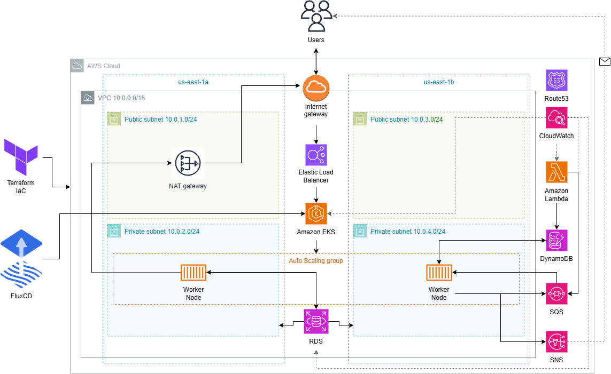
{.drawio-diagram}

**¿Por qué este stack y no otro?**

Para las bases de datos, se optó por dos soluciones según el caso de uso: **DynamoDB** para los jobs (acceso simple por clave, sin joins) y **RDS PostgreSQL** para usuarios (datos relacionales con garantías ACID). Cada una donde tiene sentido.

En mensajería, se descartó Kafka por ser excesivo para este volumen — requiere mantener un clúster propio y está pensado para millones de eventos. Con **SQS/SNS** es suficiente y sin overhead operativo. Se eligió SNS sobre SES para las notificaciones por su flexibilidad para añadir canales adicionales como SMS sin modificar la arquitectura.

El re-scheduler se implementó como **Lambda** en vez de un pod de Kubernetes. Su lógica es reducida y se ejecuta puntualmente, por lo que no tiene sentido mantener un proceso corriendo 24/7 sin carga.

Para la orquestación, la decisión estuvo entre EKS, ECS y EC2. ECS es más sencillo pero ata al ecosistema AWS. EC2 implicaría gestionar la orquestación manualmente, inviable para este proyecto. Se eligió **EKS** por su portabilidad, su ecosistema consolidado (FluxCD, NGINX Ingress...) y por ser el estándar en entornos profesionales.

Finalmente, se escogió **Terraform** sobre CloudFormation por ser agnóstico al proveedor, tener un ecosistema de módulos más amplio y un lenguaje (HCL) más legible y mantenible.

---

### Microservicios

Los microservicios de la arquitectura, desarrollados en Go, desplegados en los worker nodes del clúster de EKS mediante FluxCD, tal y como se describe en la sección de [Automatización y Pipeline CI/CD](#automatización-y-pipeline-cicd).
<a id="micros-diagram"></a>
El funcionamiento de estos microservicios queda ilustrado en la siguiente figura:


{.drawio-diagram}

El usuario se registra e inicia sesión en la aplicación a través del API Gateway. Una vez autenticado, recibe en una cookie el token JWT con el que puede acceder a los endpoints `/validate`, `/jobs` (GET, POST, DELETE) y `/jobs/:id`.

Al registrarse, el usuario recibe un correo de Amazon SNS solicitando su suscripción para poder ser notificado. Cuando se crea un job (compuesto de la URL del producto y el precio objetivo), este se encola en SQS. El scraper consume la cola mediante 5 hilos en paralelo: extrae la URL y el precio, hace scraping de la web y compara con el precio objetivo. Si el precio es igual o inferior, se notifica al usuario vía email.

El re-scheduler se encarga de reencolar los trabajos que, tras ser procesados por el scraper, no han alcanzado la condición deseada. Una vez que el scraper elimina el mensaje de la cola, el re-scheduler evalúa el último precio registrado y, si no se cumple la condición, genera un nuevo mensaje en SQS para su próximo ciclo.

El código fuente del [API Gateway](https://github.com/azuar4e/api-gateway-tfg) y del [Scraper](https://github.com/azuar4e/scraper-tfg) está disponible en los repositorios públicos de GitHub, mientras que el código del re-scheduler, al tratarse de una función Lambda de menor extensión, se incluye en el [Anexo](#anexo).

#### API Gateway

Para el desarrollo de este microservicio se ha optado por la librería [Gin](https://github.com/gin-gonic/gin), un framework de Go ligero orientado a la construcción de APIs REST, así como por el SDK de AWS para Go.

El punto de entrada de la aplicación se encuentra en `main.go`. Antes de inicializar el router, se ejecuta una función `init` en la que se establecen las conexiones con los servicios externos:

```go
func init() {
    initializers.LoadEnvVariables()
    initializers.ConnectToPostgres()
    initializers.SyncDB()
    initializers.ConnectToDynamo()
    initializers.ConnectToSQS()
    initializers.ConnectToSNS()
}
```

A continuación, en la función principal, se configura el router y se definen los endpoints:

```go
func main() {
    r := gin.Default()

    v1 := r.Group("/api/v1")
    // Registro y login de usuarios
    v1.POST("/signin", controllers.SigninHandler)
    v1.POST("/signup", controllers.RegisterHandler)

    v1.Use(middleware.AuthMiddleware())

    // Endpoints protegidos
    v1.POST("/jobs", handlers.CreateJobHandler)
    v1.GET("/jobs", handlers.GetJobsHandler)
    v1.DELETE("/jobs", handlers.DeleteJobsHandler)
    v1.GET("/jobs/:id", handlers.GetJobByIdHandler)
    v1.DELETE("/jobs/:id", handlers.DeleteJobHandler)
    v1.GET("/validate", controllers.Validate)

    r.Run(":9090")
}
```

La API queda expuesta en el puerto ``9090``, accesible desde el exterior a través del ELB bajo el prefijo `/api/v1`. El middleware de autenticación se sitúa deliberadamente después de los endpoints públicos de autenticación.

Durante el registro (`/signup`), el usuario envía sus credenciales, se genera un hash de la contraseña y se almacena en PostgreSQL. Adicionalmente, el usuario es suscrito a un topic de SNS. Para el inicio de sesión (`/signin`), se valida la contraseña y se genera un JWT firmado:

```go
token := jwt.NewWithClaims(jwt.SigningMethodHS256, jwt.MapClaims{
    "sub": user.ID,
    "exp": time.Now().Add(time.Hour * 24 * 30).Unix(),
})

tokenString, err := token.SignedWith([]byte(os.Getenv("JWT_SECRET")))

// ...

c.SetSameSite(http.SameSiteLaxMode)
c.SetCookie("Authorization", tokenString, 3600*24*30, "", "", false, true)
c.JSON(http.StatusOK, gin.H{})
```

El middleware de autenticación obtiene el token desde la cookie y procede a su validación:

```go
token, err := jwt.Parse(tokenString, func(token *jwt.Token) (any, error) {
    return []byte(os.Getenv("JWT_SECRET")), nil
}, jwt.WithValidMethods([]string{jwt.SigningMethodHS256.Alg()}))
if err != nil {
    c.AbortWithStatusJSON(http.StatusUnauthorized, gin.H{"error": "Invalid token: " + err.Error()})
    return
}
```

En cuanto a la estructura de datos persistida en DynamoDB para los jobs:

```go
type JobDynamoItem struct {
  PK          int64   `dynamodbav:"PK"` // user_id
  SK          int64   `dynamodbav:"SK"` // job_id
  URL         string  `dynamodbav:"url"`
  TargetPrice float64 `dynamodbav:"target_price"`
  LastPrice   float64 `dynamodbav:"last_price"`
  Status      string  `dynamodbav:"status"`
  CreatedAt   string  `dynamodbav:"created_at"`
  UpdatedAt   string  `dynamodbav:"updated_at"`
}
```

Las pruebas de los handlers se realizan de forma aislada mediante mocks de las dependencias externas, definiendo una interfaz que abstrae la operación `PutItem`:

```go
type DynamoInterface interface {
  PutItem(ctx context.Context, params *dynamodb.PutItemInput, optFns ...func(*dynamodb.Options)) (*dynamodb.PutItemOutput, error)
}
```

Esto permite inyectar una implementación simulada durante los tests sin necesidad de conexiones reales con AWS.

Además de la implementación funcional, el repositorio incorpora un flujo de integración continua definido mediante GitHub Actions. Dicho flujo automatiza la ejecución de pruebas, la construcción de la imagen de contenedor a partir del Dockerfile ubicado en la raíz del proyecto, y el almacenamiento de dicha imagen en el GHCR (ilustrado en el [diagrama de los micros](#micros-diagram)), garantizando que cada cambio validado pueda integrarse en condiciones reproducibles

#### Scraper

Para el desarrollo de este microservicio se ha optado por [Playwright](https://github.com/playwright-community/playwright-go), una biblioteca de automatización de navegadores, junto con el SDK de AWS para Go.

Al igual que en el API Gateway, antes de la ejecución de la función principal se inicializan las conexiones con DynamoDB, SQS y SNS mediante una función `init`.

La función `main` define una estrategia de procesamiento concurrente basada en cinco workers:

```go
func main() {
  messageChan := make(chan types.Message)

  for w := 1; w <= 5; w++ {
    go worker(w, messageChan)
  }

  for {
    output, err := initializers.SQS.ReceiveMessage(context.TODO(), &sqs.ReceiveMessageInput{
        QueueUrl:            aws.String(os.Getenv("SQS_QUEUE_URL")),
        MaxNumberOfMessages: 1,
        WaitTimeSeconds:     20,
    })
    // ...
    for _, m := range output.Messages {
      messageChan <- m
    }
  }
}

func worker(id int, messages <-chan types.Message) {
  for m := range messages {
    setJobStatus(m, "processing")
    handlers.ProcessMessageHandler(m)
    initializers.SQS.DeleteMessage(context.TODO(), &sqs.DeleteMessageInput{
      QueueUrl:      aws.String(os.Getenv("SQS_QUEUE_URL")),
      ReceiptHandle: m.ReceiptHandle,
    })
  }
}
```

Cada worker actualiza el estado del job a `processing` antes de procesarlo, evitando que el re-scheduler lo reencole de forma prematura. La extracción se realiza lanzando un navegador Firefox en modo headless:

```go
pw, err := playwright.Run()
browser, err := pw.Firefox.Launch(playwright.BrowserTypeLaunchOptions{
    Headless: playwright.Bool(true),
})
page, err := browser.NewPage(playwright.BrowserNewPageOptions{
    Locale:    playwright.String("es-ES"),
    UserAgent: playwright.String("Mozilla/5.0 (Windows NT 10.0; Win64; x64) AppleWebKit/537.36 (KHTML, like Gecko) Firefox/122.0"),
})
```

Una vez creada la página, el servicio navega hasta la URL del job y localiza los selectores del título y precio según el dominio (Amazon, PCComponentes). Si el precio actual es inferior o igual al objetivo, el job pasa a estado `notified` y se envía una notificación via SNS. En caso contrario, el estado se actualiza a `active` y se almacena el último precio para el siguiente ciclo.

Finalmente, al igual que en el API Gateway, el repositorio incorpora un flujo de integración continua definido mediante GitHub Actions. Dicho flujo automatiza la ejecución de pruebas, la construcción de la imagen del servicio a partir del Dockerfile definido en la raíz del repositorio y su publicación en el GHCR.

#### Lambda Re-Scheduler

El re-scheduler se ha implementado como una función AWS Lambda cuya responsabilidad consiste en reencolar los trabajos que continúan en estado `active` tras haber sido procesados por el scraper. Consulta DynamoDB, identifica los jobs que no han alcanzado el precio objetivo y genera un nuevo mensaje en SQS.

Su interés no reside en la complejidad algorítmica sino en la decisión arquitectónica de desacoplar la lógica de replanificación del proceso principal de scraping, aprovechando el modelo serverless de AWS Lambda.

---

### Infraestructura como Código (IaC)

El aprovisionamiento de la infraestructura se ha automatizado mediante **Terraform**. Una de las motivaciones principales es ajustarse al presupuesto del entorno AWS Academy Learner Lab (límite de 50$): gracias a IaC, se puede levantar y eliminar toda la infraestructura en minutos.

El código fuente descrito en esta sección puede encontrarse en el [repositorio de GitHub](https://github.com/azuar4e/terraform-tfg).

Los recursos están estructurados en módulos:

``` plaintext
terraform/
    environments/
    modules/
        cloudwatch/
        dynamo/
        eks/
        networking/
        rds/
        route53/
```

Estos módulos nos sirven para levantar los recursos mostrados en la siguiente imagen:


{.drawio-diagram}

> **Nota:** por cuestiones de alcance, el topic de SNS, la cola SQS y la función Lambda del re-scheduler se desplegaron manualmente. El entorno Learner Lab regenera ARNs en cada sesión, lo que hacía inviable gestionarlos desde Terraform sin complejidad añadida.

Para la configuración de la función Lambda, se crea una nueva instancia indicando un nombre y seleccionando Amazon Linux 2023 como runtime. Posteriormente, en la opción Configure custom execution role, se selecciona el rol existente LabRole. En caso de no especificar un rol manualmente, AWS intentaría generar uno automáticamente; sin embargo, esta funcionalidad se encuentra restringida en el entorno utilizado.

Finalmente, se añade el código fuente de la función. Para ello, es necesario compilarlo previamente:

```bash
$env:GOOS="linux"
$env:GOARCH="amd64"
$env:CGO_ENABLED="0"
go build -o bootstrap ./cmd/

aws lambda update-function-code --function-name microservice-scheduler --zip-file fileb://lambda.zip
```

El *trigger* se configura mediante **Amazon EventBridge** con una regla que se ejecuta cada minuto, y por último añadimos las variables de entorno utilizadas por la Lambda.

Para la configuración de SQS, se modifican dos parámetros relevantes: el tamaño máximo de mensaje (256 KB) y el `Receive message wait time` (20 segundos), para reducir el número de respuestas vacías del polling continuo del scraper.

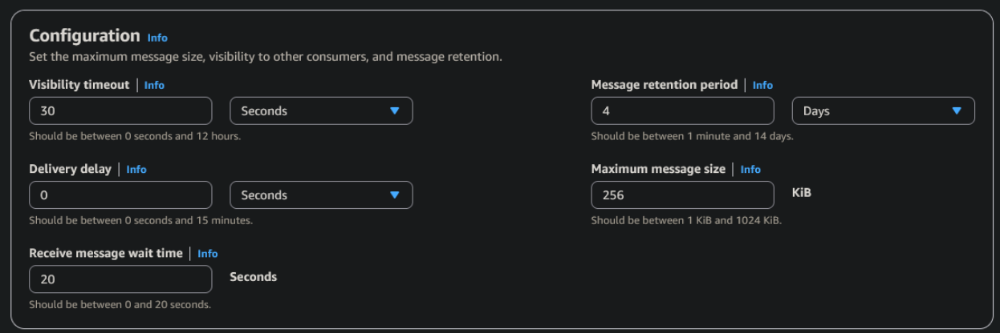

En cuanto a la creación del topic, se le asigna un nombre (``PricesNotification``) y se habilita el cifrado, manteniéndose el resto de parámetros con su configuración por defecto.

Respecto al `tfstate`, en un entorno real se almacenaría en un bucket de S3 (Simple Storage Service) con state locking mediante DynamoDB, para ello hacemos uso del módulo público ``tfstate-backend`` de Cloud Posse:

```hcl
module "terraform_state_backend" {
  source    = "cloudposse/tfstate-backend/aws"
  namespace = "tfg"
  stage     = "dev"
  name      = "azuar4e"
  attributes = ["state"]

  terraform_backend_config_file_path = "."
  terraform_backend_config_file_name = "backend.tf"
  force_destroy                      = false
}
```

En la configuración de la VPC se definen dos subredes públicas y dos privadas en distintas zonas de disponibilidad:

```hcl
resource "aws_subnet" "public-1a" {
  vpc_id            = aws_vpc.tfg-vpc.id
  cidr_block        = "10.0.1.0/24"
  availability_zone = "us-east-1a"
  tags = { Name = "public-1a" }
}

resource "aws_subnet" "private-1a" {
  vpc_id            = aws_vpc.tfg-vpc.id
  cidr_block        = "10.0.2.0/24"
  availability_zone = "us-east-1a"
  tags = { Name = "private-1a" }
}
# (ídem para 1b)
```

En EKS se habilita el cifrado de secretos mediante AWS KMS:

```hcl
resource "aws_eks_cluster" "main" {
  name     = "eks-cluster"
  role_arn = var.cluster_role_arn

  vpc_config {
    subnet_ids              = var.private_subnet_ids
    endpoint_public_access  = true
    endpoint_private_access = true
  }

  encryption_config {
    provider {
      key_arn = "arn:aws:kms:REGION:ACCOUNT_ID:alias/aws/eks"
    }
    resources = ["secrets"]
  }
}
```

RDS se configura como no accesible públicamente, con un Security Group que restringe el acceso solo al clúster EKS:

```hcl
ingress {
  from_port       = 5432
  to_port         = 5432
  protocol        = "tcp"
  security_groups = [var.eks_cluster_security_group_id]
}
```

Se configuran alarmas en CloudWatch para errores de Lambda, CPU de RDS/EKS y longitud de la cola SQS, notificando a un topic de SNS cifrado con KMS:

```hcl
resource "aws_sns_topic" "alarms" {
  name              = "cloudwatch-alarms"
  kms_master_key_id = "alias/aws/sns"
}

resource "aws_cloudwatch_metric_alarm" "lambda-errors" {
  alarm_name          = "lambda-errors-alarm"
  comparison_operator = "GreaterThanOrEqualToThreshold"
  evaluation_periods  = 2
  metric_name         = "Errors"
  namespace           = "AWS/Lambda"
  period              = 120
  statistic           = "Sum"
  threshold           = 1
  alarm_actions       = [aws_sns_topic.alarms.arn]
  dimensions = {
    FunctionName = var.lambda_function_name
  }
}
```

Por último, Route53 expone un alias estable para RDS (`db.dev.internal`), evitando modificar la configuración de los microservicios cuando se recrea la instancia:

```hcl
resource "aws_route53_record" "db_record" {
  zone_id = aws_route53_zone.dev_internal.zone_id
  name    = "db.dev.internal"
  type    = "CNAME"
  ttl     = 60
  records = [var.rds_endpoint]
}
```

La estimación de costes de la infraestructura, calculada con [Infracost](https://www.infracost.io/), asciende a **187\$/mes** con todos los recursos activos 24/7. En la práctica, solo se consumieron 19\$ durante el desarrollo del TFG gracias a levantar y destruir la infra según la necesidad.

| Módulo | Recurso | Coste mensual (USD) |
|--------|---------|---------------------|
| eks | Cluster EKS | $73.00 |
| eks | Node Group (2x t3.medium + 40GB gp2) | $64.74 |
| networks | NAT Gateway | $32.85 |
| rds | RDS PostgreSQL db.t3.micro + 20GB gp2 | $15.44 |
| cloudwatch | Alarmas CloudWatch (4x standard) | $0.40 |
| route53 | Hosted Zone | $0.50 |
| terraform_state_backend | S3 + DynamoDB (estado Terraform) | variable |
| dynamo | DynamoDB tabla jobs | variable |
| cloudwatch | SNS Topic Alarms | variable |
| **Total base mensual** | | **$186.93** |

> Los recursos marcados como variable dependen del uso (peticiones, almacenamiento, notificaciones) y tienen coste cero o mínimo en el entorno de desarrollo. El coste total base corresponde a recursos con precio fijo independiente del tráfico.

---

### Orquestación con Kubernetes

La orquestación en Kubernetes se apoya en Ingress, Services, Deployments, ConfigMaps, Secrets, metrics-server y HPA, desplegados mediante FluxCD (explicación en la sección [Automatización y Pipeline CI/CD](#automatización-y-pipeline-cicd)).

La API escucha en el puerto ``9090``, expuesta mediante un Service de tipo ClusterIP:

```yaml
spec:
  ports:
  - port: 80
    protocol: TCP
    targetPort: 9090
  selector:
    app: api-gateway
  type: ClusterIP
```

Para gestionar la entrada de tráfico se utiliza el [Ingress Controller de NGINX](https://github.com/kubernetes/ingress-nginx), instalado mediante HelmRelease y HelmRepository. En la definición del Ingress se especifican las reglas de enrutamiento HTTP hacia el servicio correspondiente. En particular, se define la ruta raíz (``/``) para redirigir todas las peticiones entrantes hacia el Service de la API:

```yaml
spec:
  ingressClassName: nginx
  rules:
  - http:
      paths:
      - backend:
           service:
             name: api-svc
             port:
               number: 80
        path: /
        pathType: Prefix
```

En el `values.yaml` se define un Service de tipo LoadBalancer para el Ingress Controller, lo que provoca la creación automática de un ELB en AWS:

```yaml
values:
  controller:
    admissionWebhooks:
      enabled: false
    replicaCount: 1
    service:
      type: LoadBalancer
```

Por otro lado, se hace uso de los recursos ConfigMap para la inyección de variables deconfiguración no sensibles en los microservicios, así como Secret para el almacenamientode información sensible, como credenciales de AWS o webhooks externos.

Los secretos (credenciales AWS, webhook Discord, conexión a RDS) se crean manualmente en el clúster y no se incluyen en el repositorio por motivos de seguridad:

```bash
kubectl create secret generic discord-url -n flux-system \
  --from-literal=address="<DISCORD_WEBHOOK_URL>"

kubectl create secret generic aws-creds \
  --from-literal=AWS_ACCESS_KEY_ID=<AWS_ACCESS_KEY_ID> \
  --from-literal=AWS_SECRET_ACCESS_KEY=<AWS_SECRET_ACCESS_KEY> \
  --from-literal=AWS_SESSION_TOKEN=<AWS_SESSION_TOKEN> \
  --from-literal=AWS_DEFAULT_REGION=us-east-1

kubectl create secret generic db-credentials \
  --from-literal=DB="host=db.dev.internal user=dbadmin password=<PASSWORD> dbname=mydb port=5432 sslmode=require"
```

En este caso se definen tres secretos: uno para el webhook de Discord, otro con las credenciales de AWS necesarias para que los microservicios interactúen con los servicios del proveedor, y un tercero con la configuración de acceso a la base de datos Postgres desplegada en RDS.

Por último, se configura un metric server, encargado de exponer las métricas de CPU y memoria de los pods a la API de Kubernetes, requisito indispensable para el funcionamiento del HPA.

---

### Automatización y Pipeline CI/CD

El ciclo de vida del software se apoya en dos mecanismos complementarios: **GitHub Actions** para la integración continua y **FluxCD** para la entrega continua. GitHub Actions valida el código, ejecuta pruebas y construye imágenes de contenedor; FluxCD implementa el enfoque GitOps sobre EKS tomando un repositorio Git como única fuente de verdad.

El código completo de FluxCD se encuentra en el repositorio público [flux-repo-tfg](https://github.com/azuar4e/flux-repo-tfg).

FluxCD se inicializa con:

```bash
flux bootstrap github \
  --owner=azuar4e \
  --repository=flux-repo-tfg \
  --branch=master \
  --path=./clusters/home \
  --token-auth \
  --components-extra=image-reflector-controller,image-automation-controller
```

Una vez completado el proceso de bootstrap, FluxCD despliega y mantiene sincronizados los recursos definidos en el repositorio, entre los que se incluyen los manifiestos de los microservicios, los servicios internos, las reglas de ingress, el servidor de métricas, las configuraciones asociadas al registro de imágenes y los objetos necesarios para automatizar la actualización de versiones desplegadas en el clúster. En la [imagen de la sección de microservicios](#micros-diagram) se ilustran algunos de los componentes desplegados por Flux.

Como caso de uso representativo, puede considerarse la monitorización de nuevas versiones de imágenes en GHCR y la actualización automática de los manifiestos. La política de actualización automática de imágenes:

```yaml
# En el manifiesto del Deployment:
- image: ghcr.io/azuar4e/scraper-tfg:22 # {"$imagepolicy": "flux-system:scraper-tfg"}
```

```yaml
apiVersion: image.toolkit.fluxcd.io/v1
kind: ImagePolicy
metadata:
  name: scraper-tfg
  namespace: flux-system
spec:
  imageRepositoryRef:
    name: scraper-tfg
  filterTags:
    pattern: '^\d+$'
  policy:
    numerical:
      order: asc
```

Por último, para materializar estos cambios en el repositorio GitOps se utiliza un recurso de tipo ImageUpdateAutomation, encargado de actualizar automáticamente los manifiestos cuando se detecta una nueva versión válida de la imagen.

Con este enfoque, al hacer push al repositorio del microservicio, GitHub Actions construye y publica la nueva imagen en GHCR; FluxCD detecta la nueva versión, actualiza el manifiesto automáticamente (commit del bot de Flux) y reconcilia el clúster, enviando una notificación a Discord.

---

### Comunicación entre servicios

La comunicación entre componentes sigue un modelo asíncrono y desacoplado. En lugar de llamadas directas entre microservicios, el intercambio se realiza mediante SQS como intermediario, y SNS como canal de salida para notificaciones.

El flujo completo:

1. El usuario llama al API Gateway, que encola el mensaje en SQS.
2. El scraper lee de esa cola y procesa el mensaje.
3. Si el precio alcanzó el objetivo se notifica via SNS al usuario.
4. Si no, la Lambda consulta DynamoDB buscando jobs en estado `active` y los reinserta en SQS para el siguiente ciclo.

Este flujo queda ilustrado en la siguiente imagen:

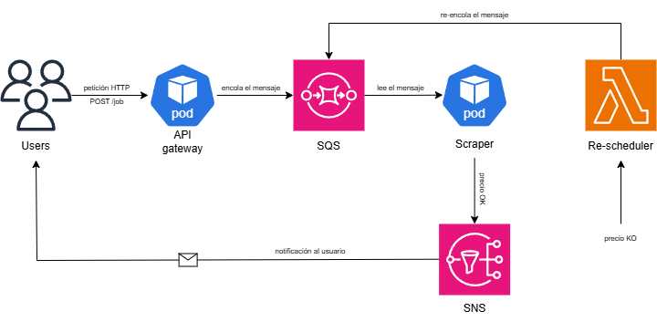
{.drawio-diagram}

Se configura un `visibility timeout` de 30 segundos en SQS para garantizar que un mensaje no sea consumido por múltiples workers simultáneamente. Además, el scraper actualiza el estado del job a `processing` en DynamoDB antes de procesarlo, evitando que el re-scheduler lo reencole de forma prematura.

---

### Seguridad

En términos de seguridad se distingue entre `security-of-the-cloud` (responsabilidad de AWS: hardware, red física, hipervisores...) y `security-in-the-cloud` (responsabilidad del desarrollador):

- **At-rest:** cifrado habilitado en RDS PostgreSQL y en la tabla DynamoDB.
- **In-transit:** como limitación, no se ha configurado TLS, por lo que las comunicaciones externas se realizan mediante HTTP. La comunicación interna entre pods tampoco cuenta con TLS al no haberse implementado un *service mesh*.

Por otra parte, a nivel de **filtrado de red**, para el control del tráfico a la RDS se hace uso de los Security Groups, aceptando solo el procedente del Security Group del clúster de EKS, como se muestra a continuación:

```hcl
ingress {
  from_port       = 5432
  to_port         = 5432
  protocol        = "tcp"
  security_groups = [var.eks_cluster_security_group_id]
}
```

El acceso a la aplicación se controla a través del API Gateway con autenticación JWT. A nivel de infraestructura, la separación entre subredes públicas y privadas garantiza que solo los componentes que requieren exposición exterior sean accesibles desde Internet. La entrada al sistema se centraliza a través del Ingress Controller y del ELB, reduciendo así la superficie de exposición de la arquitectura.

Por último, la configuración de los servicios desplegados en Kubernetes se gestiona mediante ConfigMaps y recursos de tipo Secret. Esta separación permite distinguir entre parámetros de configuración no sensibles y credenciales o valores confidenciales, manteniendo una separación entre configuración general y credenciales sensibles dentro de los manifiestos del clúster.


{.drawio-diagram}

---

### Escalabilidad y Recursos

El sistema se diseñó teniendo en cuenta la escalabilidad y el uso eficiente de recursos. Se aplicaron dos mecanismos principales:

1. **Resource requests y limits** en los Deployments para evitar que un pod consuma todos los recursos del nodo.
2. **HPA** para el scraper y la API, ajustando dinámicamente el número de réplicas según la carga.

Límites definidos para la API:

```yaml
resources:
  requests:
    cpu: "50m"
    memory: "32Mi"
  limits:
    cpu: "200m"
    memory: "128Mi"
```

Y para el scraper (ajustados tras un ``OOMKilled`` durante las pruebas):

```yaml
resources:
  requests:
    cpu: "300m"
    memory: "256Mi"
  limits:
    cpu: "900m"
    memory: "1Gi"
```

El HPA se configuró con un umbral del 50% de CPU y un rango de 1 a 10 réplicas para la API, y de 1 a 4 para el scraper. El grupo de nodos EKS se diseñó con un mínimo de 1 nodo, un deseado de 2 y un máximo de 3 instancias `t3.medium` (2 vCPUs, 4 GB RAM), con capacidad para escalar hasta 6 cores y 12 GB mediante el Cluster Autoscaler.

> Escalar el scraper por CPU no es lo ideal, ya que es un servicio asíncrono cuya carga depende del número de mensajes en la cola SQS, no del tráfico HTTP. Se usa la CPU como métrica proxy dada la ausencia de un HPA basado en métricas personalizadas. Una mejora futura sería adoptar [KEDA](https://keda.sh/) para escalar en base al número de mensajes en [SQS](https://keda.sh/docs/2.19/scalers/aws-sqs/).

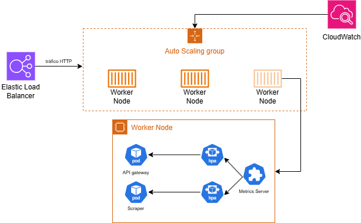
{.drawio-diagram}

---

## Validación y Pruebas

En este capítulo se valida el correcto funcionamiento del sistema, tanto a nivel funcional como de infraestructura y automatización del despliegue.

---

### Validación funcional de la API

#### Endpoint /signup

La API permite registrar correctamente un nuevo usuario.


Tras el registro, la API suscribe automáticamente al usuario a un topic de SNS, enviando un correo de confirmación.

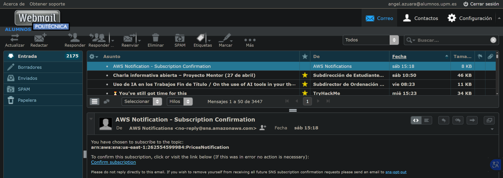

Como podemos observar, el usuario queda registrado como suscriptor una vez aceptada la invitación.


También se ha validado el comportamiento ante errores, como la ausencia del campo contraseña.

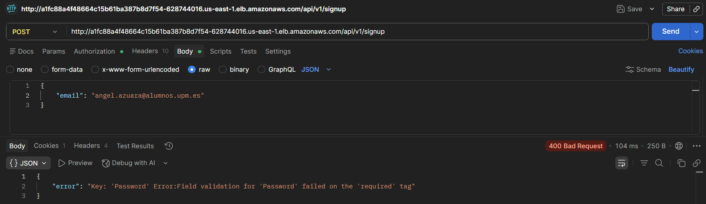

#### Endpoint /signin

La API autentica al usuario correctamente con credenciales válidas, generando una cookie con el token JWT.


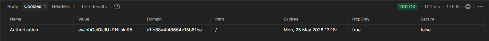

Con credenciales incorrectas devuelve error de autenticación, y sin sesión activa devuelve 401 Unauthorized.

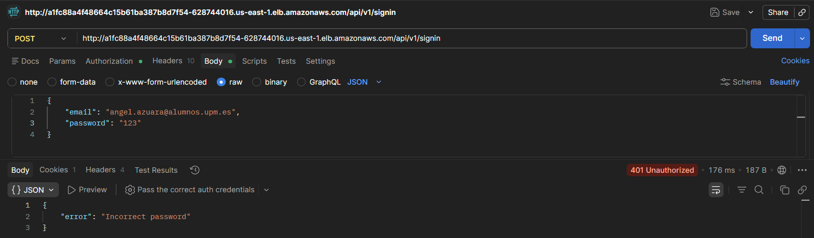
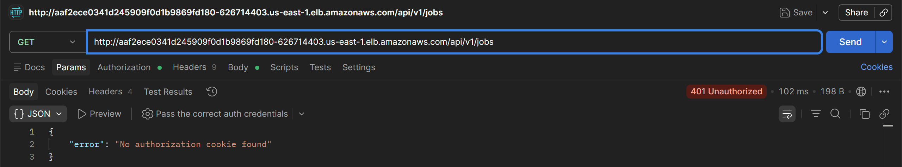

#### Endpoint /validate

Permite comprobar si el usuario se encuentra autenticado mediante la cookie de sesión.


#### Endpoint /jobs

Permite crear, listar y eliminar trabajos del usuario autenticado.

Al crear un job con un precio objetivo superior al precio actual, el sistema envía un email con el asunto *Price Alert*, confirmando el correcto funcionamiento del flujo de notificaciones.

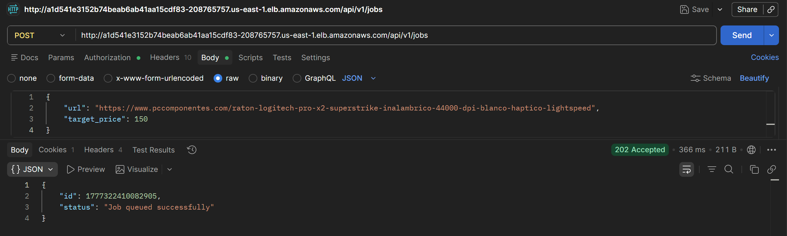
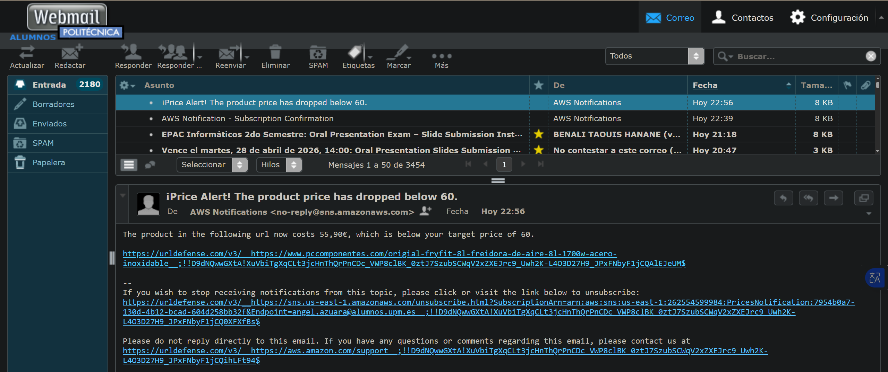

Si falta algún parámetro se devuelve un `400 Bad Request`:

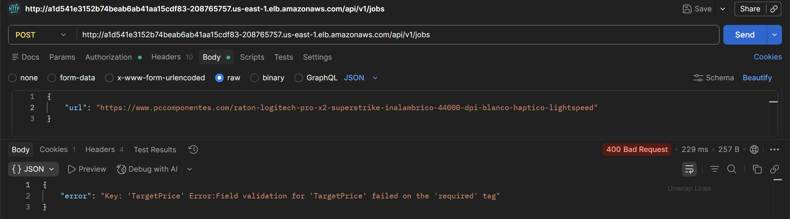

Listar los trabajos:


Borrar los trabajos:

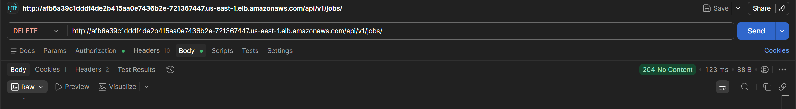

#### Endpoint /jobs/:id

Permite consultar o eliminar un trabajo concreto por su identificador. Si no existe, devuelve 404 Not Found.

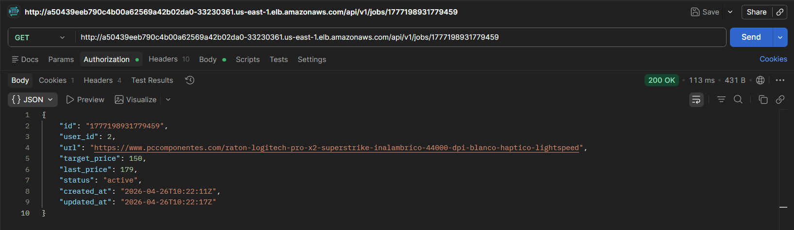
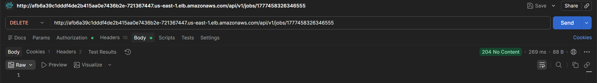

---

### Procesamiento asíncrono de trabajos

Al crear un trabajo, este se almacena con estado `pending`. Una vez procesado por el scraper, el estado pasa a `active` y se actualiza el último precio. En algún momento intermedio puede observarse el estado `processing`, indicando que el scraper ha leído el trabajo de la cola SQS.

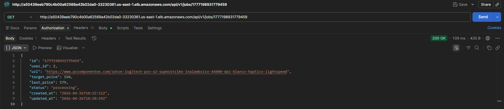

---

### Monitorización del sistema

Para validar el comportamiento de los componentes asíncronos se utilizaron las herramientas de monitorización de AWS.

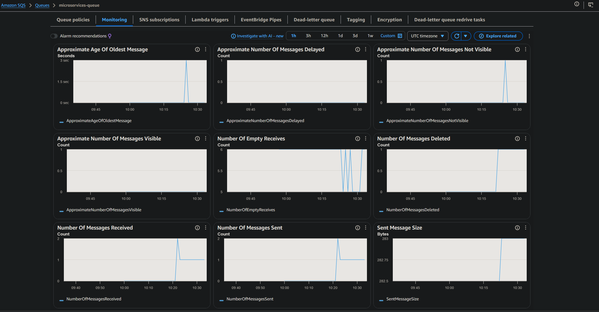


---

### Validación de la infraestructura

Se configuraron alarmas en CloudWatch para monitorizar el estado de los recursos desplegados.


---

### Automatización del despliegue

Al realizar un commit en el repositorio, GitHub Actions construye y publica automáticamente la nueva imagen. FluxCD detecta la nueva versión, actualiza el manifiesto (commit automático del bot de Flux) y genera una notificación en Discord confirmando la reconciliación del clúster.

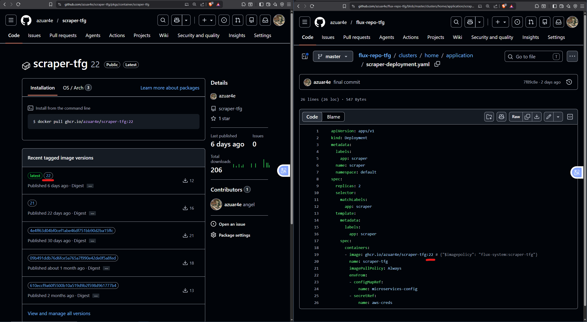


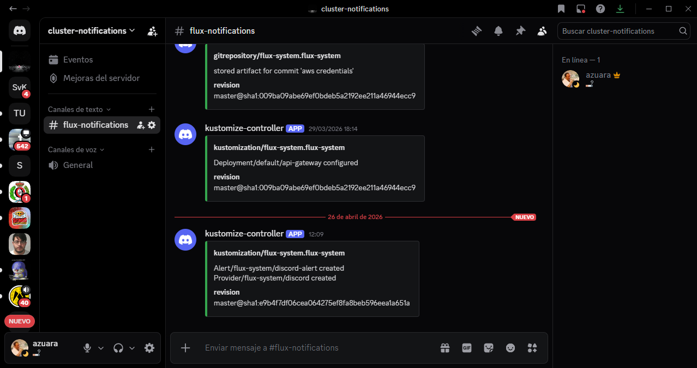

---

### Pruebas de carga y rendimiento

Una vez validado el funcionamiento del sistema, se realizaron pruebas de carga con **k6** para analizar su comportamiento bajo diferentes niveles de demanda.

Como se ha mencionado en la sección de [Escalabilidad y Recursos](#escalabilidad-y-recursos), el scraper debería escalarse en función de parámetros como el número de mensajes en la cola y no el uso de CPU. Por ello, estas pruebas evalúan principalmente la capacidad de respuesta de la API.

#### Test de Carga

El objetivo de esta prueba es determinar cómo responderá el sistema ante una carga constante. En este ejemplo utilizamos 50 usuarios virtuales concurrentes durante 4 minutos ejecutando llamadas ``HTTP GET`` al endpoint ``/jobs``.

```javascript
export const options = {
  stages: [
    { duration: "30s", target: 50 },
    { duration: "3m", target: 50 },
    { duration: "30s", target: 0 },
  ],
};
```

**Resultado:** 100% de checks exitosos sobre 6.837 peticiones, latencia media de 541ms, mediana de 114ms y p(95) de 2.26s.

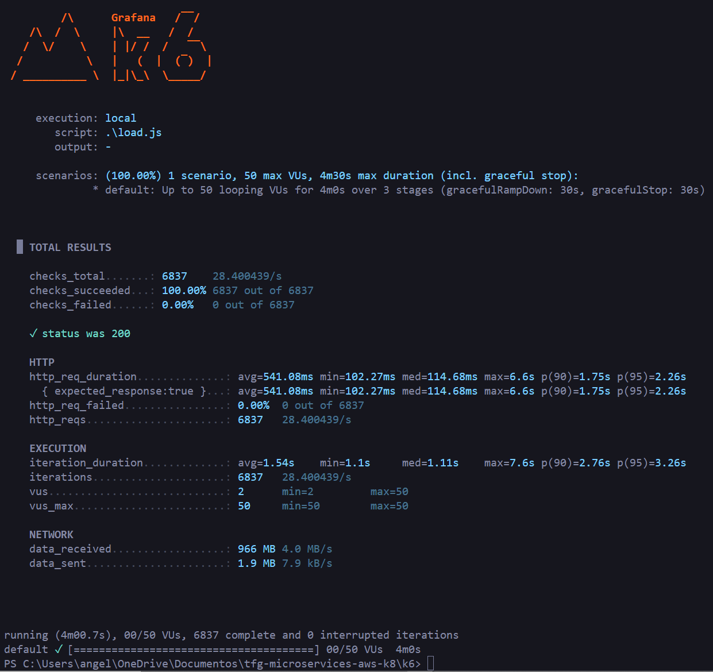

#### Test de Estrés

En una prueba de estrés, lo que queremos ver es como la aplicación manejará una carga mayor. En este caso, empezamos con una carga de 100 usuarios virtuales y vamos escalándolo progresivamente:

```javascript
export const options = {
  stages: [
    { duration: "30s", target: 100 },
    { duration: "1m",  target: 200 },
    { duration: "1m",  target: 500 },
    { duration: "1m",  target: 1000 },
    { duration: "30s", target: 0 },
  ],
};
```

**Resultado:** 80.145 peticiones a 333 req/s, latencia media de 147ms, mediana de 110ms. Solo un 0.61% de fallos (491 peticiones) en los momentos de mayor carga con 1000 VUs simultáneos.

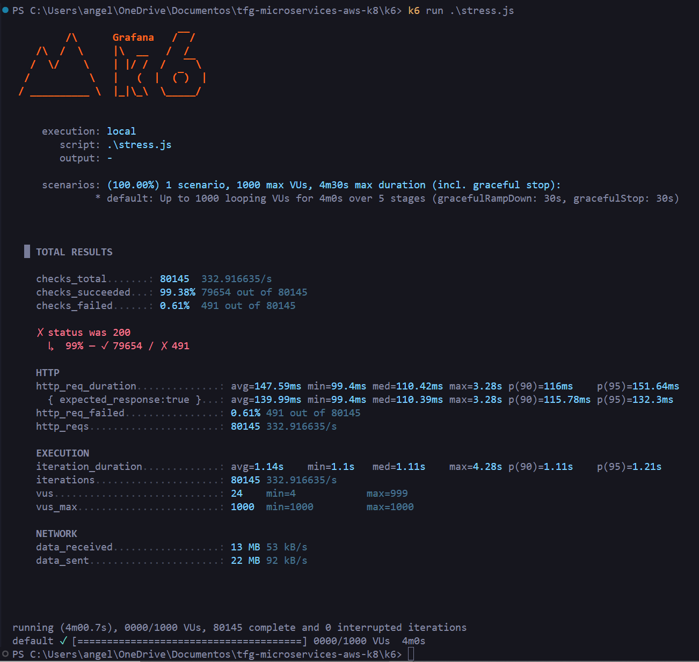

#### Test de Pico

Pueden darse escenarios en los que el sistema reciba un pico repentino de tráfico y no sea capaz de responder adecuadamente. En el fragmento que se muestra a continuación se simula una transición brusca desde una carga moderada de 50 usuarios virtuales hasta 2000 usuarios virtuales en tan solo 10 segundos:

```javascript
export const options = {
  stages: [
    { duration: "30s", target: 50 },
    { duration: "10s", target: 2000 },
    { duration: "1m",  target: 2000 },
    { duration: "10s", target: 50 },
    { duration: "30s", target: 0 },
  ],
};
```

**Resultado:** 71.54% de fallos, todos por timeout, con latencia media de 18.5s. El HPA no dispone de tiempo suficiente para reaccionar ante un incremento tan abrupto: el comportamiento esperado en un spike test.


#### Resumen

En la tabla se muestra un resumen con los resultados de las pruebas.

| Escenario | VUs | Peticiones | Tasa de error | Latencia media | P95 |
|-----------|-----|-----------|---------------|----------------|-----|
| Carga (sostenida) | 50 | 6.837 | 0,00% | 541ms | 2.260ms |
| Estrés (progresiva) | 1.000 | 80.145 | 0,61% | 147ms | 151ms |
| Pico (avalancha) | 2.000 | 8.518 | 71,54% | 18.510ms | >60.000ms |

---

## Vídeo DEMO

<video controls width="100%">
  <source src="/videos/demo-tfg-presentacion.mp4" type="video/mp4">
</video>

---

## Conclusiones

Este trabajo sirve para entender la importancia que tienen actualmente los diseños de arquitecturas basadas en microservicios, así como el enfoque cloud-native.

Hemos profundizado en todas las etapas del ciclo de vida de una aplicación hasta llegar a producción, desde el desarrollo, empezando por la elección del stack tecnológico, pasando por la contenerización y validación de los servicios, automatizados mediante GitHub Actions, acabando con el despliegue en un clúster de EKS utilizando una herramienta basada en GitOps, como es FluxCD, en la que mediante un repositorio como única fuente de verdad, definimos el estado deseado del clúster.

También hemos indagado en el despliegue de una infraestructura automatizada mediante Infraestructura como Código, pudiendo levantarla de forma declarativa y persistente, y almacenando el estado de la misma en un backend de S3.

Nuevamente, todo el código está disponible en los repositorios de GitHub de mi cuenta.

>👉 <https://github.com/azuar4e/api-gateway-tfg>
>
>👉 <https://github.com/azuar4e/scraper-tfg>
>
>👉 <https://github.com/azuar4e/flux-repo-tfg>
>
>👉 <https://github.com/azuar4e/terraform-tfg>

Gracias por leer, nos vemos en la próxima, ¡Cuidaos! 👋

---

## Anexo

```Go
package main

import (
    "context"
    "encoding/json"
    "log"
    "os"

    "github.com/aws/aws-lambda-go/lambda"
    "github.com/aws/aws-sdk-go-v2/aws"
    "github.com/aws/aws-sdk-go-v2/feature/dynamodb/attributevalue"
    "github.com/aws/aws-sdk-go-v2/service/dynamodb"
    "github.com/aws/aws-sdk-go-v2/service/dynamodb/types"
    "github.com/aws/aws-sdk-go-v2/service/sqs"
    "github.com/azuar4e/lambda-scheduler-tfg/internal/initializers"
    "github.com/azuar4e/lambda-scheduler-tfg/internal/models"
)

func init() {
    initializers.LoadEnvVariables()
    initializers.ConnectToDynamo()
    initializers.ConnectToSQS()
}

func main() {

    lambda.Start(func(ctx context.Context) error {
        result, err := initializers.DY.Scan(context.TODO(), &dynamodb.ScanInput{
            TableName:        aws.String("PriceAlerts"),
            FilterExpression: aws.String("#s = :s"),
            ExpressionAttributeNames: map[string]string{
                "#s": "status",
            },
            ExpressionAttributeValues: map[string]types.AttributeValue{
                ":s": &types.AttributeValueMemberS{Value: "active"},
            },
        })

        if err != nil {
            return err
        }

        for _, item := range result.Items {
            // hacemos el re schedule
            var jobItem models.JobDynamoItem
            attributevalue.UnmarshalMap(item, &jobItem)
            job := jobItem.ToJob()
            body, err := json.Marshal(job)

            if err != nil {
                log.Printf("Error generating the json")
                continue
            }

            _, err = initializers.SQS.SendMessage(context.TODO(), &sqs.SendMessageInput{
                QueueUrl:    aws.String(os.Getenv("SQS_QUEUE_URL")),
                MessageBody: aws.String(string(body)),
            })

            if err != nil {
                log.Printf("Error queueing the job %s in SQS: %v\n", job.ID, err)
                continue
            }
        }
        return nil
    })
}
```


---

> Autor: [Angel Azuara Eizaguirre](https://www.linkedin.com/in/angel-azuara/)  
> URL: https://azuar4e.github.io/es/posts/tfg/  

